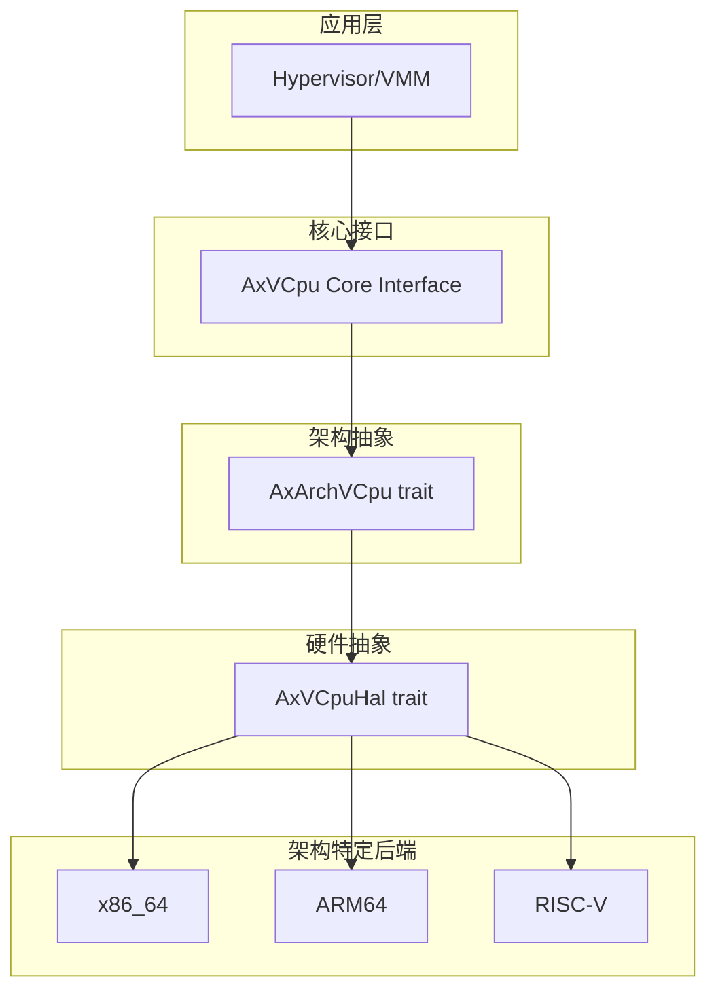
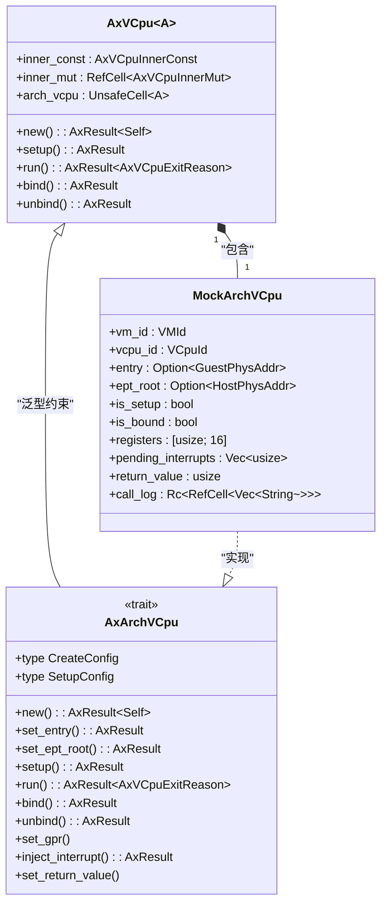
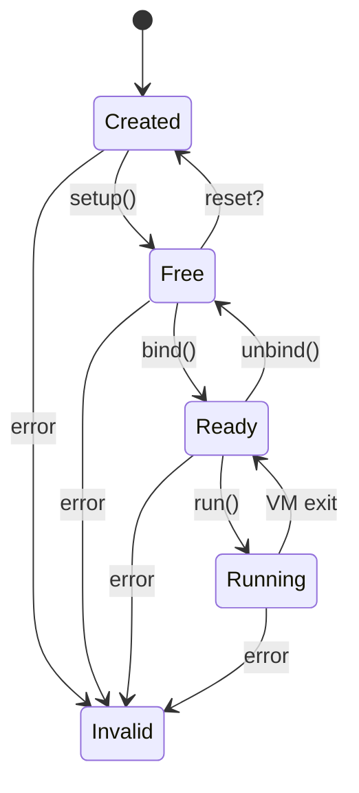
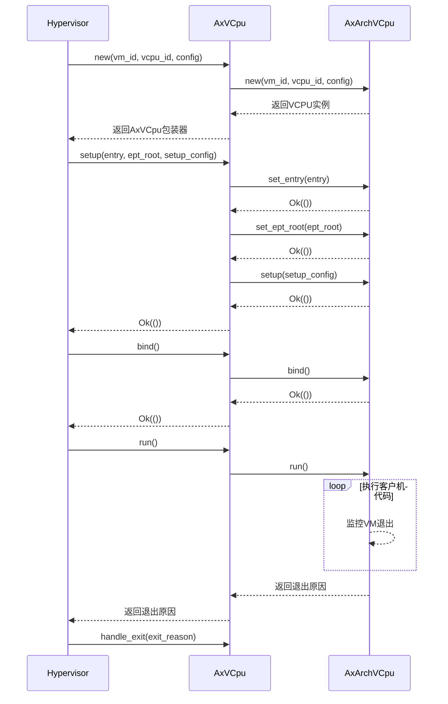

# AxArchVCpu trait

<cite>
**本文档中引用的文件**
- [arch_vcpu.rs](file://src/arch_vcpu.rs)
- [vcpu.rs](file://src/vcpu.rs)
- [test.rs](file://src/test.rs)
- [lib.rs](file://src/lib.rs)
</cite>

## 目录
1. [简介](#简介)
2. [核心契约与设计目的](#核心契约与设计目的)
3. 关联类型详解
   1. [CreateConfig - 创建时配置](#createconfig---创建时配置)
   2. [SetupConfig - 运行前设置](#setupconfig---运行前设置)
4. 方法接口文档
   1. [new() - 构建逻辑与资源分配](#new---构建逻辑与资源分配)
   2. [set_entry() - 设置客户机启动入口](#set_entry---设置客户机启动入口)
   3. [set_ept_root() - 配置页表根地址](#set_ept_root---配置页表根地址)
   4. [setup() - 完成架构特定初始化](#setup---完成架构特定初始化)
   5. [run() - 执行客户机代码](#run---执行客户机代码)
   6. [bind() 和 unbind() - 物理CPU绑定管理](#bind-和-unbind---物理cpu绑定管理)
   7. [set_gpr() 和 inject_interrupt() - 寄存器与中断操作](#set_gpr-和-inject_interrupt---寄存器与中断操作)
5. [实现模式与解耦机制](#实现模式与解耦机制)
6. [状态机与生命周期管理](#状态机与生命周期管理)
7. [错误处理与返回结果](#错误处理与返回结果)
8. [示例与使用场景](#示例与使用场景)

## 简介

AxArchVCpu trait 是 ArceOS 虚拟化框架中的核心抽象层，为不同硬件架构（x86_64, ARM64, RISC-V）上的虚拟CPU提供统一的行为接口。该trait定义了虚拟CPU在各种硬件平台上的低级虚拟化原语，实现了架构无关的核心逻辑与架构特定实现之间的清晰分离。

通过此trait，hypervisor可以以统一的方式管理跨架构的虚拟CPU，同时允许每个架构提供其特有的虚拟化功能实现。这种设计模式支持可插拔的后端扩展，使得新架构能够无缝集成到现有系统中。

**Section sources**
- [arch_vcpu.rs](file://src/arch_vcpu.rs#L0-L80)
- [lib.rs](file://src/lib.rs#L0-L33)

## 核心契约与设计目的

AxArchVCpu trait作为架构抽象层的核心契约，旨在解决多架构虚拟化环境中的兼容性问题。其主要设计目标包括：

1. **统一接口**：为所有支持的架构提供一致的虚拟CPU操作接口
2. **解耦设计**：将通用VCPU逻辑与架构特定实现分离
3. **可扩展性**：支持未来新增架构的无缝集成
4. **类型安全**：利用Rust的关联类型确保配置参数的正确性

该trait位于分层架构的中间层，上接架构无关的VCPU核心接口，下连具体的硬件后端实现，形成了"应用层 → 核心接口 → 架构抽象 → 硬件抽象 → 架构特定后端"的完整层次结构。



**Diagram sources**
- [arch_vcpu.rs](file://src/arch_vcpu.rs#L0-L30)
- [README.md](file://README.md#L15-L32)

**Section sources**
- [arch_vcpu.rs](file://src/arch_vcpu.rs#L0-L30)
- [README.md](file://README.md#L15-L32)

## 关联类型详解

### CreateConfig - 创建时配置

`CreateConfig`关联类型用于定义虚拟CPU创建时所需的架构特定配置参数。这个类型允许每个架构根据其特性定义初始化阶段需要的配置信息。

设计目的：
- 在VCPU创建阶段捕获架构特定的初始化需求
- 提供类型安全的配置传递机制
- 支持不同架构间差异化的创建流程

使用场景：
- x86_64架构可能需要指定MSR初始值
- ARM64架构可能需要配置SCTLR_EL1寄存器
- RISC-V架构可能需要设置mstatus寄存器

该配置在`new()`方法调用时使用，是VCPU生命周期的第一个配置点。

**Section sources**
- [arch_vcpu.rs](file://src/arch_vcpu.rs#L15-L20)

### SetupConfig - 运行前设置

`SetupConfig`关联类型用于定义虚拟CPU在执行前最终设置阶段所需的架构特定配置参数。与`CreateConfig`相比，这是更接近执行阶段的配置。

设计目的：
- 在基本VCPU创建后但执行前进行最后的架构特定设置
- 允许延迟某些配置直到必要时刻
- 支持动态调整执行环境

使用场景：
- 配置架构特定的调试寄存器
- 设置性能监控单元(PMU)
- 初始化浮点单元(FPU)状态

该配置在`setup()`方法调用时使用，是VCPU进入可执行状态前的最后一个配置机会。

**Section sources**
- [arch_vcpu.rs](file://src/arch_vcpu.rs#L23-L28)

## 方法接口文档

### new() - 构建逻辑与资源分配

`new()`方法负责创建新的架构特定VCPU实例，是整个VCPU生命周期的起点。

**方法签名**
```rust
fn new(vm_id: VMId, vcpu_id: VCpuId, config: Self::CreateConfig) -> AxResult<Self>;
```

**参数含义**
- `vm_id`: 所属虚拟机的唯一标识符
- `vcpu_id`: 此VCPU在虚拟机内的唯一标识符  
- `config`: 架构特定的创建配置

**返回结果**
- 成功时返回`Ok(Self)`，包含新创建的VCPU实例
- 失败时返回`AxResult`错误码

**潜在失败原因**
- 内存分配失败
- 架构特定资源不可用
- 配置参数无效
- 硬件虚拟化功能未启用

**构建逻辑**
1. 分配必要的内存资源
2. 初始化架构特定的状态
3. 应用创建时配置
4. 返回准备好的VCPU实例

**Section sources**
- [arch_vcpu.rs](file://src/arch_vcpu.rs#L32-L35)
- [vcpu.rs](file://src/vcpu.rs#L78-L114)

### set_entry() - 设置客户机启动入口

`set_entry()`方法用于设置客户机物理地址作为VCPU的启动入口点。

**方法签名**
```rust
fn set_entry(&mut self, entry: GuestPhysAddr) -> AxResult;
```

**参数含义**
- `entry`: 客户机物理地址，表示VCPU执行开始的位置

**保证条件**
- 该函数保证只被调用一次
- 调用发生在`setup()`方法之前

**作用**
- 确定客户机操作系统或应用程序的起始执行地址
- 为后续的VM entry准备入口点信息

**潜在失败原因**
- 地址格式无效
- 内存区域不可访问
- 重复设置入口点

**Section sources**
- [arch_vcpu.rs](file://src/arch_vcpu.rs#L38-L42)

### set_ept_root() - 配置页表根地址

`set_ept_root()`方法用于设置扩展页表(EPT)根地址，实现内存虚拟化。

**方法签名**
```rust
fn set_ept_root(&mut self, ept_root: HostPhysAddr) -> AxResult;
```

**参数含义**
- `ept_root`: 主机物理地址，指向EPT页表的顶层

**作用**
- 定义客户机到主机物理地址转换的顶级页表
- 实现硬件辅助的内存虚拟化
- 控制客户机对物理内存的访问权限

**重要性**
- 是内存隔离和保护的关键机制
- 影响客户机内存访问性能
- 决定了客户机可见的物理内存布局

**潜在失败原因**
- 页表结构损坏
- 地址对齐不符合要求
- 内存权限不足

**Section sources**
- [arch_vcpu.rs](file://src/arch_vcpu.rs#L45-L51)

### setup() - 完成架构特定初始化

`setup()`方法执行任何最终的架构特定初始化，为VCPU执行做准备。

**方法签名**
```rust
fn setup(&mut self, config: Self::SetupConfig) -> AxResult;
```

**参数含义**
- `config`: 架构特定的设置配置

**职责边界**
- 执行创建后、执行前的最后初始化步骤
- 应用运行前的特定配置
- 准备架构特定的执行环境

**调用时机**
- 在`set_entry()`和`set_ept_root()`之后
- 在`bind()`之前
- VCPU状态从Created过渡到Free时

**潜在失败原因**
- 必需的前置条件未满足
- 配置参数冲突
- 硬件状态不兼容

**Section sources**
- [arch_vcpu.rs](file://src/arch_vcpu.rs#L54-L59)

### run() - 执行客户机代码

`run()`方法是VCPU的核心执行方法，负责转移控制权给客户机并运行直到发生VM退出。

**方法签名**
```rust
fn run(&mut self) -> AxResult<AxVCpuExitReason>;
```

**控制流语义**
- 将控制权转移到客户机VCPU
- 持续执行客户机代码
- 当触发VM退出条件时返回控制权给hypervisor
- 返回导致退出的具体原因

**执行过程**
1. 进入客户机模式
2. 开始执行客户机代码
3. 监控VM退出事件
4. 发生退出时保存状态
5. 返回退出原因给hypervisor

**返回结果**
- 成功时返回`AxVCpuExitReason`枚举，说明退出原因
- 失败时返回相应的错误码

**Section sources**
- [arch_vcpu.rs](file://src/arch_vcpu.rs#L62-L68)

### bind() 和 unbind() - 物理CPU绑定管理

`bind()`和`unbind()`方法分别用于将VCPU绑定到当前物理CPU和解除绑定。

**方法签名**
```rust
fn bind(&mut self) -> AxResult;
fn unbind(&mut self) -> AxResult;
```

**bind()作用**
- 执行架构特定的初始化以准备在当前物理CPU上执行
- 设置物理CPU的上下文
- 过渡VCPU状态到Ready

**unbind()作用**
- 执行清理和状态保存
- 保存VCPU的当前状态
- 为迁移到其他物理CPU做准备

**使用场景**
- 调度器将VCPU分配给特定物理CPU时调用bind()
- 调度器重新分配资源时调用unbind()
- 处理物理CPU故障或维护

**Section sources**
- [arch_vcpu.rs](file://src/arch_vcpu.rs#L71-L80)

### set_gpr() 和 inject_interrupt() - 寄存器与中断操作

这些方法提供对VCPU底层状态的直接操作能力。

**set_gpr() - 设置通用寄存器**

```rust
fn set_gpr(&mut self, reg: usize, val: usize);
```
- 直接设置指定索引的通用寄存器值
- 用于初始化寄存器状态或调试目的
- 不返回结果，操作应始终成功

**inject_interrupt() - 注入中断**

```rust
fn inject_interrupt(&mut self, vector: usize) -> AxResult;
```
- 向VCPU注入指定向量的中断
- 可能在VCPU未运行时需要中断队列缓冲
- 调用者必须确保在正确的物理CPU上调用

**保证条件**
- 方法调用时VCPU可能正在运行或排队中
- 中断注入可能需要延迟到VCPU实际运行时

**Section sources**
- [arch_vcpu.rs](file://src/arch_vcpu.rs#L83-L90)

## 实现模式与解耦机制

AxArchVCpu trait通过精心设计的架构实现了核心逻辑与具体实现的完全解耦，支持可插拔的架构后端扩展。

**解耦设计要点**

1. **泛型包装**：`AxVCpu<A: AxArchVCpu>`结构体封装了架构无关的逻辑
2. **委托模式**：核心VCPU将架构特定操作委托给trait实现
3. **关联类型**：使用CreateConfig和SetupConfig确保类型安全的配置传递
4. **状态机**：统一的VCPU生命周期管理



**Diagram sources**
- [vcpu.rs](file://src/vcpu.rs#L57-L76)
- [test.rs](file://src/test.rs#L39-L78)

**Section sources**
- [vcpu.rs](file://src/vcpu.rs#L57-L76)
- [test.rs](file://src/test.rs#L39-L78)

## 状态机与生命周期管理

VCPU遵循严格的生命周期状态机，确保状态转换的安全性和正确性。

**状态转换图**



**状态说明**
- **Created**: 初始状态，VCPU已创建但未初始化
- **Free**: 已初始化，准备绑定到物理CPU
- **Ready**: 已绑定到物理CPU，准备执行
- **Running**: 正在物理CPU上执行客户机代码
- **Invalid**: 错误状态，表示状态转换失败

**状态转换保证**
- 使用`with_state_transition`方法确保原子性
- 每个转换都有明确的前置和后置条件
- 错误发生时自动进入Invalid状态

**Section sources**
- [vcpu.rs](file://src/vcpu.rs#L26-L55)
- [vcpu.rs](file://src/vcpu.rs#L162-L208)

## 错误处理与返回结果

AxArchVCpu trait采用统一的错误处理机制，所有可能失败的方法都返回`AxResult`类型。

**返回结果类型**
- `AxResult<T>`: 成功时包含T类型的值，失败时包含错误信息
- `AxVCpuExitReason`: 枚举类型，描述VM退出的具体原因

**常见错误类型**
- `AxError::InvalidInput`: 输入参数无效
- `AxError::BadState`: VCPU处于错误状态
- 架构特定的错误码

**错误处理策略**
- 前置条件检查
- 状态验证
- 资源可用性检查
- 返回详细的错误信息以便调试

**Section sources**
- [arch_vcpu.rs](file://src/arch_vcpu.rs#L0-L80)
- [exit.rs](file://src/exit.rs#L0-L260)

## 示例与使用场景

以下是一个典型的VCPU使用流程示例：



**Diagram sources**
- [vcpu.rs](file://src/vcpu.rs#L252-L296)
- [README.md](file://README.md#L59-L107)

**Section sources**
- [vcpu.rs](file://src/vcpu.rs#L252-L296)
- [README.md](file://README.md#L59-L107)