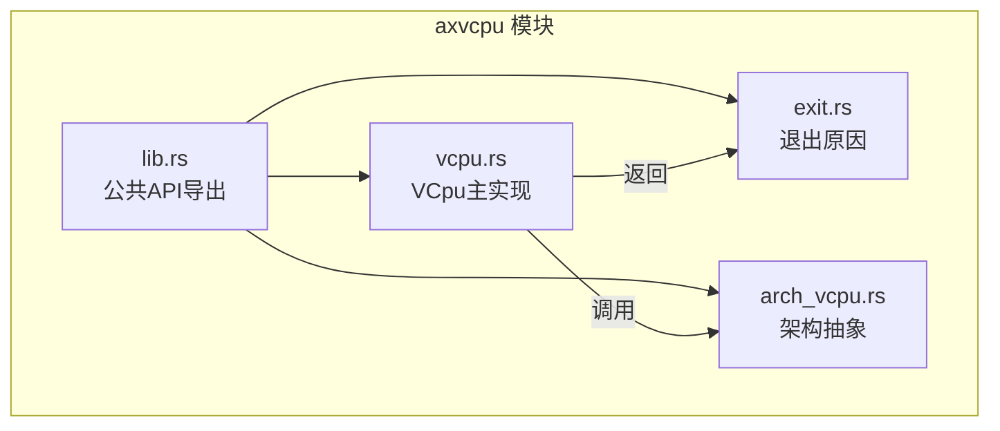
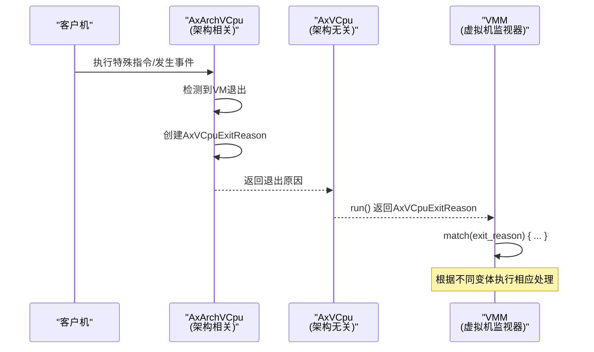

# AxVCpuExitReason 枚举

<cite>
**本文档引用的文件**
- [exit.rs](file://src/exit.rs)
- [vcpu.rs](file://src/vcpu.rs)
- [lib.rs](file://src/lib.rs)
</cite>

## 目录
1. [简介](#简介)
2. [项目结构](#项目结构)
3. [核心组件](#核心组件)
4. [架构概述](#架构概述)
5. [详细组件分析](#详细组件分析)
6. [依赖分析](#依赖分析)
7. [性能考虑](#性能考虑)
8. [故障排除指南](#故障排除指南)
9. [结论](#结论)

## 简介
`AxVCpuExitReason` 是 ArceOS 虚拟化框架中用于表示虚拟 CPU（VCPU）退出原因的关键枚举类型。当客户机执行过程中触发特定事件时，控制权会从客户机转移到 VMM（虚拟机监视器），该枚举即用于描述此类 VM 退出的具体原因。它在虚拟化事件处理流程中扮演中枢角色，指导开发者如何根据 `vcpu.run()` 的返回值进行模式匹配，从而正确分发和处理各类虚拟化事件。

本参考文档系统性地列出所有变体及其数据携带情况，并为每个变体明确标注其触发条件、典型处理方式及在 VMM 中的响应策略。

## 项目结构
ArceOS 的 axvcpu 模块采用清晰的模块化设计，主要源码位于 `src/` 目录下，各文件职责分明：

```
.
├── src
│   ├── arch_vcpu.rs     # 架构相关 VCpu 特性的抽象定义
│   ├── exit.rs          # VM 退出原因枚举定义 (AxVCpuExitReason)
│   ├── hal.rs           # 硬件抽象层接口
│   ├── lib.rs           # 库入口与公共 API 导出
│   ├── percpu.rs        # 每核虚拟化状态管理
│   ├── test.rs          # 单元测试
│   └── vcpu.rs          # 架构无关的 VCpu 主实现
└── Cargo.toml
└── README.md
```

其中，`exit.rs` 定义了 `AxVCpuExitReason` 枚举，而 `vcpu.rs` 实现了 `AxVCpu` 结构体，其 `run()` 方法返回此枚举类型的实例。



**Diagram sources**
- [lib.rs](file://src/lib.rs#L1-L35)
- [exit.rs](file://src/exit.rs#L1-L259)
- [vcpu.rs](file://src/vcpu.rs#L1-L349)

**Section sources**
- [lib.rs](file://src/lib.rs#L1-L35)
- [exit.rs](file://src/exit.rs#L1-L259)
- [vcpu.rs](file://src/vcpu.rs#L1-L349)

## 核心组件
`AxVCpuExitReason` 枚举是整个虚拟化事件处理机制的核心。它通过丰富的变体（variants）精确地捕获了客户机执行过程中可能发生的各种需要 VMM 干预的场景。这些变体涵盖了 I/O 操作、系统事件、电源管理、多处理器通信等多个类别。

`AxVCpu` 结构体则封装了虚拟 CPU 的生命周期管理，其 `run()` 方法是进入客户机执行并等待退出事件的主要接口。当 `run()` 返回一个 `AxVCpuExitReason` 值时，VMM 必须对其进行模式匹配以决定后续操作。

**Section sources**
- [exit.rs](file://src/exit.rs#L1-L259)
- [vcpu.rs](file://src/vcpu.rs#L1-L349)

## 架构概述
`AxVCpuExitReason` 在 ArceOS 虚拟化架构中处于事件处理的中心位置。当客户机因特定指令或硬件事件而退出时，底层的架构相关代码（如 x86_64 或 AArch64 的 `AxArchVCpu` 实现）会生成一个 `AxVCpuExitReason` 实例。该实例随后被 `AxVCpu::run()` 方法返回给上层 VMM。

VMM 随后使用 `match` 表达式对这个枚举值进行分支处理，针对不同的退出原因执行相应的模拟、转发或状态管理逻辑。



**Diagram sources**
- [exit.rs](file://src/exit.rs#L1-L259)
- [vcpu.rs](file://src/vcpu.rs#L1-L349)

## 详细组件分析
### AxVCpuExitReason 变体详解
以下是对 `AxVCpuExitReason` 枚举各个变体的全面分析，包括触发条件、携带数据、典型处理方式及 VMM 响应策略。

#### Halt
- **触发条件**: 客户机操作系统执行了停机指令（如 x86 的 `HLT`），表明当前无任务可执行，进入空闲状态。
- **数据携带**: 无附加数据。
- **典型处理方式**: VMM 可以选择将此 VCPU 置于阻塞状态，直到有外部中断或其他事件唤醒它。
- **VMM 响应策略**: 记录 VCPU 进入空闲状态，可能触发调度器选择其他任务运行，或进入低功耗循环。

**Section sources**
- [exit.rs](file://src/exit.rs#L164)

#### IoRead / IoWrite
- **触发条件**: 客户机尝试执行端口 I/O 指令（仅限 x86 架构）。`IoRead` 用于读取 I/O 端口，`IoWrite` 用于写入。
- **数据携带**:
  - `port`: 被访问的 I/O 端口号。
  - `width`: 访问宽度（8, 16, 或 32 位）。
  - `data` (仅 `IoWrite`): 写入的数据。
- **典型处理方式**: VMM 需要模拟对应的硬件设备行为。例如，读取串口端口可能返回接收缓冲区中的字符，写入磁盘控制器端口可能启动一次磁盘操作。
- **VMM 响应策略**: 根据端口号查找对应的虚拟设备驱动，调用其读写处理函数，并将结果写回客户机寄存器或更新设备状态。

**Section sources**
- [exit.rs](file://src/exit.rs#L105-L125)

#### ExternalInterrupt
- **触发条件**: 有来自外部设备的硬件中断被投递给该 VCPU。
- **数据携带**:
  - `vector`: 硬件中断向量号。
- **典型处理方式**: VMM 通常需要将此中断转发给客户机操作系统，使其能够调用相应的中断服务程序（ISR）。
- **VMM 响应策略**: 调用 `inject_interrupt()` 方法将中断注入客户机上下文，使客户机在下次运行时能响应此中断。

**Section sources**
- [exit.rs](file://src/exit.rs#L139-L141)
- [vcpu.rs](file://src/vcpu.rs#L338-L341)

#### NestedPageFault
- **触发条件**: 发生嵌套页表错误（x86 上称为 EPT 错误），即客户机在访问其物理内存时违反了嵌套页表的映射规则。
- **数据携带**:
  - `addr`: 引发错误的客户机物理地址（GPA）。
  - `access_flags`: 尝试的访问类型（读、写、执行）。
- **典型处理方式**: VMM 需要检查该 GPA 是否对应于 MMIO 区域、共享内存或需要按需分配的页面。
- **VMM 响应策略**: 若为 MMIO，则转为 `MmioRead`/`MmioWrite` 处理；若为缺页，则分配物理页并更新 EPT；否则可能是恶意访问，需终止客户机。

**Section sources**
- [exit.rs](file://src/exit.rs#L153-L157)

#### Hypercall
- **触发条件**: 客户机操作系统主动发起超调用（Hypercall），请求 VMM 提供特定服务（类似于系统调用）。
- **数据携带**:
  - `nr`: 超调用编号，标识请求的服务。
  - `args`: 传递给超调用的参数数组（最多 6 个）。
- **典型处理方式**: VMM 解析 `nr` 和 `args`，执行相应的服务逻辑，如获取时间、管理内存等。
- **VMM 响应策略**: 根据超调用编号分发到具体的处理函数，执行完毕后将结果通过寄存器返回给客户机。

**Section sources**
- [exit.rs](file://src/exit.rs#L33-L41)

#### CpuUp
- **触发条件**: 请求启动一个次级 CPU 核心（如 x86 的 SIPI 或 ARM 的 PSCI 调用）。
- **数据携带**:
  - `target_cpu`: 目标 CPU 的标识符（如 APIC ID）。
  - `entry_point`: 次级 CPU 启动后执行的入口地址。
  - `arg`: 传递给次级 CPU 的启动参数。
- **典型处理方式**: VMM 需要初始化目标 VCPU 的状态，并将其置于就绪状态。
- **VMM 响应策略**: 查找或创建对应的 `AxVCpu` 实例，调用 `setup()` 设置入口点，并绑定到物理 CPU 上准备运行。

**Section sources**
- [exit.rs](file://src/exit.rs#L173-L184)

#### SendIPI
- **触发条件**: 客户机尝试向其他 CPU 发送处理器间中断（IPI）。
- **数据携带**:
  - `target_cpu`: 目标 CPU ID。
  - `send_to_all`: 是否广播给所有 CPU。
  - `send_to_self`: 是否发送给自己。
  - `vector`: IPI 的中断向量号。
- **典型处理方式**: VMM 需要将此 IPI 请求转发给目标 VCPU。
- **VMM 响应策略**: 根据目标信息找到对应的 `AxVCpu` 实例，并调用其 `inject_interrupt()` 方法注入指定向量的中断。

**Section sources**
- [exit.rs](file://src/exit.rs#L235-L258)

#### 其他变体
- **MmioRead/MmioWrite**: 客户机访问 MMIO 地址空间，需由 VMM 模拟设备行为。
- **SysRegRead/SysRegWrite**: 客户机读写系统寄存器（MSR/CSR），VMM 需提供虚拟化视图或拦截敏感操作。
- **SystemDown**: 客户机请求关机，VMM 应终止整个虚拟机。
- **Nothing**: 无特殊处理，VMM 可进行后台任务检查后立即恢复客户机。
- **FailEntry**: VM 入口失败，通常是严重错误，VMM 需记录并可能终止 VCPU。

**Section sources**
- [exit.rs](file://src/exit.rs#L43-L258)

## 依赖分析
`AxVCpuExitReason` 枚举与其他模块存在紧密的依赖关系。

```mermaid
classDiagram
class AxVCpuExitReason {
+Hypercall{nr : u64, args : [u64; 6]}
+MmioRead{addr : GuestPhysAddr, ...}
+IoRead{port : Port, width : AccessWidth}
+ExternalInterrupt{vector : u64}
+NestedPageFault{addr : GuestPhysAddr, access_flags : MappingFlags}
+Halt
+CpuUp{target_cpu : u64, entry_point : GuestPhysAddr, arg : u64}
+SendIPI{...}
+...
}
class AxVCpu {
-inner_const : AxVCpuInnerConst
-inner_mut : RefCell<AxVCpuInnerMut>
-arch_vcpu : UnsafeCell<A>
+run() AxResult<AxVCpuExitReason>
+bind() AxResult
+inject_interrupt(vector : usize) AxResult
}
class AxArchVCpu {
<<trait>>
+run() AxResult<AxVCpuExitReason>
+inject_interrupt(vector : usize) AxResult
}
AxVCpu --> AxVCpuExitReason : "run() 返回"
AxVCpu --> AxArchVCpu : "包含具体实现"
AxArchVCpu ..> AxVCpuExitReason : "产生退出原因"
note right of AxVCpu
架构无关的VCPU主接口
run()方法返回AxVCpuExitReason
end note
note left of AxArchVCpu
架构相关的VCPU实现
实际执行并产生退出事件
end note
```

**Diagram sources**
- [exit.rs](file://src/exit.rs#L1-L259)
- [vcpu.rs](file://src/vcpu.rs#L1-L349)
- [arch_vcpu.rs](file://src/arch_vcpu.rs#L1-L75)

**Section sources**
- [exit.rs](file://src/exit.rs#L1-L259)
- [vcpu.rs](file://src/vcpu.rs#L1-L349)
- [arch_vcpu.rs](file://src/arch_vcpu.rs#L1-L75)

## 性能考虑
`AxVCpuExitReason` 的设计对性能有重要影响。频繁的 VM 退出（如密集的 I/O 操作）会导致性能下降。因此，VMM 应尽量减少不必要的退出，例如通过批处理中断或优化 MMIO 访问路径。此外，模式匹配的效率也很关键，编译器通常能对此进行优化，但应避免过于复杂的嵌套匹配。

## 故障排除指南
- **未知退出原因**: 如果遇到未预期的 `AxVCpuExitReason` 变体，首先检查是否使用了 `..` 在 `match` 语句中以确保向前兼容性。
- **频繁 Halt 退出**: 检查客户机操作系统是否正常调度，或 VMM 是否未能及时注入中断唤醒客户机。
- **NestedPageFault 循环**: 可能是 EPT 配置错误或客户机恶意扫描内存，需检查 GPA 映射逻辑。
- **Hypercall 失败**: 确认 VMM 是否实现了对应的超调用编号，并检查参数传递是否正确。

**Section sources**
- [exit.rs](file://src/exit.rs#L1-L259)
- [test.rs](file://src/test.rs#L1-L450)

## 结论
`AxVCpuExitReason` 枚举是 ArceOS 虚拟化框架中不可或缺的一部分，它为 VMM 提供了一种类型安全且详尽的方式来处理客户机的各种退出事件。通过系统性地分析其所有变体，开发者可以构建健壮的虚拟机监视器，正确地模拟硬件、处理中断并管理虚拟 CPU 的生命周期。遵循本文档的指导，结合具体的 `match` 示例代码，能够有效提升虚拟化系统的开发效率和稳定性。