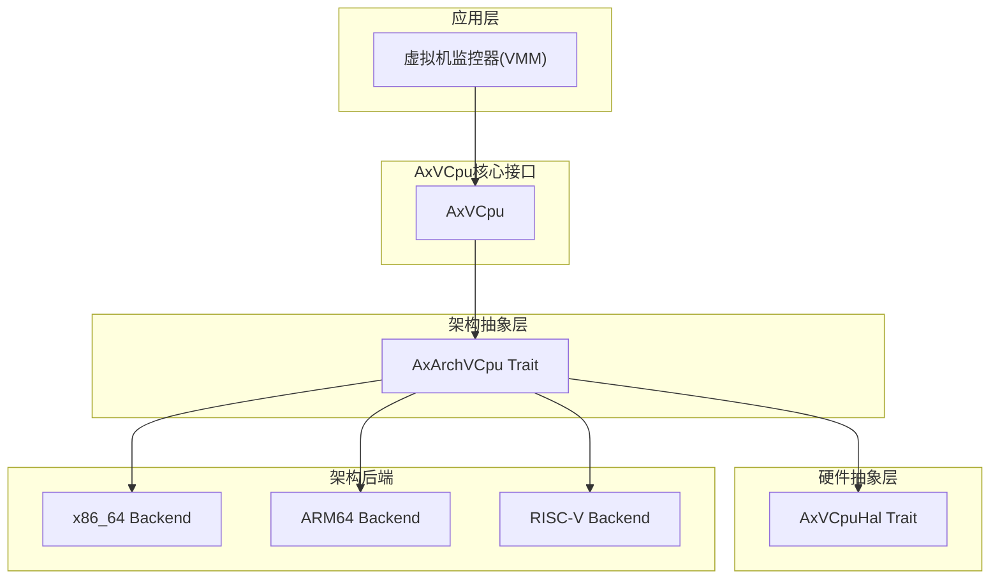
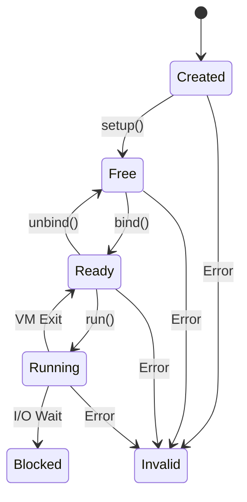
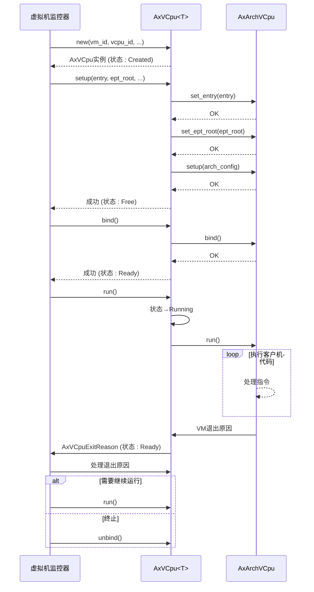

# AxVCpu结构体

<cite>
**Referenced Files in This Document**   
- [vcpu.rs](file://src/vcpu.rs)
- [arch_vcpu.rs](file://src/arch_vcpu.rs)
- [exit.rs](file://src/exit.rs)
- [lib.rs](file://src/lib.rs)
</cite>

## 目录
1. [简介](#简介)
2. [核心组件](#核心组件)
3. [API参考文档](#api参考文档)
4. [状态机与生命周期](#状态机与生命周期)
5. [典型调用流程](#典型调用流程)

## 简介

AxVCpu是一个为ArceOS虚拟机监控器（Hypervisor）设计的虚拟CPU抽象库，提供统一且架构无关的接口来管理虚拟化环境中的虚拟CPU。该库采用分层架构设计，将架构特定的操作与通用功能分离，支持x86_64、ARM64和RISC-V等多种架构。

本API参考文档详细描述了`AxVCpu<T>`结构体的核心方法及其使用方式，包括创建、配置、绑定和运行虚拟CPU的完整生命周期管理。通过清晰的状态转换机制和硬件抽象层，开发者可以安全高效地实现跨平台的虚拟化解决方案。

**Section sources**
- [README.md](file://README.md#L0-L167)

## 核心组件

AxVCpu库由多个关键模块组成，共同构建了一个完整的虚拟CPU管理系统：

- **`AxArchVCpu` trait**：定义了架构特定的虚拟CPU实现接口，允许不同架构（如x86_64、ARM64）提供底层操作。
- **`AxVCpuExitReason` enum**：枚举所有可能的VM退出原因，用于处理从客户机返回到监控器的各种事件。
- **`AxVCpuHal` trait**：硬件抽象层接口，封装了与具体硬件交互的操作。
- **`VCpuState` enum**：表示虚拟CPU的执行状态，遵循严格的有限状态机模型。

这些组件协同工作，确保虚拟CPU在不同架构上具有一致的行为模式和可靠的生命周期管理。



**Diagram sources**
- [lib.rs](file://src/lib.rs#L0-L34)

**Section sources**
- [lib.rs](file://src/lib.rs#L0-L34)
- [arch_vcpu.rs](file://src/arch_vcpu.rs#L0-L79)

## API参考文档

### new() - 创建虚拟CPU实例

#### 函数签名
```rust
pub fn new(
    vm_id: VMId,
    vcpu_id: VCpuId,
    favor_phys_cpu: usize,
    phys_cpu_set: Option<usize>,
    arch_config: A::CreateConfig,
) -> AxResult<Self>
```

#### 参数说明
- **vm_id**: 所属虚拟机的唯一标识符
- **vcpu_id**: 虚拟CPU在虚拟机内的唯一标识符
- **favor_phys_cpu**: 优先运行此虚拟CPU的物理CPU ID，用于CPU亲和性优化
- **phys_cpu_set**: 可选的物理CPU位掩码，指定允许运行该虚拟CPU的物理CPU集合；若为`None`，则可在任意可用物理CPU上运行
- **arch_config**: 架构特定的创建配置参数，类型为`A::CreateConfig`

#### 返回值解释
成功时返回`Ok(AxVCpu)`，失败时返回`AxResult`错误。创建后虚拟CPU处于`Created`状态。

#### 错误类型
- 架构特定的初始化失败
- 资源分配失败

#### 使用示例
```rust
let vcpu = AxVCpu::<MyArchVCpu>::new(
    vm_id,           // VM标识符
    vcpu_id,         // VCpu标识符  
    favor_cpu,       // 偏好物理CPU
    cpu_set,         // CPU亲和性掩码
    config           // 架构特定配置
)?;
```

**Section sources**
- [vcpu.rs](file://src/vcpu.rs#L100-L130)

### setup() - 配置虚拟CPU

#### 函数签名
```rust
pub fn setup(
    &self,
    entry: GuestPhysAddr,
    ept_root: HostPhysAddr,
    arch_config: A::SetupConfig,
) -> AxResult
```

#### 参数说明
- **entry**: 客户机物理地址，作为虚拟CPU执行的入口点
- **ept_root**: 主机物理地址，指向扩展页表（EPT）根目录，用于内存虚拟化
- **arch_config**: 架构特定的设置配置参数，类型为`A::SetupConfig`

#### 执行语义
此方法完成虚拟CPU的最终初始化并准备执行。它会：
1. 设置客户机入口地址
2. 配置内存虚拟化（EPT根）
3. 执行任何必要的架构特定设置
4. 将状态从`Created`转换为`Free`

#### 错误类型
- 状态非法（当前状态不是`Created`）
- 架构特定的配置失败

**Section sources**
- [vcpu.rs](file://src/vcpu.rs#L132-L145)

### bind() - 绑定虚拟CPU

#### 函数签名
```rust
pub fn bind(&self) -> AxResult
```

#### 执行语义
将虚拟CPU绑定到当前物理CPU进行执行。此方法执行以下操作：
- 执行架构特定的初始化以准备在当前物理CPU上执行
- 将状态从`Free`转换为`Ready`
- 确保后续操作可以在正确的上下文中进行

#### CPU绑定机制
通过内部的`manipulate_arch_vcpu`方法，在状态转换的同时设置当前虚拟CPU上下文，保证线程安全性。

#### 错误类型
- 状态非法（当前状态不是`Free`）
- 物理CPU资源不可用

**Section sources**
- [vcpu.rs](file://src/vcpu.rs#L248-L253)

### run() - 运行虚拟CPU

#### 函数签名
```rust
pub fn run(&self) -> AxResult<AxVCpuExitReason>
```

#### 执行语义
触发底层架构实现的虚拟CPU运行，直到发生VM退出事件。调用过程如下：
1. 状态从`Ready`转换为`Running`
2. 调用底层`AxArchVCpu::run()`方法执行客户机代码
3. 当VM退出发生时，状态从`Running`转回`Ready`
4. 返回`AxVCpuExitReason`描述退出原因

#### 状态变化
```
调用前: Ready
执行中: Running  
退出后: Ready (或 Blocked)
```

#### 返回值解释
返回`AxResult<AxVCpuExitReason>`，其中`AxVCpuExitReason`枚举包含详细的退出原因。

#### 不安全操作
无直接不安全操作，但依赖于底层架构实现的安全性。

**Section sources**
- [vcpu.rs](file://src/vcpu.rs#L242-L246)

## 状态机与生命周期

### 虚拟CPU状态机



#### 状态定义
- **Created**: 创建后的初始状态，尚未初始化
- **Free**: 已初始化，可绑定到物理CPU
- **Ready**: 已绑定到物理CPU，准备执行
- **Running**: 正在物理CPU上执行
- **Blocked**: 执行被阻塞（等待I/O等）
- **Invalid**: 错误状态，状态转换失败

#### 生命周期约束
- 状态转换必须按严格顺序进行
- 每个状态转换都受`with_state_transition`保护
- 错误会导致进入`Invalid`状态

**Diagram sources**
- [README.md](file://README.md#L35-L50)

**Section sources**
- [vcpu.rs](file://src/vcpu.rs#L40-L65)
- [README.md](file://README.md#L35-L50)

## 典型调用流程



**Diagram sources**
- [vcpu.rs](file://src/vcpu.rs#L100-L253)
- [arch_vcpu.rs](file://src/arch_vcpu.rs#L0-L79)

**Section sources**
- [vcpu.rs](file://src/vcpu.rs#L100-L253)
- [README.md](file://README.md#L100-L167)