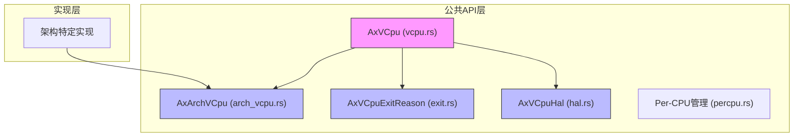
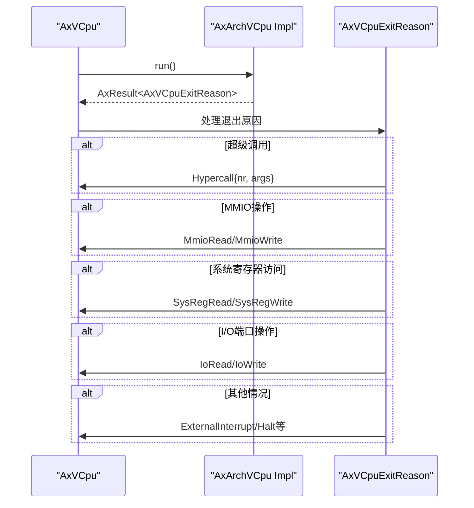
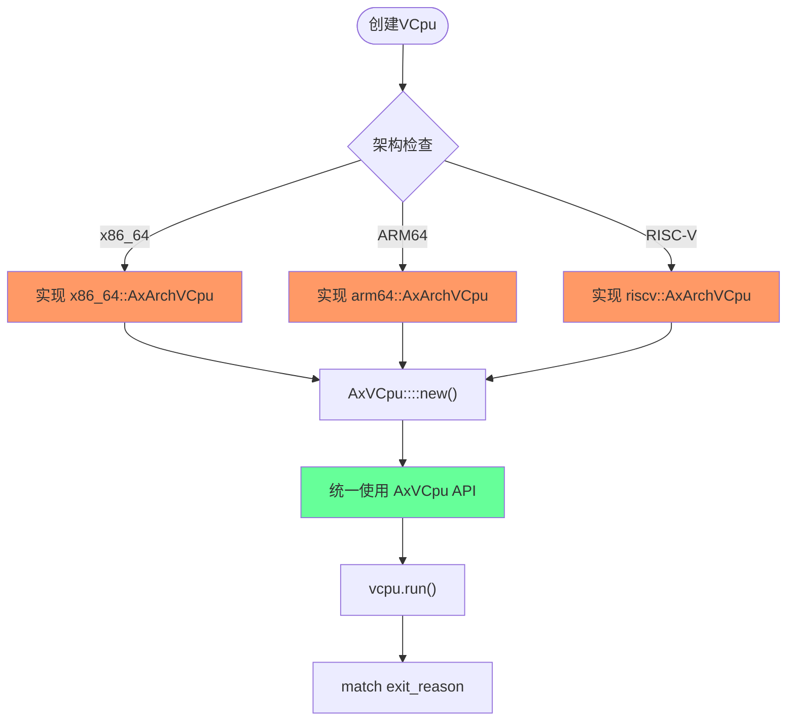
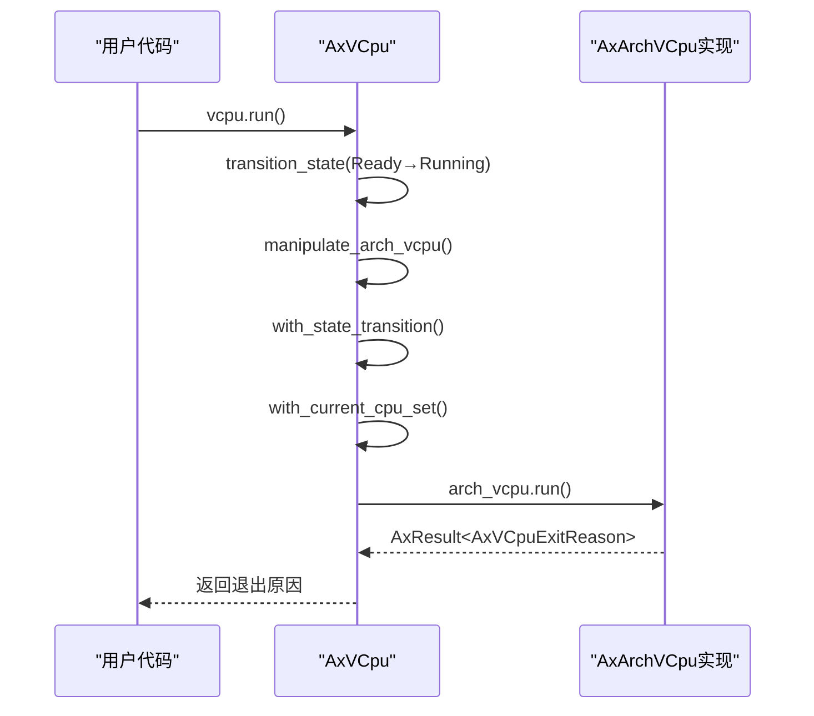
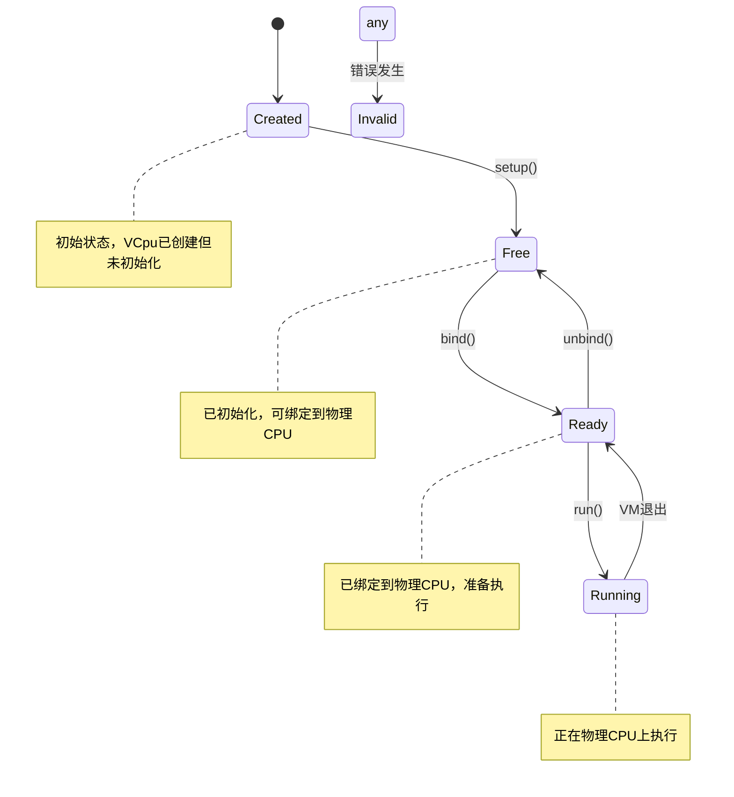

# 内部模块依赖

<cite>
**Referenced Files in This Document**  
- [lib.rs](file://src/lib.rs)
- [vcpu.rs](file://src/vcpu.rs)
- [arch_vcpu.rs](file://src/arch_vcpu.rs)
- [exit.rs](file://src/exit.rs)
</cite>

## 目录
1. [模块架构概览](#模块架构概览)
2. [核心模块依赖关系](#核心模块依赖关系)
3. [分层设计原理](#分层设计原理)
4. [数据流与调用链路](#数据流与调用链路)
5. [组件引用网络组织原则](#组件引用网络组织原则)

## 模块架构概览

AxVCpu 库采用分层架构设计，通过 `mod` 关键字在 `lib.rs` 中引入多个核心模块，并使用 `pub use` 重新导出关键类型以形成统一的公共 API。这种设计实现了架构无关的核心逻辑与架构特定实现之间的清晰分离。



**Diagram sources**
- [lib.rs](file://src/lib.rs#L1-L34)
- [vcpu.rs](file://src/vcpu.rs#L1-L349)

**Section sources**
- [lib.rs](file://src/lib.rs#L1-L34)

## 核心模块依赖关系

### vcpu模块对arch_vcpu模块的依赖

`vcpu.rs` 模块通过泛型参数 `A: AxArchVCpu` 依赖于 `arch_vcpu.rs` 中定义的 `AxArchVCpu` trait，实现了架构抽象机制。这种设计允许 `AxVCpu` 结构体在不关心具体架构细节的情况下，通过 trait 对象调用底层架构特定的操作。

```mermaid
classDiagram
class AxVCpu {
+inner_const : AxVCpuInnerConst
+inner_mut : RefCell<AxVCpuInnerMut>
+arch_vcpu : UnsafeCell<A>
+new() : AxResult<Self>
+setup() : AxResult
+run() : AxResult<AxVCpuExitReason>
+bind() : AxResult
+unbind() : AxResult
}
class AxArchVCpu {
<<trait>>
+new() : AxResult<Self>
+set_entry() : AxResult
+set_ept_root() : AxResult
+setup() : AxResult
+run() : AxResult<AxVCpuExitReason>
+bind() : AxResult
+unbind() : AxResult
}
AxVCpu --> AxArchVCpu : "泛型约束<br/>A : AxArchVCpu"
```

**Diagram sources**
- [vcpu.rs](file://src/vcpu.rs#L1-L349)
- [arch_vcpu.rs](file://src/arch_vcpu.rs#L1-L80)

**Section sources**
- [vcpu.rs](file://src/vcpu.rs#L1-L349)
- [arch_vcpu.rs](file://src/arch_vcpu.rs#L1-L80)

### vcpu模块对exit模块的依赖

`vcpu.rs` 模块直接依赖 `exit.rs` 中定义的 `AxVCpuExitReason` 枚举类型来处理虚拟机退出状态。当执行 `run()` 方法时，控制权最终会转移到架构特定的实现，而返回值则通过这个枚举类型传达各种可能的退出原因。



**Diagram sources**
- [vcpu.rs](file://src/vcpu.rs#L1-L349)
- [exit.rs](file://src/exit.rs#L1-L260)

**Section sources**
- [vcpu.rs](file://src/vcpu.rs#L1-L349)
- [exit.rs](file://src/exit.rs#L1-L260)

## 分层设计原理

AxVCpu 的分层设计通过将关注点分离为不同的模块，有效解耦了核心逻辑与架构细节，提升了系统的可扩展性。

### 解耦核心逻辑与架构细节

`vcpu.rs` 实现了与架构无关的虚拟 CPU 核心功能，包括：
- VCpu 生命周期状态管理（Created → Free → Ready → Running）
- CPU 亲和性配置
- 统一的执行控制接口

而具体的架构相关操作则委托给 `AxArchVCpu` trait 的实现者完成，如：
- 设置客户机入口点
- 配置扩展页表（EPT）根
- 执行底层虚拟化指令

这种设计使得新增架构支持只需实现 `AxArchVCpu` trait，无需修改核心逻辑代码。

### 提升可扩展性的机制

通过泛型和 trait 对象的组合使用，AxVCpu 实现了高度可扩展的设计：



**Diagram sources**
- [vcpu.rs](file://src/vcpu.rs#L1-L349)
- [arch_vcpu.rs](file://src/arch_vcpu.rs#L1-L80)

**Section sources**
- [vcpu.rs](file://src/vcpu.rs#L1-L349)
- [arch_vcpu.rs](file://src/arch_vcpu.rs#L1-L80)

## 数据流与调用链路

### 主要调用链路分析

从 `AxVCpu` 的 `run()` 方法到实际执行的完整调用链路如下：



**Diagram sources**
- [vcpu.rs](file://src/vcpu.rs#L1-L349)

**Section sources**
- [vcpu.rs](file://src/vcpu.rs#L1-L349)

### 状态转换数据流

VCpu 的状态机转换遵循严格的规则，确保状态一致性：



**Diagram sources**
- [vcpu.rs](file://src/vcpu.rs#L1-L349)

**Section sources**
- [vcpu.rs](file://src/vcpu.rs#L1-L349)

## 组件引用网络组织原则

AxVCpu 的组件引用网络遵循以下组织原则：

### 单向依赖原则

所有依赖关系都是单向的，避免循环依赖：
- `lib.rs` → `vcpu.rs`, `arch_vcpu.rs`, `exit.rs`
- `vcpu.rs` → `arch_vcpu.rs`, `exit.rs`
- `arch_vcpu.rs` → `exit.rs`

### 公共API聚合原则

`lib.rs` 作为门面模式（Facade Pattern）的实现，集中导出所有公共类型，为使用者提供统一的导入接口：

```rust
pub use arch_vcpu::AxArchVCpu;
pub use exit::AxVCpuExitReason; 
pub use hal::AxVCpuHal;
pub use percpu::*;
pub use vcpu::*;
```

### 内部可变性管理原则

对于需要在共享引用下修改状态的场景，采用适当的内部可变性机制：
- 使用 `RefCell` 管理 `AxVCpuInnerMut` 的可变状态
- 使用 `UnsafeCell` 管理 `arch_vcpu` 字段，因为 `RefCell` 在控制权转移给客户机时无法正确释放

这些组织原则共同构成了一个清晰、可维护且易于扩展的模块化系统架构。