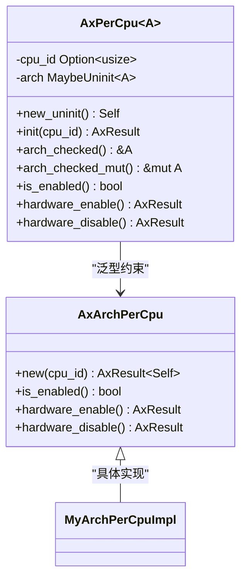

# 外部依赖

<cite>
**Referenced Files in This Document**   
- [Cargo.toml](file://Cargo.toml)
- [percpu.rs](file://src/percpu.rs)
- [arch_vcpu.rs](file://src/arch_vcpu.rs)
- [vcpu.rs](file://src/vcpu.rs)
- [exit.rs](file://src/exit.rs)
</cite>

## 表格目录
1. [外部依赖概览](#外部依赖概览)
2. [版本约束策略分析](#版本约束策略分析)
3. [各依赖功能与技术价值](#各依赖功能与技术价值)
4. [升级建议与兼容性风险](#升级建议与兼容性风险)

## 外部依赖概览

根据 `Cargo.toml` 文件中的配置，`axvcpu` 项目依赖以下五个外部 crate：

```toml
[dependencies]
axerrno = "0.1.0"
memory_addr = "0.4"
percpu = "0.2.0"
axaddrspace = "=0.1.0"
axvisor_api = "=0.1.0"
```

这些依赖在虚拟化环境中扮演着关键角色，共同支撑了虚拟 CPU 的抽象、状态管理、地址转换和错误处理等核心功能。

**Section sources**
- [Cargo.toml](file://Cargo.toml)

## 版本约束策略分析

### 版本号语义说明

| 版本格式 | 示例 | 含义 |
|--------|------|------|
| `x.y.z` | `0.1.0` | 允许补丁版本更新（z），保持主版本和次版本不变 |
| `=x.y.z` | `=0.1.0` | 精确匹配指定版本，禁止任何自动更新 |

### 构建可重现性保障

通过使用精确版本锁定（`=0.1.0`）对 `axaddrspace` 和 `axvisor_api` 进行约束，确保了构建的完全可重现性。这种策略特别适用于：

- **接口稳定性要求高的组件**：如与 VMM 通信的 API 层
- **底层地址空间管理模块**：避免因内存映射逻辑变更导致的安全隐患
- **跨团队协作场景**：保证所有开发者和 CI/CD 系统使用完全一致的依赖版本

相比之下，`axerrno` 虽然也指定了 `0.1.0` 版本，但未使用等号锁定，允许补丁版本更新，在保持稳定性的同时能获取必要的错误修复。

**Section sources**
- [Cargo.toml](file://Cargo.toml)

## 各依赖功能与技术价值

### axerrno：统一错误码处理

`axerrno` 提供了标准化的错误类型系统，用于在整个虚拟化栈中传递和处理错误信息。其主要作用包括：

- 定义统一的 `AxError` 枚举类型，涵盖常见虚拟化操作错误
- 提供 `AxResult<T>` 类型别名简化错误传播
- 支持上下文信息附加，便于调试复杂状态转换问题

该依赖被广泛应用于各个模块的状态转换和资源初始化过程中，确保错误处理的一致性和可追溯性。

**Section sources**
- [percpu.rs](file://src/percpu.rs#L0-L18)
- [arch_vcpu.rs](file://src/arch_vcpu.rs#L0-L30)

### memory_addr：物理地址安全表示

`memory_addr` crate 提供了类型安全的物理地址封装，防止常见的地址操作错误。其技术价值体现在：

- 使用 `GuestPhysAddr` 和 `HostPhysAddr` 区分客户机与宿主机物理地址
- 防止直接进行原始指针运算，减少内存安全漏洞
- 提供地址对齐检查和范围验证辅助方法

此依赖对于实现安全的地址转换机制至关重要，特别是在处理 EPT（扩展页表）根地址时。

**Section sources**
- [arch_vcpu.rs](file://src/arch_vcpu.rs#L0-L30)
- [vcpu.rs](file://src/vcpu.rs#L0-L24)

### percpu：每CPU变量管理

`percpu` 支持高效的每 CPU 变量管理，为多核虚拟化环境提供关键基础设施。其核心功能包括：

- 通过 `#[percpu::def_percpu]` 宏定义静态每 CPU 数据结构
- 实现 `AxPerCpu<A: AxArchPerCpu>` 结构体管理架构特定的虚拟化状态
- 提供硬件虚拟化启用/禁用控制接口

该依赖使得每个物理 CPU 可以独立维护自己的虚拟化上下文，支持并发执行多个 vCPU 实例。



**Diagram sources**
- [percpu.rs](file://src/percpu.rs#L0-L64)

**Section sources**
- [percpu.rs](file://src/percpu.rs#L0-L64)

### axaddrspace：虚拟机地址空间控制

`axaddrspace` 负责管理虚拟机的地址空间布局和转换机制。其主要职责包括：

- 定义 `GuestPhysAddr` 和 `HostPhysAddr` 类型用于地址转换
- 提供内存区域映射和权限控制接口
- 实现嵌套页表（如 Intel EPT 或 AMD NPT）的支持

该依赖是实现客户机内存隔离和高效地址翻译的基础，直接影响虚拟机性能和安全性。

**Section sources**
- [arch_vcpu.rs](file://src/arch_vcpu.rs#L0-L30)
- [vcpu.rs](file://src/vcpu.rs#L0-L24)

### axvisor_api：与VMM的交互接口

`axvisor_api` 定义了 hypervisor 与虚拟机监控器（VMM）之间的标准通信接口。其关键作用包括：

- 声明 `VMId` 和 `VCpuId` 类型标识虚拟机和虚拟 CPU
- 规范化跨组件的数据交换格式
- 提供事件通知和状态查询的标准方法

作为系统集成的关键粘合层，它确保了不同模块之间能够以一致的方式协同工作。

**Section sources**
- [arch_vcpu.rs](file://src/arch_vcpu.rs#L0-L30)
- [vcpu.rs](file://src/vcpu.rs#L0-L24)

## 升级建议与兼容性风险

### 升级策略建议

| 依赖名称 | 推荐升级策略 | 理由 |
|---------|-------------|------|
| axerrno | 允许补丁版本更新 | 错误处理属于稳定接口，补丁更新通常只包含 bug 修复 |
| memory_addr | 小版本内更新 | 地址表示可能涉及底层优化，需测试兼容性 |
| percpu | 严格测试后手动升级 | 涉及线程本地存储和 CPU 绑定，变更影响大 |
| axaddrspace | 精确版本锁定 | 直接影响内存安全，必须保证二进制兼容 |
| axvisor_api | 精确版本锁定 | 接口契约敏感，变更可能导致通信失败 |

### 潜在兼容性风险

#### API 变更风险
当上游依赖发布新版本时，可能出现：
- 函数签名改变导致编译失败
- 枚举成员增减破坏模式匹配
- Trait 方法默认实现变更影响行为一致性

#### 生命周期不一致问题
由于 `axaddrspace` 和 `axvisor_api` 被精确锁定版本，而其他依赖允许一定程度的更新，可能导致：
- 不同子系统间传递的地址类型版本不一致
- 错误码定义与实际抛出的异常不匹配
- 每 CPU 状态初始化顺序与内存管理模块不协调

#### 编译目标兼容性
部分依赖可能引入新的 `no_std` 兼容性要求或改变最小 Rust 版本需求，需要同步更新项目的 `edition = "2024"` 设置。

建议建立定期审查机制，评估锁定依赖的新版本是否提供了必要的功能改进或安全修复，并在受控环境中进行全面测试后再决定是否升级。