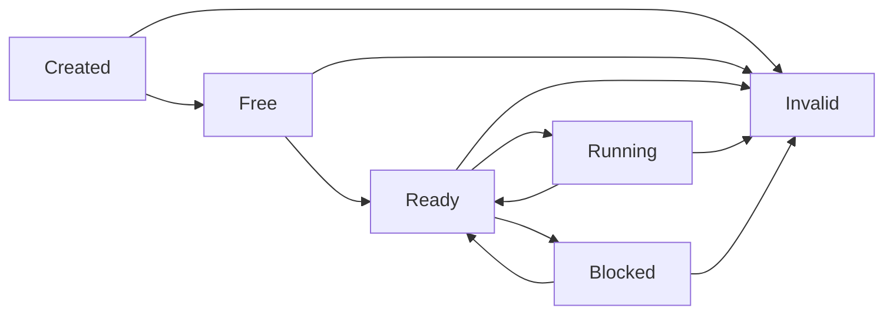

<cite>
**本文档中引用的文件**
- [Cargo.toml](file://Cargo.toml)
- [lib.rs](file://src/lib.rs)
- [vcpu.rs](file://src/vcpu.rs)
- [exit.rs](file://src/exit.rs)
- [test.rs](file://src/test.rs)
- [README.md](file://README.md)
</cite>

# 快速入门

## 目录
1. [依赖项配置](#依赖项配置)
2. [基础使用示例](#基础使用示例)
3. [VCPU状态机详解](#vcpu状态机详解)
4. [VM退出事件处理](#vm退出事件处理)
5. [错误处理与常见陷阱](#错误处理与常见陷阱)
6. [安装验证](#安装验证)

## 依赖项配置

要在Rust项目中集成`axvcpu`，首先需要在`Cargo.toml`文件中添加相应的依赖项。根据仓库的`Cargo.toml`文件，`axvcpu`的版本为`0.1.0`。

```toml
[dependencies]
axvcpu = "0.1.0"
```

此依赖项将提供创建和管理虚拟CPU（VCPU）所需的核心功能，包括架构无关的接口、状态管理和硬件抽象层。

**Section sources**
- [Cargo.toml](file://Cargo.toml#L1-L18)

## 基础使用示例

以下是一个完整的、可运行的基础使用示例，展示了从创建VCPU实例到执行的完整流程。该示例基于`test.rs`中的测试用例，并遵循`README.md`中的快速入门指南。

```rust
use axvcpu::{AxVCpu, VCpuState};
use axaddrspace::{GuestPhysAddr, HostPhysAddr};

// 假设已有一个实现了AxArchVCpu trait的架构特定VCPU实现
struct MyArchVCpu;
impl AxArchVCpu for MyArchVCpu {
    type CreateConfig = ();
    type SetupConfig = ();

    fn new(_vm_id: VMId, _vcpu_id: VCpuId, _config: Self::CreateConfig) -> AxResult<Self> {
        Ok(Self)
    }

    // ... 实现其他必需的方法
}

fn main() -> AxResult<()> {
    // 1. 创建新的虚拟CPU实例
    let vm_id = 1;           // 虚拟机唯一标识符
    let vcpu_id = 0;         // VCPU在虚拟机内的唯一标识符
    let favor_cpu = 0;       // 优先运行此VCPU的物理CPU ID
    let cpu_set = None;      // 允许运行此VCPU的物理CPU位掩码 (None表示无限制)
    let config = ();         // 架构特定的创建配置

    let vcpu = AxVCpu::<MyArchVCpu>::new(vm_id, vcpu_id, favor_cpu, cpu_set, config)?;

    // 2. 验证初始状态
    assert_eq!(vcpu.state(), VCpuState::Created);

    // 3. 设置VCPU
    let entry_addr = GuestPhysAddr::from(0x1000); // 客户机入口地址
    let ept_root = HostPhysAddr::from(0x2000);    // EPT根页表地址
    let setup_config = ();                        // 架构特定的设置配置

    vcpu.setup(entry_addr, ept_root, setup_config)?;

    // 4. 绑定到当前物理CPU
    vcpu.bind()?;

    // 5. 执行VCPU
    let exit_reason = vcpu.run()?;

    // 6. 处理VM退出事件
    match exit_reason {
        AxVCpuExitReason::Halt => println!("客户机已停止"),
        // ... 处理其他退出原因
        _ => {}
    }

    Ok(())
}
```

### 参数含义详解

- **`vm_id`**: `VMId`类型，表示此VCPU所属虚拟机的唯一标识符。
- **`vcpu_id`**: `VCpuId`类型，表示在此虚拟机内VCPU的唯一标识符。ID为0的VCPU通常被视为引导处理器（BSP）。
- **`favor_cpu`**: `usize`类型，表示有优先权运行此VCPU的物理CPU ID。这用于CPU亲和性优化，但目前在实现中未被强制执行。
- **`cpu_set`**: `Option<usize>`类型，一个位掩码，指定了可以运行此VCPU的物理CPU集合。如果为`None`，则VCPU可以在任何可用的物理CPU上运行。
- **`entry`**: `GuestPhysAddr`类型，指定客户机操作系统开始执行的物理内存地址。
- **`ept_root`**: `HostPhysAddr`类型，指向扩展页表（EPT）的根页表地址，用于内存虚拟化。

**Section sources**
- [test.rs](file://src/test.rs#L0-L452)
- [README.md](file://README.md#L117-L149)
- [vcpu.rs](file://src/vcpu.rs#L100-L138)

## VCPU状态机详解

`axvcpu`库通过一个严格的状态机来管理VCPU的生命周期。理解这个状态机对于正确使用API至关重要。



**Diagram sources**
- [vcpu.rs](file://src/vcpu.rs#L45-L64)
- [README.md](file://README.md#L35-L50)

### 状态说明

- **`Created`**: 在调用`AxVCpu::new`后VCPU的初始状态。此时VCPU尚未初始化。
- **`Free`**: 在成功调用`setup`方法后进入此状态。VCPU已初始化，准备好绑定到物理CPU。
- **`Ready`**: 在成功调用`bind`方法后进入此状态。VCPU已绑定到物理CPU，准备执行。
- **`Running`**: 在调用`run`方法后进入此状态。VCPU正在物理CPU上执行客户机代码。
- **`Blocked`**: 当VCPU执行被阻塞（例如等待I/O）时进入此状态。
- **`Invalid`**: 当状态转换失败或发生错误时进入此状态。

所有状态转换都由`axvcpu`内部自动管理，用户不应直接修改状态。

## VM退出事件处理

当客户机VCPU执行时，各种条件会导致控制权返回给hypervisor，这被称为“VM退出”。`axvcpu`通过`AxVCpuExitReason`枚举来表示这些退出原因。

```mermaid
flowchart TD
Start([vcpu.run()]) --> Exit{VM Exit Reason}
Exit --> |Halt| Halt["打印: '客户机已停止'"]
Exit --> |MmioRead| MmioRead["模拟MMIO读取并注入数据"]
Exit --> |MmioWrite| MmioWrite["模拟MMIO写入并更新设备状态"]
Exit --> |SysRegRead| SysRegRead["读取系统寄存器值"]
Exit --> |SysRegWrite| SysRegWrite["写入系统寄存器值"]
Exit --> |IoRead| IoRead["从I/O端口读取数据"]
Exit --> |IoWrite| IoWrite["向I/O端口写入数据"]
Exit --> |ExternalInterrupt| ExternalInterrupt["注入中断到客户机"]
Exit --> |NestedPageFault| NestedPageFault["处理嵌套页错误"]
Exit --> |CpuUp| CpuUp["启动次级CPU核心"]
Exit --> |SystemDown| SystemDown["关闭虚拟机"]
Exit --> |Nothing| Nothing["检查设备状态后继续"]
Exit --> |FailEntry| FailEntry["记录错误并终止"]
Exit --> |SendIPI| SendIPI["发送处理器间中断"]
Halt --> Continue
MmioRead --> Continue
MmioWrite --> Continue
SysRegRead --> Continue
SysRegWrite --> Continue
IoRead --> Continue
IoWrite --> Continue
ExternalInterrupt --> Continue
NestedPageFault --> Continue
CpuUp --> Continue
SystemDown --> End
Nothing --> Continue
FailEntry --> End
SendIPI --> Continue
Continue([vcpu.run()])
End([程序结束])
```

**Diagram sources**
- [exit.rs](file://src/exit.rs#L15-L250)

### 关键退出原因

- **`Halt`**: 客户机执行了停机指令，处于空闲状态。
- **`MmioRead` / `MmioWrite`**: 客户机访问了内存映射I/O区域，需要hypervisor进行模拟。
- **`SysRegRead` / `SysRegWrite`**: 客户机读取或写入了系统寄存器（如MSR、CSR）。
- **`IoRead` / `IoWrite`**: （仅x86）客户机执行了端口I/O操作。
- **`CpuUp`**: 请求启动一个次级CPU核心。
- **`SystemDown`**: 客户机请求系统关机。
- **`FailEntry`**: 进入客户机模式失败，通常是致命错误。

处理这些事件是hypervisor的主要职责，通常涉及模拟硬件行为或响应客户机请求。

**Section sources**
- [exit.rs](file://src/exit.rs#L15-L250)

## 错误处理与常见陷阱

### 错误处理模式

所有可能失败的操作都返回`AxResult<T>`类型。应使用`?`操作符或`match`语句进行处理：

```rust
match vcpu.setup(entry_addr, ept_root, setup_config) {
    Ok(()) => println!("VCPU设置成功"),
    Err(e) => eprintln!("VCPU设置失败: {}", e),
}
```

### 常见初始化陷阱

1.  **状态顺序错误**: 必须严格按照`Created → Free → Ready → Running`的顺序进行状态转换。跳过步骤（如在未调用`setup`的情况下调用`bind`）会返回`AxError::BadState`。
2.  **重复绑定**: 尝试对已处于`Ready`或`Running`状态的VCPU调用`bind`会失败。
3.  **无效参数**: 提供无效的`entry`地址或`ept_root`可能导致`setup`失败。
4.  **并发访问**: `AxVCpu`不是线程安全的，必须由调用者确保其安全性。

**Section sources**
- [vcpu.rs](file://src/vcpu.rs#L140-L348)
- [test.rs](file://src/test.rs#L350-L452)

## 安装验证

为了验证`axvcpu`是否已成功集成，可以在创建VCPU实例后立即添加一个简单的断言，检查其初始状态是否为`Created`：

```rust
let vcpu = AxVCpu::<MyArchVCpu>::new(...)?;
assert_eq!(vcpu.state(), VCpuState::Created);
```

此断言利用了`vcpu.rs`中定义的状态机逻辑，确保VCPU对象已正确初始化。如果此断言通过，则表明`axvcpu`库已被正确链接和加载。

**Section sources**
- [vcpu.rs](file://src/vcpu.rs#L200-L205)
- [test.rs](file://src/test.rs#L40-L45)