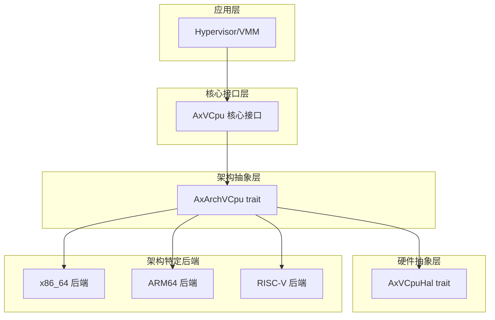
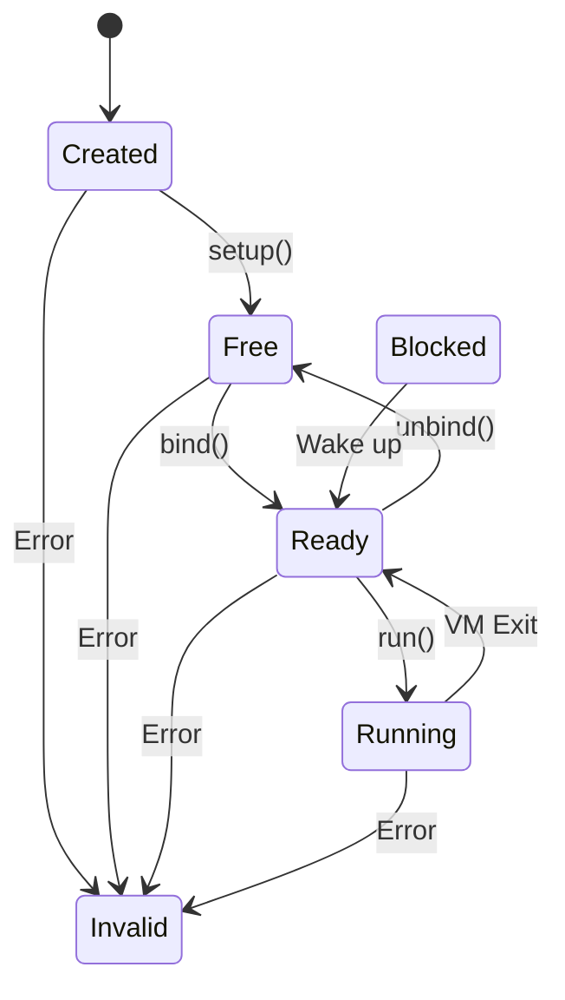
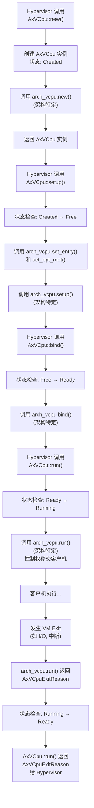

<cite>
**本文档中引用的文件**
- [lib.rs](file://src/lib.rs)
- [vcpu.rs](file://src/vcpu.rs)
- [arch_vcpu.rs](file://src/arch_vcpu.rs)
- [hal.rs](file://src/hal.rs)
- [exit.rs](file://src/exit.rs)
- [percpu.rs](file://src/percpu.rs)
</cite>

## 目录
1. [技术架构](#技术架构)
2. [分层架构设计](#分层架构设计)
3. [核心VCPU实现与状态机](#核心vcpu实现与状态机)
4. [内部可变性与线程安全](#内部可变性与线程安全)
5. [模块化设计与公共API](#模块化设计与公共api)
6. [组件依赖关系与数据流](#组件依赖关系与数据流)

## 技术架构

AxVCpu 是一个为 ArceOS 虚拟机监视器（Hypervisor）设计的虚拟 CPU 抽象库，提供了一个统一且与硬件架构无关的接口来管理虚拟环境中的虚拟 CPU。其核心设计理念是通过清晰的分层架构和 trait 对象机制，将通用的 VCPU 管理逻辑与特定于 x86_64、ARM64 等架构的底层实现解耦。

该库遵循严格的生命周期状态机模型，确保 VCPU 在创建、初始化、执行和终止过程中的状态转换安全可靠。通过 `RefCell` 和 `UnsafeCell` 等内部可变性原语，实现了在不可变引用 (`&self`) 上的安全状态修改，同时保证了单线程上下文下的运行时安全性。整个系统通过 `lib.rs` 中的模块导出机制实现了良好的模块化，使得上层应用（如 Hypervisor）可以方便地集成和使用。

**Section sources**
- [lib.rs](file://src/lib.rs#L1-L35)
- [README.md](file://README.md#L0-L167)

## 分层架构设计

AxVCpu 采用自顶向下的分层架构设计，每一层都有明确的职责边界，并通过定义良好的接口与下层交互。这种设计极大地增强了代码的可维护性和可扩展性，允许为新的硬件架构轻松添加后端支持。



**Diagram sources**
- [lib.rs](file://src/lib.rs#L1-L35)
- [arch_vcpu.rs](file://src/arch_vcpu.rs#L1-L80)
- [hal.rs](file://src/hal.rs#L1-L33)

### 应用层 (Hypervisor/VMM)
这是最顶层，由实际的虚拟机监视器或操作系统内核构成。它直接调用 AxVCpu 提供的公共 API 来创建、配置和运行虚拟 CPU 实例。这一层无需关心底层硬件的具体细节，只需与 `AxVCpu` 结构体进行交互。

### AxVCpu 核心接口层
位于 `vcpu.rs` 文件中的 `AxVCpu<A: AxArchVCpu>` 结构体是整个库的核心。它封装了所有与架构无关的 VCPU 功能，包括：
- **生命周期管理**：通过 `new()`、`setup()`、`run()` 等方法控制 VCPU 的创建、配置和执行。
- **状态管理**：维护一个严格的状态机，跟踪 VCPU 的当前状态（如 Created, Ready, Running）。
- **CPU 亲和性**：管理 VCPU 与物理 CPU 之间的绑定关系，优化调度性能。
- **通用操作**：提供设置寄存器、注入中断等通用功能。

该层不包含任何具体的硬件指令或虚拟化技术实现，而是将这些任务委托给下一层。

**Section sources**
- [vcpu.rs](file://src/vcpu.rs#L1-L349)

### 架构抽象层 (AxArchVCpu trait)
位于 `arch_vcpu.rs` 文件中的 `AxArchVCpu` trait 定义了所有架构特定操作的契约。它是连接核心接口层与具体后端的桥梁。该 trait 规定了后端必须实现的方法，例如：
- `new()`: 创建架构特定的 VCPU 实例。
- `set_entry()`: 设置客户机的入口地址。
- `set_ept_root()`: 配置内存虚拟化的页表根（如 x86 的 EPT 或 ARM 的 NPT）。
- `run()`: 执行客户机代码，直到发生 VM Exit。
- `bind()` / `unbind()`: 将 VCPU 绑定到当前物理 CPU 或解除绑定。

通过使用泛型参数 `<A: AxArchVCpu>`，`AxVCpu` 结构体可以在编译时持有对任何符合此 trait 的后端的引用，从而实现了多态性。

**Section sources**
- [arch_vcpu.rs](file://src/arch_vcpu.rs#L1-L80)

### 硬件抽象层 (AxVCpuHal trait)
位于 `hal.rs` 文件中的 `AxVCpuHal` trait 为底层软件（如宿主内核或 Hypervisor）提供了需要实现的接口。它主要用于处理与宿主系统相关的操作，例如：
- `irq_fetch()`: 获取当前的中断号。
- `irq_handler()`: 处理并分发中断请求到宿主操作系统。

这层确保了 AxVCpu 可以在不同的宿主环境中运行，只要宿主实现了这些必要的回调函数。

**Section sources**
- [hal.rs](file://src/hal.rs#L1-L33)

### 架构特定后端 (x86_64, ARM64 等)
这是最底层，包含了针对特定 CPU 架构（如 x86_64, ARM64, RISC-V）的实际实现。每个后端都提供一个结构体来实现 `AxArchVCpu` trait。例如，x86_64 后端会使用 VMX 指令（如 `vmread`, `vmwrite`, `vmlaunch`, `vmresume`）来管理虚拟机控制结构（VMCS），而 ARM64 后端则会使用 EL2 异常级别的相关指令。这些后端是真正与硬件交互的部分。

## 核心VCPU实现与状态机

`AxVCpu` 结构体的设计精巧地分离了不变配置和可变状态，并利用 Rust 的所有权和借用检查器来保障安全。

### 数据结构
`AxVCpu` 包含三个主要部分：
1.  **`inner_const: AxVCpuInnerConst`**: 存储 VCPU 的不变属性，如 `vm_id`、`vcpu_id` 和 CPU 亲和性设置。这部分在创建后永不改变。
2.  **`inner_mut: RefCell<AxVCpuInnerMut>`**: 包装了可变的运行时状态，主要是 `state` 字段。使用 `RefCell` 允许在 `&self` 上获得内部可变性，同时在运行时进行借用检查。
3.  **`arch_vcpu: UnsafeCell<A>`**: 持有架构特定的后端实例。使用 `UnsafeCell` 而非 `RefCell` 是因为当控制权转移给客户机（guest）时，`RefCell` 的借用标记无法被正确释放，可能导致运行时 panic。`UnsafeCell` 提供了更底层的、无运行时开销的可变性，但要求开发者自行保证安全。

### 状态机模式
VCPU 的生命周期由一个严格的状态机管理，定义在 `VCpuState` 枚举中：



**Diagram sources**
- [vcpu.rs](file://src/vcpu.rs#L1-L349)

状态转换规则如下：
- **Created**: VCPU 刚被创建，尚未初始化。
- **Free**: 通过 `setup()` 方法成功配置后进入此状态，表示已准备好绑定到物理 CPU。
- **Ready**: 通过 `bind()` 方法绑定到某个物理 CPU 后进入此状态，可以随时开始执行。
- **Running**: 调用 `run()` 方法后进入此状态，此时客户机正在执行。
- **Blocked**: 当 VCPU 因等待 I/O 等事件而暂停时进入此状态。
- **Invalid**: 当状态转换失败（如从错误的状态调用 `run()`）时进入此状态，表明 VCPU 已损坏。

关键方法 `manipulate_arch_vcpu()` 结合了 `with_state_transition()` 和 `with_current_cpu_set()`，确保在执行任何架构特定操作前，状态转换是合法的，并且当前 VCPU 上下文已被正确设置。

**Section sources**
- [vcpu.rs](file://src/vcpu.rs#L1-L349)

## 内部可变性与线程安全

AxVCpu 明智地运用了 Rust 的内部可变性概念来解决在不可变引用上修改状态的需求。

- **`RefCell` 的应用**: `inner_mut` 字段使用 `RefCell` 来包装 `AxVCpuInnerMut`。这使得 `state()` 和 `transition_state()` 等方法可以在 `&self` 上被调用，同时安全地修改内部状态。`RefCell` 在运行时检查借用规则，如果违反（如同时存在多个可变借用），则会导致 panic。这适用于 VCPU 状态这种需要频繁读写但通常在单线程上下文中访问的数据。

- **`UnsafeCell` 的必要性**: `arch_vcpu` 字段使用 `UnsafeCell`。这是因为当调用 `arch_vcpu.run()` 时，控制权会长时间交给客户机代码。在此期间，`RefCell` 的可变借用无法被“归还”，导致借用计数器一直处于高位。当下次尝试借用时，即使逻辑上是安全的，`RefCell` 也会因检测到冲突而 panic。`UnsafeCell` 绕过了这种运行时检查，允许直接获取 `&mut A`，但这也意味着开发者必须确保不会在同一时间从多个地方访问同一个 `arch_vcpu`，否则会产生未定义行为。

- **线程安全**: 文档明确指出 `AxVCpu` 本身不是线程安全的。它假设同一时间只有一个线程会操作一个特定的 VCPU 实例。线程安全的责任由调用者（即 Hypervisor 的调度器）来保证。

**Section sources**
- [vcpu.rs](file://src/vcpu.rs#L1-L349)

## 模块化设计与公共API

`lib.rs` 文件是整个 crate 的入口点，它通过精心设计的模块化结构和公共 API 导出来构建一个清晰的外部接口。

```rust
// Core modules
mod arch_vcpu;
mod exit;
mod hal;
mod percpu;
mod test;
mod vcpu;

// Public API exports
pub use arch_vcpu::AxArchVCpu;
pub use exit::AxVCpuExitReason;
pub use hal::AxVCpuHal;
pub use percpu::*;
pub use vcpu::*;
```

这种设计有几个优点：
1.  **关注点分离**: 每个 `.rs` 文件负责一个特定的功能领域，代码组织清晰。
2.  **最小化暴露**: 只有必要的类型和函数通过 `pub use` 被重新导出。例如，`AxVCpu` 结构体在 `vcpu` 模块中定义，但通过 `pub use vcpu::*;` 对外公开，使用者无需知道其具体位置。
3.  **易于使用**: 用户只需导入 `axvcpu` crate，即可访问所有核心功能，如 `AxVCpu`, `AxVCpuExitReason` 等。

**Section sources**
- [lib.rs](file://src/lib.rs#L1-L35)

## 组件依赖关系与数据流

以下图表展示了从 Hypervisor 调用 `AxVCpu::new()` 开始，到最终返回 `AxVCpuExitReason` 的完整数据流路径。



**Diagram sources**
- [vcpu.rs](file://src/vcpu.rs#L1-L349)
- [arch_vcpu.rs](file://src/arch_vcpu.rs#L1-L80)
- [exit.rs](file://src/exit.rs#L1-L260)

**Section sources**
- [vcpu.rs](file://src/vcpu.rs#L1-L349)
- [arch_vcpu.rs](file://src/arch_vcpu.rs#L1-L80)
- [exit.rs](file://src/exit.rs#L1-L260)