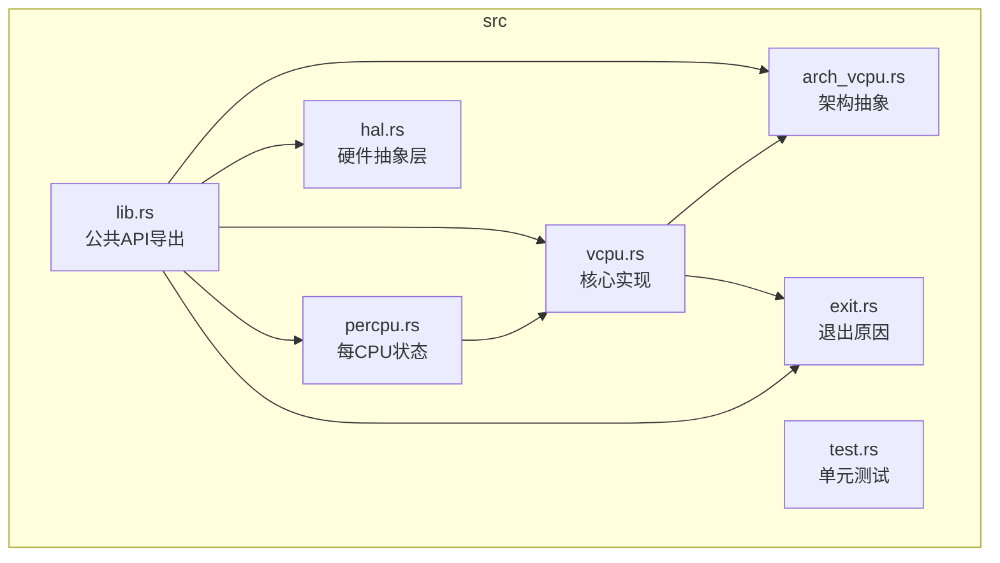
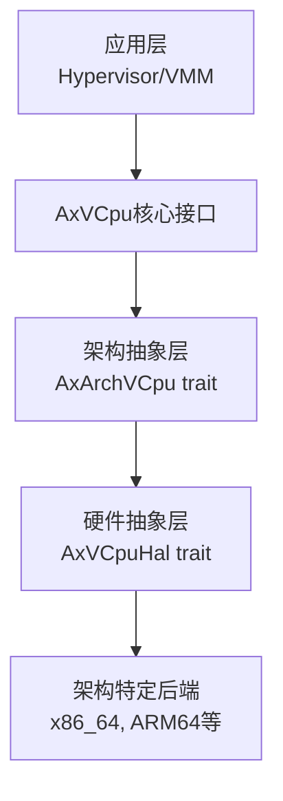
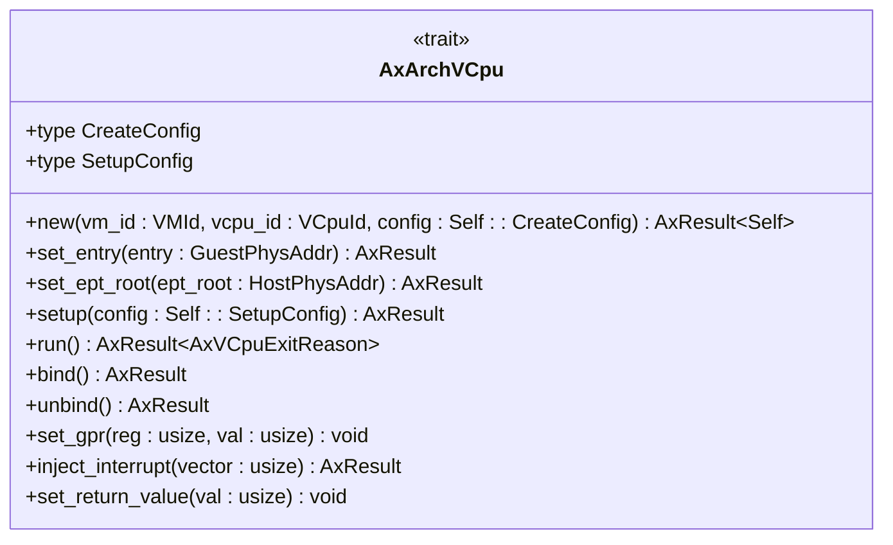
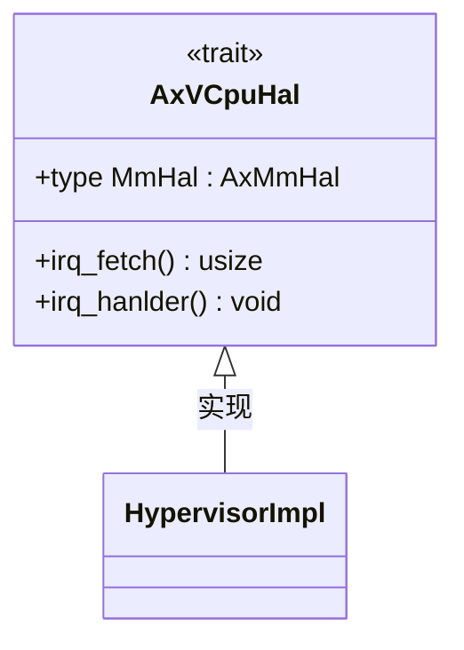
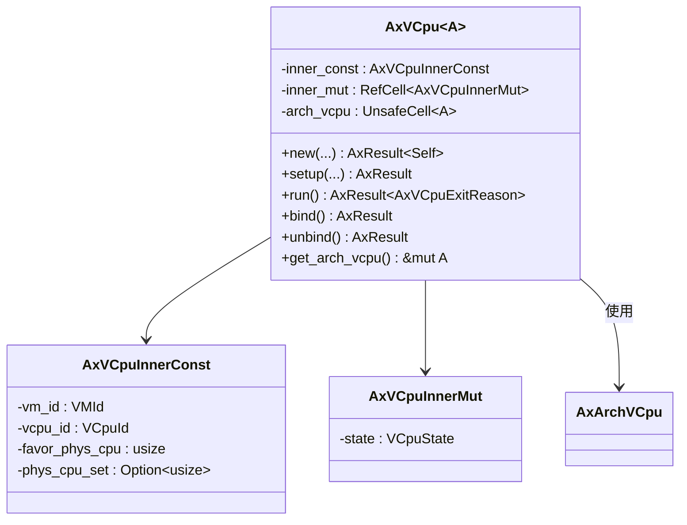
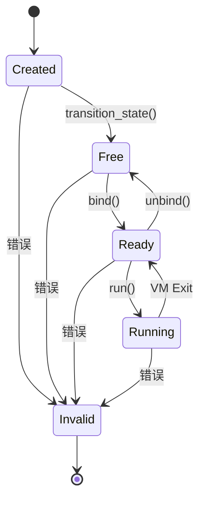
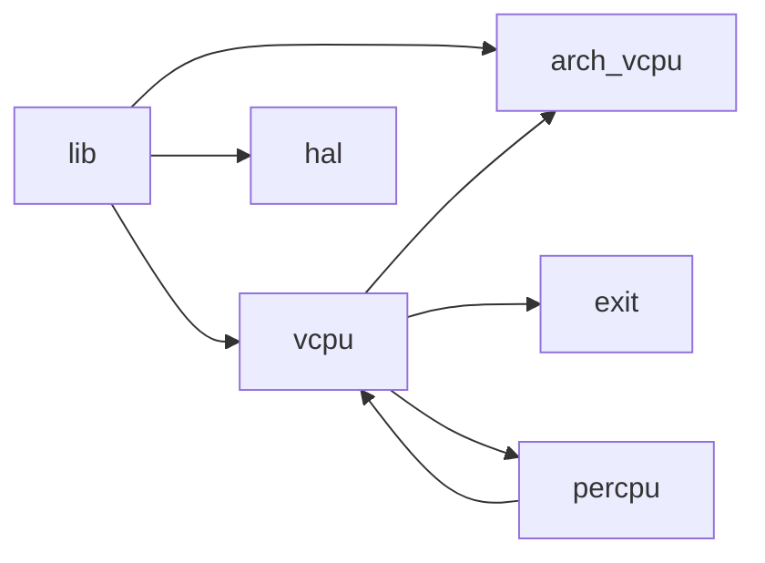

# 抽象层设计

<cite>
**本文档中引用的文件**
- [arch_vcpu.rs](file://src/arch_vcpu.rs)
- [hal.rs](file://src/hal.rs)
- [lib.rs](file://src/lib.rs)
- [vcpu.rs](file://src/vcpu.rs)
</cite>

## 目录
1. [简介](#简介)
2. [项目结构](#项目结构)
3. [核心组件](#核心组件)
4. [架构概述](#架构概述)
5. [详细组件分析](#详细组件分析)
6. [依赖分析](#依赖分析)
7. [性能考虑](#性能考虑)
8. [故障排除指南](#故障排除指南)
9. [结论](#结论)

## 简介
AxVCpu 是一个为 ArceOS 虚拟机监视器（Hypervisor）设计的虚拟 CPU 抽象库，提供统一且与架构无关的接口来管理虚拟化环境中的虚拟 CPU。该库通过 `AxArchVCpu` 和 `AxVCpuHal` 两个核心 trait 实现了清晰的职责分离：前者为不同硬件架构（如 x86_64、ARM64、RISC-V）提供统一的低级虚拟化原语，后者则定义了底层 VMM 必须实现的硬件抽象接口。本技术文档将深入解析这两个 trait 的设计哲学、契约规范及其在整体架构中的作用，并阐述 `AxVCpu` 结构体如何利用泛型和 `UnsafeCell` 实现编译时多态与安全的内部可变性。

## 项目结构
该项目采用模块化设计，各源文件职责分明，共同构建了一个分层的虚拟 CPU 管理系统。

**Diagram sources**
- [lib.rs](file://src/lib.rs#L0-L34)
- [arch_vcpu.rs](file://src/arch_vcpu.rs#L0-L79)
- [hal.rs](file://src/hal.rs#L0-L32)
- [vcpu.rs](file://src/vcpu.rs#L0-L348)

**Section sources**
- [lib.rs](file://src/lib.rs#L0-L34)
- [arch_vcpu.rs](file://src/arch_vcpu.rs#L0-L79)
- [hal.rs](file://src/hal.rs#L0-L32)
- [vcpu.rs](file://src/vcpu.rs#L0-L348)

## 核心组件
本节将重点分析 `AxArchVCpu` 和 `AxVCpuHal` 两个核心 trait 的设计与职责，以及 `AxVCpu` 结构体如何整合它们以提供统一的 API。

**Section sources**
- [arch_vcpu.rs](file://src/arch_vcpu.rs#L0-L79)
- [hal.rs](file://src/hal.rs#L0-L32)
- [vcpu.rs](file://src/vcpu.rs#L0-L348)

## 架构概述
AxVCpu 遵循分层架构设计，从上至下分别为应用层、核心接口、架构抽象层、硬件抽象层和架构特定后端。这种设计实现了关注点分离，使得上层逻辑无需关心底层硬件细节。

**Diagram sources**
- [README.md](file://README.md#L15-L32)

## 详细组件分析
### AxArchVCpu Trait 分析
`AxArchVCpu` trait 定义了所有架构必须实现的低级虚拟化操作，为上层提供了统一的接口。

#### 方法契约规范
该 trait 规定了严格的调用顺序和状态转换契约：
- **new**: 创建 VCpu 实例，返回 `AxResult<Self>`。
- **set_entry**: 设置客户机入口点，保证仅在 `setup` 前调用一次。
- **set_ept_root**: 设置扩展页表根地址，用于内存虚拟化。
- **setup**: 完成最终初始化，准备执行。
- **run**: 执行客户机代码直至发生 VM 退出，返回 `AxVCpuExitReason`。
- **bind/unbind**: 绑定/解绑物理 CPU，进行必要的上下文切换。
- **set_gpr/inject_interrupt/set_return_value**: 操作寄存器、注入中断和设置返回值。

**Diagram sources**
- [arch_vcpu.rs](file://src/arch_vcpu.rs#L0-L79)

**Section sources**
- [arch_vcpu.rs](file://src/arch_vcpu.rs#L0-L79)

### AxVCpuHal Trait 分析
`AxVCpuHal` trait 定义了底层软件（内核或 Hypervisor）必须提供的硬件抽象接口。

#### 与底层VMM的集成
该 trait 的主要作用是桥接虚拟化库与宿主操作系统：
- **MmHal**: 关联 `axaddrspace` crate 中的内存管理接口。
- **irq_fetch**: 获取当前硬件中断号。
- **irq_handler**: 处理中断请求，此方法必须由底层实现，否则会触发 `unimplemented!`。

**Diagram sources**
- [hal.rs](file://src/hal.rs#L0-L32)

**Section sources**
- [hal.rs](file://src/hal.rs#L0-L32)

### AxVCpu 结构体分析
`AxVCpu<A: AxArchVCpu>` 是架构无关的虚拟 CPU 主要实现，它封装了架构特定的实例并管理其生命周期。

#### 泛型参数与编译时多态
通过泛型参数 `A: AxArchVCpu`，`AxVCpu` 在编译时即可确定具体的架构实现，从而实现零成本抽象。所有对 `arch_vcpu` 的调用都会被静态分发，避免了运行时开销。

#### UnsafeCell 的必要性
`arch_vcpu` 字段使用 `UnsafeCell<A>` 而非 `RefCell<A>` 封装，这是因为在控制权转移至客户机代码期间，`RefCell` 的借用检查机制无法正常工作。`UnsafeCell` 允许在已知安全的情况下进行可变访问，避免了运行时崩溃。

**Diagram sources**
- [vcpu.rs](file://src/vcpu.rs#L57-L76)
- [vcpu.rs](file://src/vcpu.rs#L0-L24)

**Section sources**
- [vcpu.rs](file://src/vcpu.rs#L0-L348)

### VCpu 状态机
VCpu 遵循严格的状态机模型，确保了状态转换的安全性和正确性。

**Diagram sources**
- [vcpu.rs](file://src/vcpu.rs#L26-L55)
- [README.md](file://README.md#L34-L47)

**Section sources**
- [vcpu.rs](file://src/vcpu.rs#L26-L55)

## 依赖分析
`AxVCpu` 库的模块间依赖关系清晰，形成了一个稳定的调用链。

**Diagram sources**
- [lib.rs](file://src/lib.rs#L0-L34)
- [vcpu.rs](file://src/vcpu.rs#L0-L348)

**Section sources**
- [lib.rs](file://src/lib.rs#L0-L34)
- [vcpu.rs](file://src/vcpu.rs#L0-L348)

## 性能考虑
- **编译时多态**: 泛型设计消除了动态调度开销。
- **状态机优化**: 明确的状态转换减少了无效操作。
- **每CPU状态**: `percpu` 模块减少了跨CPU同步的开销。
- **UnsafeCell**: 避免了 `RefCell` 的运行时检查，提升了性能。

## 故障排除指南
- **状态转换失败**: 检查是否遵循了正确的调用顺序（Created → Free → Ready → Running）。
- **中断处理未实现**: 确保 `AxVCpuHal` 的 `irq_handler` 方法已被正确实现。
- **绑定失败**: 确认物理 CPU 支持硬件虚拟化并已启用。
- **嵌套操作 panic**: 避免在 `with_current_cpu_set` 的闭包中再次调用相关方法。

**Section sources**
- [vcpu.rs](file://src/vcpu.rs#L210-L250)
- [hal.rs](file://src/hal.rs#L0-L32)

## 结论
AxVCpu 通过精心设计的 `AxArchVCpu` 和 `AxVCpuHal` trait，成功地在不同硬件架构之上构建了一个统一、高效且安全的虚拟 CPU 抽象层。`AxVCpu` 结构体利用 Rust 的泛型和 `UnsafeCell` 特性，实现了编译时多态和安全的内部可变性，同时通过严格的状态机模型保证了系统的健壮性。其模块化的公共 API 导出机制（`lib.rs`）使得该库易于集成和使用，为构建高性能的虚拟化解决方案奠定了坚实的基础。