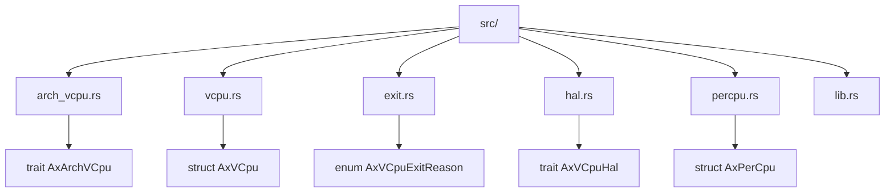
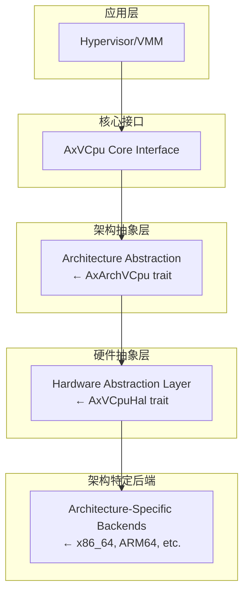
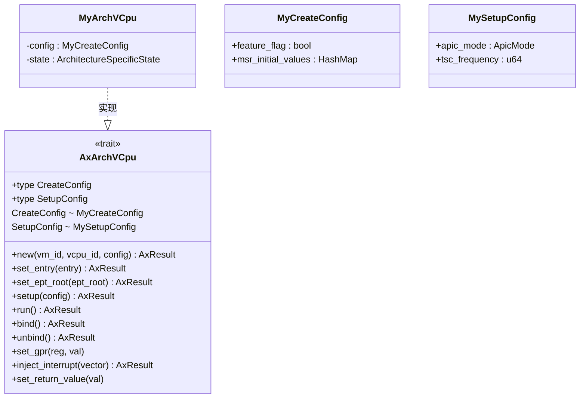
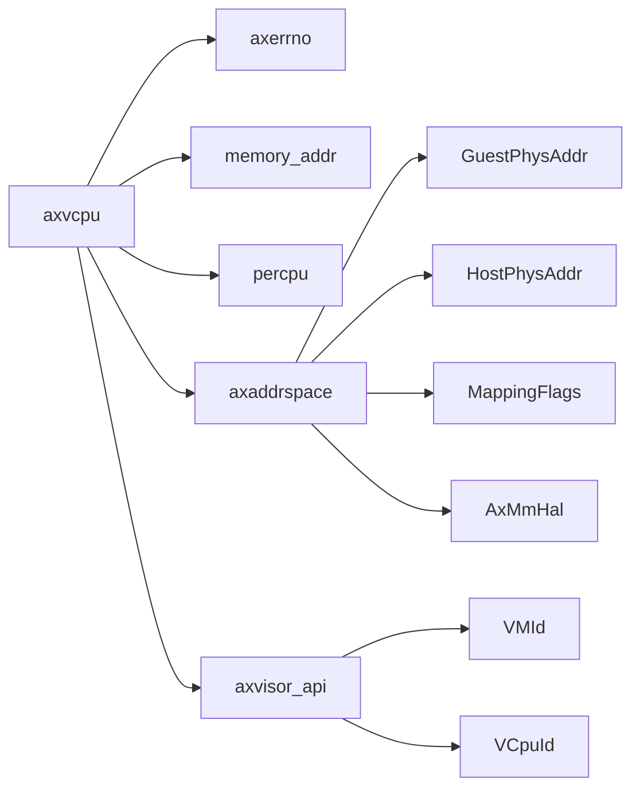

# 架构抽象层

<cite>
**本文档中引用的文件**
- [arch_vcpu.rs](file://src/arch_vcpu.rs)
- [vcpu.rs](file://src/vcpu.rs)
- [exit.rs](file://src/exit.rs)
- [lib.rs](file://src/lib.rs)
- [hal.rs](file://src/hal.rs)
</cite>

## 目录
1. [引言](#引言)
2. [项目结构](#项目结构)
3. [核心组件](#核心组件)
4. [架构概述](#架构概述)
5. [详细组件分析](#详细组件分析)
6. [依赖关系分析](#依赖关系分析)
7. [性能考量](#性能考量)
8. [故障排除指南](#故障排除指南)
9. [结论](#结论)

## 引言
AxVCpu 是为 ArceOS 虚拟机监视器（Hypervisor）设计的虚拟 CPU 抽象库，旨在提供统一且与架构无关的虚拟 CPU 管理接口。其核心是 `AxArchVCpu` trait，它作为架构抽象层，允许 x86_64、ARM64 和 RISC-V 等不同硬件架构实现各自的虚拟化原语，同时向高层应用暴露一致的 API。该文档将深入剖析 `AxArchVCpu` trait 的设计原理、实现契约及其在跨平台兼容性中的作用。

**Section sources**
- [lib.rs](file://src/lib.rs#L0-L33)

## 项目结构
AxVCpu 项目的目录结构清晰地反映了其模块化设计。核心功能被划分为多个独立的模块，每个模块负责特定的职责。


**Diagram sources**
- [src/arch_vcpu.rs](file://src/arch_vcpu.rs#L0-L80)
- [src/vcpu.rs](file://src/vcpu.rs#L0-L349)
- [src/exit.rs](file://src/exit.rs#L0-L260)
- [src/hal.rs](file://src/hal.rs#L0-L32)
- [src/percpu.rs](file://src/percpu.rs#L0-L103)

**Section sources**
- [src/arch_vcpu.rs](file://src/arch_vcpu.rs#L0-L80)
- [src/vcpu.rs](file://src/vcpu.rs#L0-L349)
- [src/exit.rs](file://src/exit.rs#L0-L260)
- [src/hal.rs](file://src/hal.rs#L0-L32)
- [src/percpu.rs](file://src/percpu.rs#L0-L103)

## 核心组件
本项目的核心组件围绕 `AxArchVCpu` trait 展开，由 `AxVCpu` 结构体进行封装和管理，并通过 `AxVCpuExitReason` 枚举来处理执行过程中的各种中断事件。

**Section sources**
- [arch_vcpu.rs](file://src/arch_vcpu.rs#L0-L80)
- [vcpu.rs](file://src/vcpu.rs#L0-L349)
- [exit.rs](file://src/exit.rs#L0-L260)

## 架构概述
AxVCpu 采用分层架构设计，实现了关注点分离。上层应用（如 Hypervisor/VMM）通过统一的 `AxVCpu` 接口进行操作，而底层则由具体的架构后端实现 `AxArchVCpu` trait 来完成硬件相关的细节。



**Diagram sources**
- [README.md](file://README.md#L15-L32)

## 详细组件分析

### AxArchVCpu Trait 分析
`AxArchVCpu` trait 是整个架构抽象层的核心契约。它定义了一组方法，这些方法必须由所有支持的 CPU 架构（如 x86_64, ARM64, RISC-V）来实现，从而确保了跨平台的一致性。

#### 方法语义规范与状态机转换
`AxArchVCpu` 的各个方法在 VCPU 的生命周期状态机中扮演着关键角色。`AxVCpu` 结构体通过 `manipulate_arch_vcpu` 等辅助方法，在调用这些底层方法前后强制执行正确的状态转换。

```mermaid
stateDiagram-v2
[*] --> Created
Created --> Free : setup()
Free --> Ready : bind()
Ready --> Running : run()
Running --> Ready : VM Exit
Ready --> Free : unbind()
Created --> Invalid : Error
Free --> Invalid : Error
Ready --> Invalid : Error
Running --> Invalid : Error
note right of Created
new() 创建后进入此状态
end
note right of Free
setup() 成功后进入此状态
end
note right of Ready
bind() 成功后进入此状态
end
note right of Running
run() 执行期间处于此状态
end
```

**Diagram sources**
- [vcpu.rs](file://src/vcpu.rs#L26-L55)
- [vcpu.rs](file://src/vcpu.rs#L116-L160)
- [vcpu.rs](file://src/vcpu.rs#L252-L296)

#### 关联类型 CreateConfig 和 SetupConfig
为了支持架构间的差异化配置，`AxArchVCpu` 定义了两个关联类型：`CreateConfig` 和 `SetupConfig`。这使得不同架构可以在创建 (`new`) 和设置 (`setup`) 阶段接受各自特有的参数。



**Diagram sources**
- [arch_vcpu.rs](file://src/arch_vcpu.rs#L0-L80)
- [README.md](file://README.md#L109-L167)

**Section sources**
- [arch_vcpu.rs](file://src/arch_vcpu.rs#L0-L80)
- [vcpu.rs](file://src/vcpu.rs#L78-L114)
- [vcpu.rs](file://src/vcpu.rs#L116-L160)

### AxVCpuExitReason 枚举分析
当 VCPU 执行过程中发生需要虚拟机监控器干预的事件时，`run` 方法会返回一个 `AxVCpuExitReason` 枚举值。该枚举涵盖了从 I/O 操作到系统事件的各种退出原因。

```mermaid
erDiagram
EXIT_REASON ||--o{ MMIO_READ : 包含
EXIT_REASON ||--o{ MMIO_WRITE : 包含
EXIT_REASON ||--o{ SYS_REG_ACCESS : 包含
EXIT_REASON ||--o{ IO_PORT_ACCESS : 包含
EXIT_REASON ||--o{ INTERRUPT : 包含
EXIT_REASON ||--o{ PAGE_FAULT : 包含
EXIT_REASON ||--o{ POWER_EVENT : 包含
EXIT_REASON {
string variant_name PK
}
MMIO_READ {
GuestPhysAddr addr
AccessWidth width
usize reg
}
MMIO_WRITE {
GuestPhysAddr addr
AccessWidth width
u64 data
}
SYS_REG_ACCESS {
SysRegAddr addr
Option<u64> value
usize reg
}
IO_PORT_ACCESS {
Port port
AccessWidth width
Option<u64> data
}
INTERRUPT {
u64 vector
}
PAGE_FAULT {
GuestPhysAddr addr
MappingFlags access_flags
}
POWER_EVENT {
string event_type
Option<u64> target_cpu
Option<GuestPhysAddr> entry_point
}
```

**Diagram sources**
- [exit.rs](file://src/exit.rs#L0-L260)

**Section sources**
- [exit.rs](file://src/exit.rs#L0-L260)

## 依赖关系分析
AxVCpu 库依赖于几个外部 crate 来实现其功能，这些依赖在 `Cargo.toml` 文件中明确定义。



**Diagram sources**
- [Cargo.toml](file://Cargo.toml#L0-L17)
- [lib.rs](file://src/lib.rs#L0-L33)

**Section sources**
- [Cargo.toml](file://Cargo.toml#L0-L17)

## 性能考量
`AxVCpu` 结构体的设计考虑了性能因素。它使用 `UnsafeCell` 来包裹 `arch_vcpu` 字段，而不是 `RefCell`。这是因为在 `run` 方法执行期间，控制权会转移到客户机代码，此时无法保证 `RefCell` 的借用规则（即不能有可变借用存在），否则会导致运行时 panic。使用 `UnsafeCell` 可以避免这种问题，但要求开发者自己确保内存安全。

此外，`CURRENT_VCPU` 使用了每核（per-CPU）变量，这可以高效地追踪当前正在执行的 VCPU，对于中断注入等操作至关重要。

**Section sources**
- [vcpu.rs](file://src/vcpu.rs#L57-L76)
- [vcpu.rs](file://src/vcpu.rs#L295-L336)

## 故障排除指南
常见的错误通常与 VCPU 的状态机有关。例如，如果尝试在非 `Ready` 状态下调用 `run` 方法，或者在非 `Free` 状态下调用 `bind` 方法，都会导致状态转换失败并进入 `Invalid` 状态。开发者应始终检查 `state()` 方法的返回值或相关操作的返回结果，以确保遵循了正确的状态转换路径。

另一个潜在问题是 `inject_interrupt` 方法的调用时机。文档明确指出，该方法应在 VCPU 正在运行或排队的物理 CPU 上调用，有时可能需要一个中断队列来缓冲中断，直到 VCPU 开始运行。

**Section sources**
- [vcpu.rs](file://src/vcpu.rs#L210-L250)
- [arch_vcpu.rs](file://src/arch_vcpu.rs#L70-L79)

## 结论
`AxArchVCpu` trait 成功地为 ArceOS 生态系统中的虚拟 CPU 提供了一个强大且灵活的架构抽象层。通过定义清晰的方法契约和利用关联类型，它既保证了跨不同 CPU 架构的 API 统一性，又允许各架构实现必要的差异化配置。结合严谨的状态机管理和高效的底层设计，AxVCpu 为构建高性能、可移植的虚拟机监视器奠定了坚实的基础。