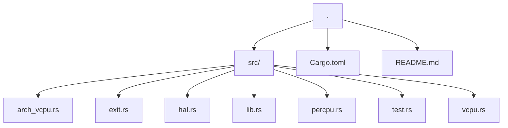
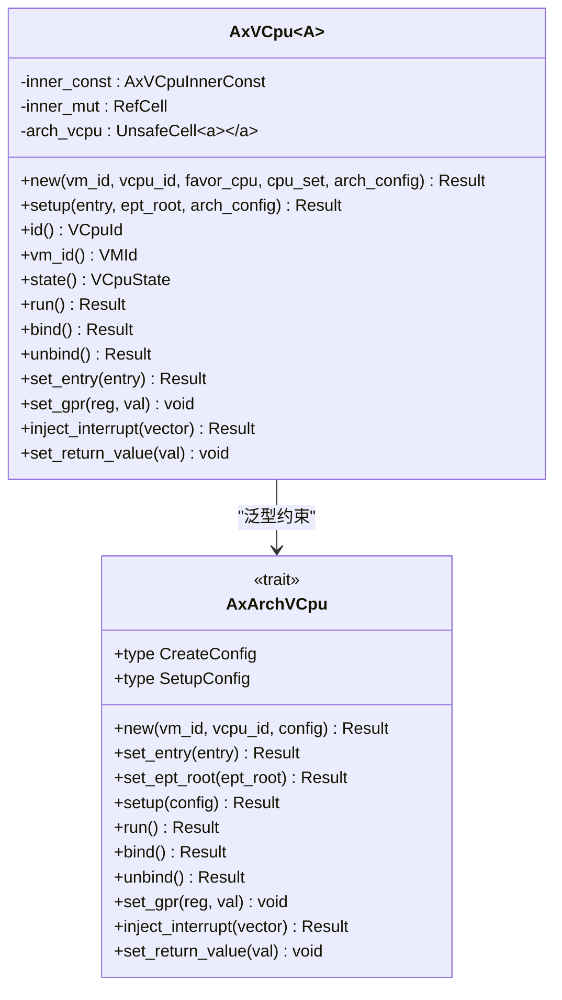
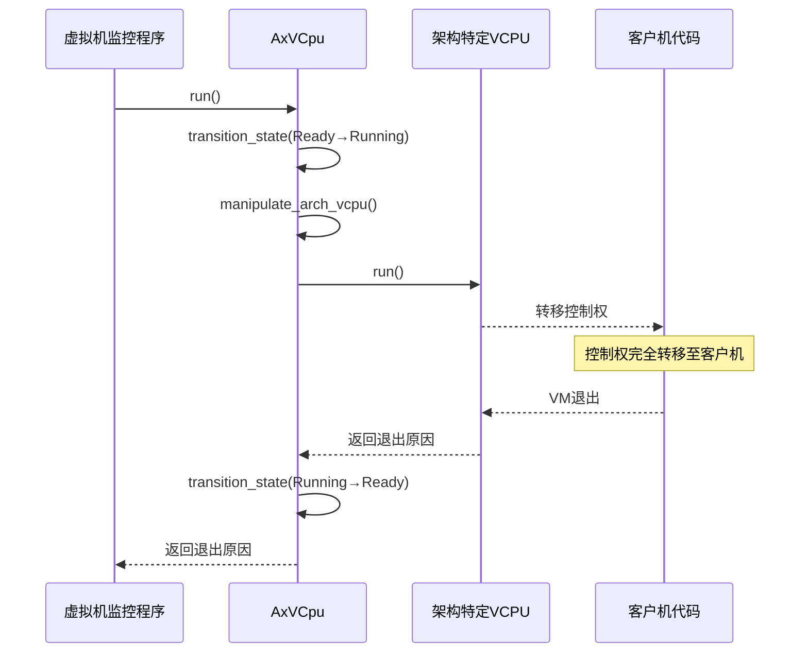
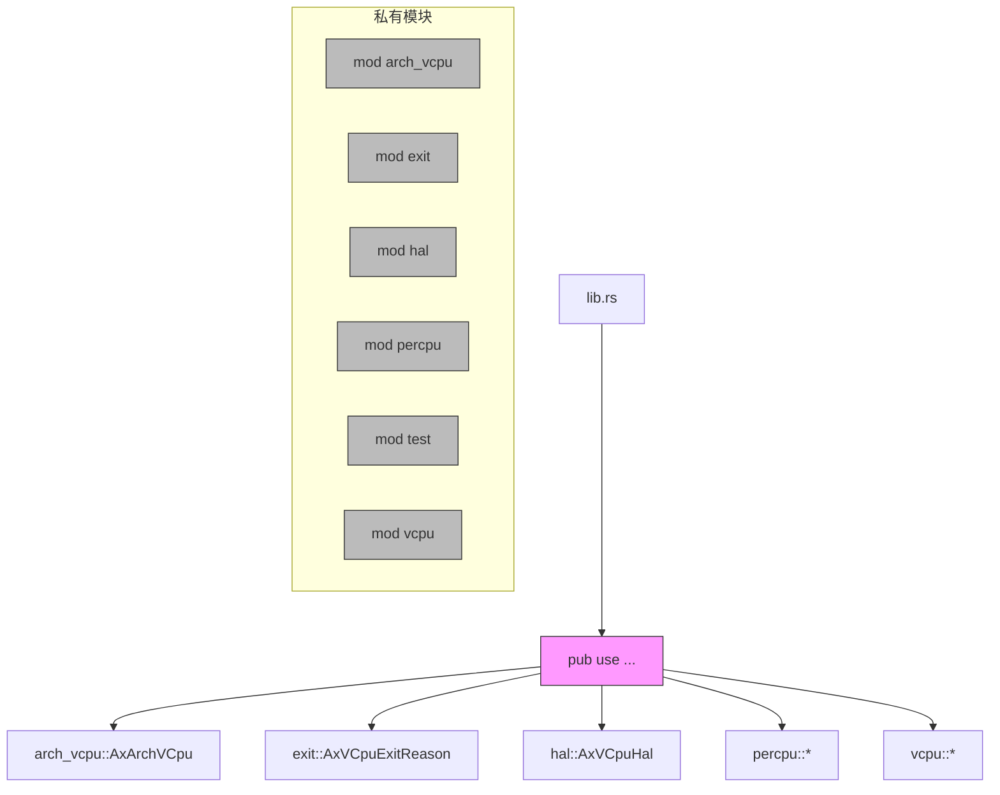

# 泛型集成机制

<cite>
**本文档引用的文件**
- [lib.rs](file://src/lib.rs)
- [vcpu.rs](file://src/vcpu.rs)
- [arch_vcpu.rs](file://src/arch_vcpu.rs)
- [Cargo.toml](file://Cargo.toml)
- [README.md](file://README.md)
</cite>

## 目录
1. [项目结构](#项目结构)
2. [核心组件分析](#核心组件分析)
3. [泛型架构集成机制](#泛型架构集成机制)
4. [状态管理与生命周期控制](#状态管理与生命周期控制)
5. [UnsafeCell在运行时控制权转移中的作用](#unsafecell在运行时控制权转移中的作用)
6. [公共API导出策略](#公共api导出策略)
7. [依赖关系分析](#依赖关系分析)

## 项目结构



**图示来源**
- [Cargo.toml](file://Cargo.toml)
- 项目结构信息

## 核心组件分析

**组件来源**
- [lib.rs](file://src/lib.rs#L1-L34)
- [vcpu.rs](file://src/vcpu.rs#L0-L348)
- [arch_vcpu.rs](file://src/arch_vcpu.rs#L0-L79)

## 泛型架构集成机制

`AxVCpu<A: AxArchVCpu>` 结构体通过泛型参数 `A` 实现了编译时多态，允许在不牺牲性能的前提下支持多种CPU架构。这种设计模式实现了零成本抽象，因为所有架构特定的操作都在编译时被具体化，避免了运行时虚函数调用的开销。

泛型参数 `A` 必须实现 `AxArchVCpu` trait，该trait定义了架构特定VCPU所需的所有基本操作，包括创建、设置入口点、内存管理配置、执行控制等。通过这种方式，高层API保持了一致性，而底层实现可以根据不同架构进行优化。



**图示来源**
- [arch_vcpu.rs](file://src/arch_vcpu.rs#L6-L78)
- [vcpu.rs](file://src/vcpu.rs#L57-L76)

## 状态管理与生命周期控制

VCPU遵循严格的生命周期状态机：Created → Free → Ready → Running → Blocked，Invalid状态用于表示错误情况。这种状态机确保了VCPU操作的正确顺序和安全性。

```mermaid
stateDiagram-v2
[*] --> Created
Created --> Free : setup()
Free --> Ready : bind()
Ready --> Running : run()
Running --> Ready : VM退出
Running --> Blocked : 阻塞操作
Blocked --> Ready : 解除阻塞
Created --> Invalid : 错误转换
Free --> Invalid : 错误转换
Ready --> Invalid : 错误转换
Running --> Invalid : 错误转换
Blocked --> Invalid : 错误转换
state Invalid {
[*] --> Invalid
}
```

**图示来源**
- [vcpu.rs](file://src/vcpu.rs#L26-L55)
- [vcpu.rs](file://src/vcpu.rs#L162-L208)

## UnsafeCell在运行时控制权转移中的作用

在`AxVCpu<A>`结构体中，`arch_vcpu`字段使用`UnsafeCell<A>`而不是`RefCell<A>`进行封装，这是为了避免在`run`期间控制权转移至客户机代码时发生`RefCell`运行时检查崩溃。

当调用`run`方法时，控制权会完全转移到客户机代码，此时Rust的借用检查器无法跟踪对`arch_vcpu`的访问。如果使用`RefCell`，其内部的借用计数器会在控制权转移期间保持不变，可能导致后续操作时借用冲突。而`UnsafeCell`提供了对内部值的可变访问，无需运行时借用检查，从而避免了这个问题。



**图示来源**
- [vcpu.rs](file://src/vcpu.rs#L73-L75)
- [vcpu.rs](file://src/vcpu.rs#L252-L256)

## 公共API导出策略

`lib.rs`文件通过有选择地导出模块和类型来暴露公共API，确保类型安全与接口清晰：



**图示来源**
- [lib.rs](file://src/lib.rs#L29-L33)

## 依赖关系分析

```mermaid
graph LR
vcpu[vcpu.rs] --> core[core::cell::{RefCell, UnsafeCell}]
vcpu --> axaddrspace[axaddrspace]
vcpu --> axerrno[axerrno]
vcpu --> axvisor_api[axvisor_api]
vcpu --> super[super::{AxArchVCpu, AxVCpuExitReason}]
arch_vcpu[arch_vcpu.rs] --> axaddrspace[axaddrspace]
arch_vcpu --> axerrno[axerrno]
arch_vcpu --> axvisor_api[axvisor_api]
arch_vcpu --> exit[crate::exit::AxVCpuExitReason]
lib[lib.rs] --> vcpu[vcpu]
lib --> arch_vcpu[arch_vcpu]
lib --> exit[exit]
lib --> hal[hal]
lib --> percpu[percpu]
Cargo[Cargo.toml] --> dependencies[axerrno, memory_addr, percpu, axaddrspace, axvisor_api]
```

**图示来源**
- [Cargo.toml](file://Cargo.toml#L10-L17)
- [lib.rs](file://src/lib.rs#L1-L34)