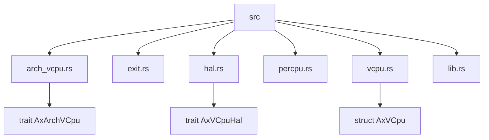
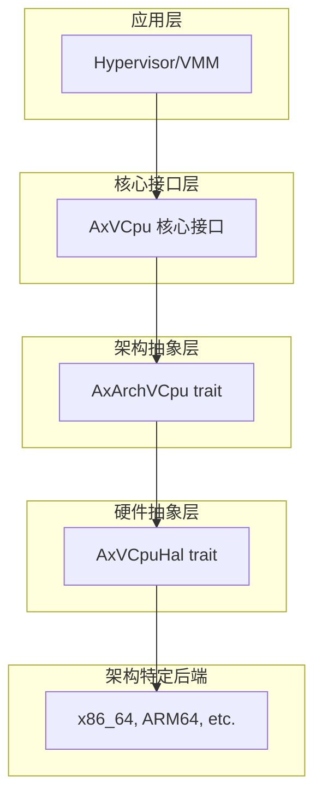
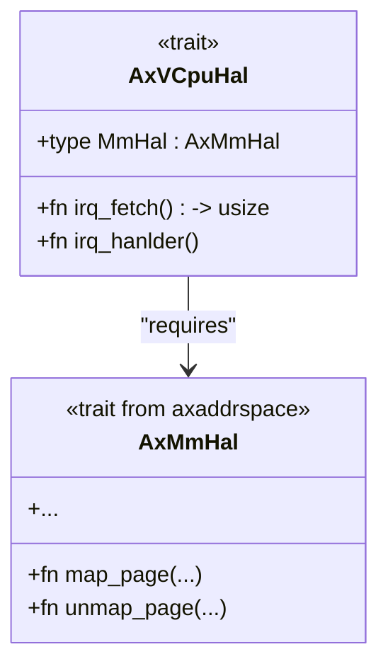
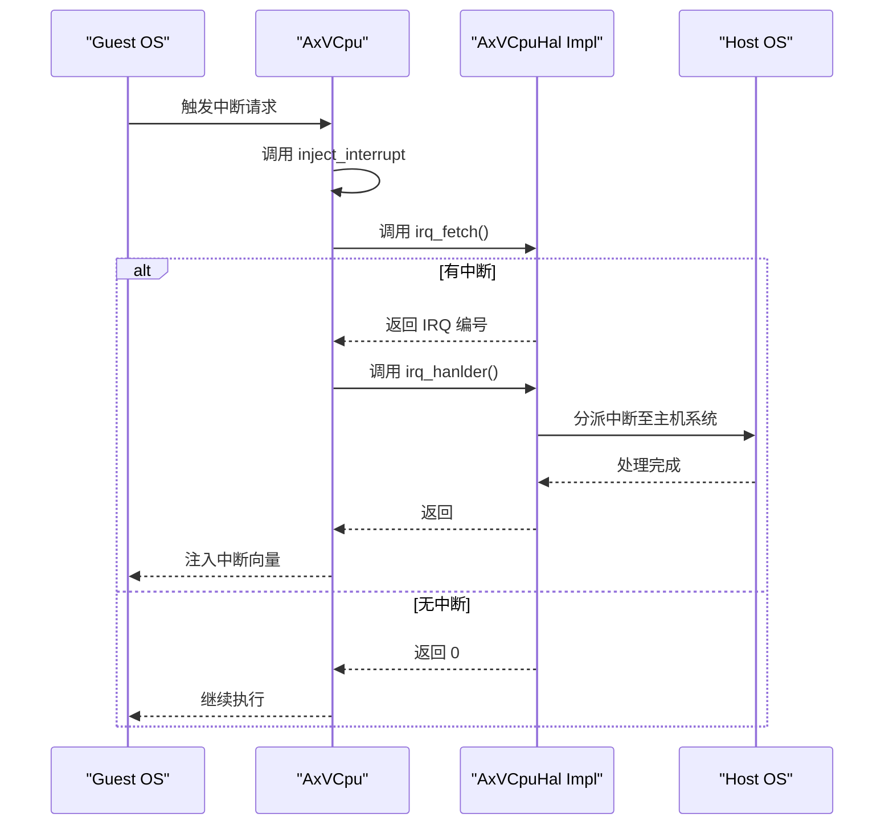
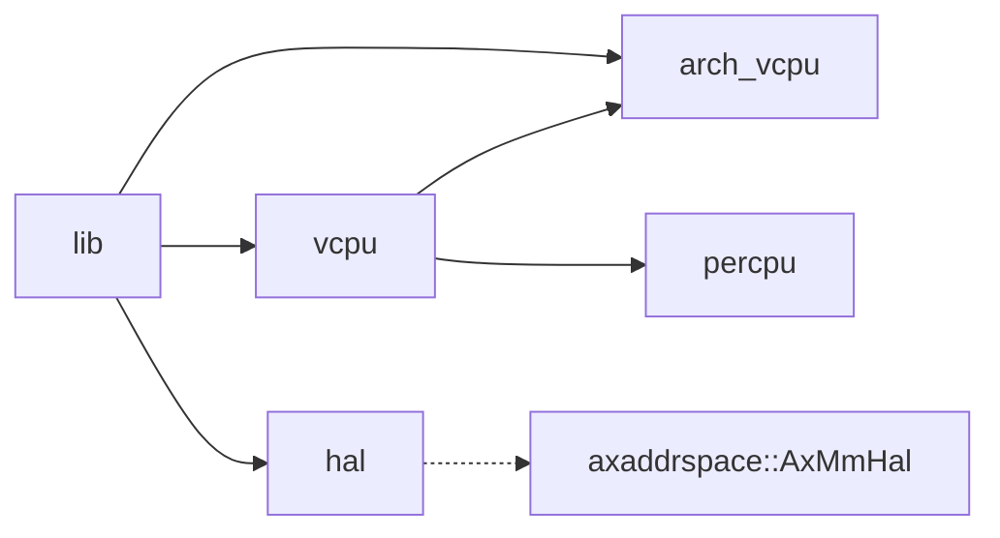

# 硬件抽象层

<cite>
**本文档中引用的文件**
- [hal.rs](file://src/hal.rs)
- [vcpu.rs](file://src/vcpu.rs)
- [arch_vcpu.rs](file://src/arch_vcpu.rs)
- [lib.rs](file://src/lib.rs)
</cite>

## 目录
1. [引言](#引言)
2. [项目结构](#项目结构)
3. [核心组件](#核心组件)
4. [架构概述](#架构概述)
5. [详细组件分析](#详细组件分析)
6. [依赖关系分析](#依赖关系分析)
7. [性能考虑](#性能考虑)
8. [故障排除指南](#故障排除指南)
9. [结论](#结论)

## 引言
AxVCpu 是一个为 ArceOS 虚拟机监控器（Hypervisor）设计的虚拟 CPU 抽象库，提供统一且与架构无关的接口来管理虚拟化环境中的虚拟 CPU。该库通过将架构特定的操作委托给 `AxArchVCpu` trait 的实现，同时提供状态管理、CPU 绑定和执行控制等通用功能，实现了硬件抽象。

本技术文档聚焦于 `AxVCpuHal` trait 的职责与集成机制，详细说明其如何解耦 VCPU 核心逻辑与底层 hypervisor 或内核的具体实现。重点分析中断处理流程中的 `irq_fetch` 和 `irq_hanlder` 方法，解释为何后者必须由具体平台实现并标记为 `unimplemented`，以及实现时需注意的安全性问题如重入防护。同时，阐述 `MmHal` 关联类型如何与 `axaddrspace::AxMmHal` 协同工作以支持内存管理操作，并通过实际场景展示 hypervisor 如何提供该 trait 的实例来适配不同硬件环境。

## 项目结构
AxVCpu 项目的目录结构清晰地划分了不同的功能模块，遵循了分层的设计理念。核心模块包括用于定义架构特定 VCpu 操作的 `arch_vcpu`，用于 VM 退出原因枚举的 `exit`，用于硬件抽象层接口的 `hal`，用于每 CPU 虚拟化状态管理的 `percpu`，以及包含主 VCpu 实现和状态管理的 `vcpu`。

**Diagram sources**
- [src/lib.rs](file://src/lib.rs#L0-L33)
- [src/hal.rs](file://src/hal.rs#L0-L31)

**Section sources**
- [src/lib.rs](file://src/lib.rs#L0-L33)
- [src/hal.rs](file://src/hal.rs#L0-L31)

## 核心组件
`AxVCpuHal` trait 是整个系统硬件抽象的核心，它定义了底层软件（内核或 hypervisor）必须实现的接口，以支持 VCPU 的中断处理和内存管理等关键操作。该 trait 通过关联类型 `MmHal` 和两个关键方法 `irq_fetch` 与 `irq_hanlder`，实现了对底层硬件细节的有效隔离。

**Section sources**
- [src/hal.rs](file://src/hal.rs#L0-L31)

## 架构概述
AxVCpu 遵循分层架构设计，从上到下依次为应用层、核心接口层、架构抽象层、硬件抽象层和架构特定后端。这种设计确保了上层代码的可移植性和可维护性，同时允许底层针对特定硬件进行优化。

**Diagram sources**
- [README.md](file://README.md#L15-L32)

## 详细组件分析

### AxVCpuHal 特性分析
`AxVCpuHal` trait 的主要职责是为 VCPU 子系统提供一个与具体硬件无关的接口，从而实现核心逻辑与底层实现的解耦。

#### 内存管理抽象
该 trait 定义了一个名为 `MmHal` 的关联类型，要求其实现 `axaddrspace::AxMmHal` trait。这使得 VCPU 可以通过统一的接口执行内存管理操作，而无需关心底层页表格式或物理地址转换机制的具体实现。具体的 hypervisor 在实现 `AxVCpuHal` 时，会指定其使用的内存管理后端作为 `MmHal` 的具体类型。

**Diagram sources**
- [src/hal.rs](file://src/hal.rs#L0-L31)
- [src/lib.rs](file://src/lib.rs#L0-L33)

#### 中断处理流程
中断处理是 VCPU 与外部世界交互的关键机制。`AxVCpuHal` 通过 `irq_fetch` 和 `irq_hanlder` 两个方法构建了完整的中断处理链路。

- **`irq_fetch`**: 此方法负责从硬件或虚拟中断控制器中获取当前待处理的中断号（IRQ number）。其默认实现返回 0，表示无中断，这为不支持中断的简单场景提供了便利。
- **`irq_hanlder`**: 这是中断处理流程的核心。当 VCPU 检测到需要处理中断时，会调用此方法。该方法的默认实现直接 panic 并提示“未实现”，强制要求底层 hypervisor 必须提供自己的实现。

**Diagram sources**
- [src/hal.rs](file://src/hal.rs#L0-L31)
- [src/vcpu.rs](file://src/vcpu.rs#L252-L296)

**Section sources**
- [src/hal.rs](file://src/hal.rs#L0-L31)
- [src/vcpu.rs](file://src/vcpu.rs#L252-L296)

### 实现要求与安全性
`irq_hanlder` 方法被标记为 `unimplemented` 的根本原因在于，中断的实际处理逻辑高度依赖于底层 hypervisor 或宿主操作系统的具体架构和中断控制器（如 APIC、GIC）。因此，这个责任必须由具体的平台实现者来承担。

在实现 `irq_hanlder` 时，安全性至关重要，特别是要避免**重入**（reentrancy）问题。如果中断处理代码本身可以被更高优先级的中断再次打断，可能会导致状态混乱、死锁或数据损坏。实现者应确保：
1.  在处理一个中断期间，适当屏蔽或禁用同类型的中断。
2.  使用原子操作或适当的锁机制保护共享资源。
3.  尽量减少中断处理程序中的复杂逻辑，将耗时操作推迟到下半部（bottom half）执行。

## 依赖关系分析
`AxVCpu` 库内部各模块之间存在明确的依赖关系。`vcpu` 模块是核心，它依赖于 `arch_vcpu` 来进行架构特定的操作，并依赖于 `hal` 来访问硬件抽象层。`lib.rs` 作为公共 API 的入口，重新导出了这些核心 trait 和类型。

**Diagram sources**
- [src/lib.rs](file://src/lib.rs#L0-L33)
- [src/hal.rs](file://src/hal.rs#L0-L31)

**Section sources**
- [src/lib.rs](file://src/lib.rs#L0-L33)
- [src/hal.rs](file://src/hal.rs#L0-L31)

## 性能考虑
虽然本节不分析具体文件，但可以指出，`AxVCpu` 的设计考虑了性能。例如，使用 `UnsafeCell` 而非 `RefCell` 来包装 `arch_vcpu`，是因为在 VCPU 执行期间（控制权转移给客户机），`RefCell` 的借用守卫无法被正确释放。此外，`CURRENT_VCPU` 的每 CPU变量设计也减少了跨 CPU 同步的开销。

## 故障排除指南
当遇到 VCPU 相关问题时，应首先检查 `AxVCpuHal` 的实现是否正确。常见的错误包括：
- 忘记实现 `irq_hanlder` 方法，导致程序在尝试处理中断时 panic。
- `irq_fetch` 实现有误，导致中断丢失或错误地报告中断。
- `MmHal` 类型绑定错误，导致内存管理操作失败。

**Section sources**
- [src/hal.rs](file://src/hal.rs#L0-L31)

## 结论
`AxVCpuHal` trait 成功地在 VCPU 核心逻辑与底层硬件实现之间建立了一道清晰的屏障。通过强制要求实现 `irq_hanlder` 并提供 `MmHal` 关联类型，它既保证了灵活性，又确保了关键功能的正确实现。这种设计模式使得 AxVCpu 能够轻松适配不同的 hypervisor 和硬件平台，为构建可移植的虚拟化解决方案奠定了坚实的基础。