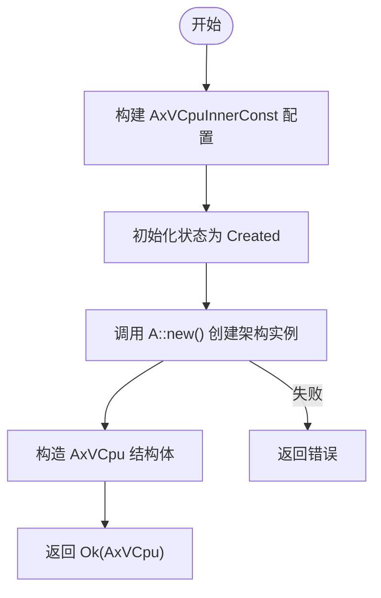
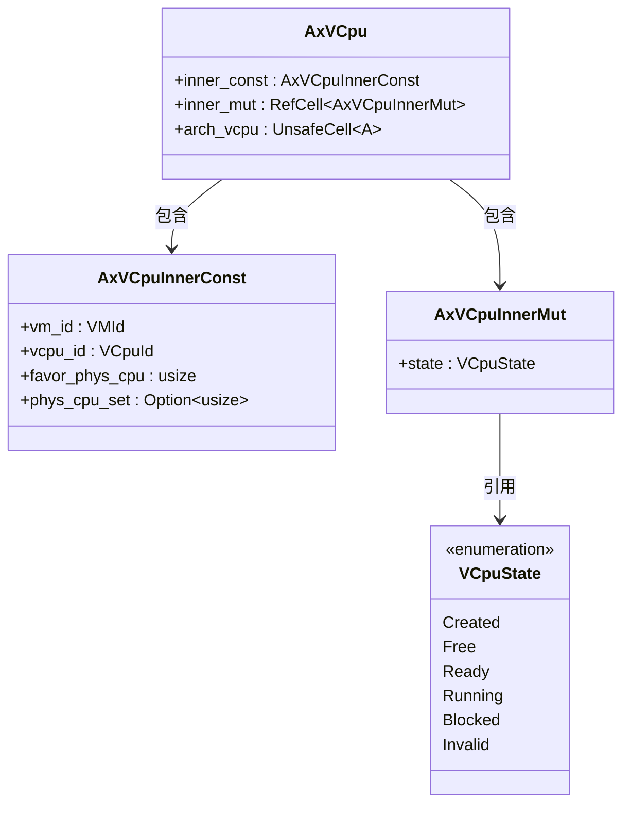
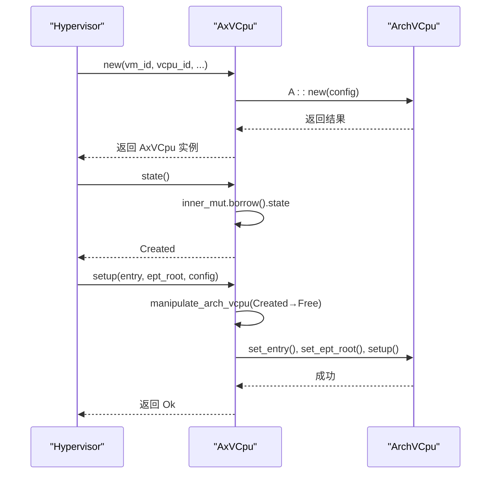

# 初始化流程

<cite>
**本文档中引用的文件**  
- [vcpu.rs](file://src/vcpu.rs)
- [arch_vcpu.rs](file://src/arch_vcpu.rs)
- [test.rs](file://src/test.rs)
- [Cargo.toml](file://Cargo.toml)
- [README.md](file://README.md)
</cite>

## 目录
1. [简介](#简介)  
2. [核心结构与初始化参数](#核心结构与初始化参数)  
3. `AxVCpu::new()` 方法实现机制分析  
4. 不可变配置结构 AxVCpuInnerConst 的构建  
5. 架构特定实例 ArchVCpu 的创建与状态初始化  
6. UnsafeCell 在内部可变性中的作用  
7. Hypervisor 调用接口的标准模式示例  
8. 错误场景与处理策略分析  
9. 总结  

## 简介
`AxVCpu` 是 ArceOS 虚拟化框架中用于抽象虚拟 CPU（VCPU）的核心组件，提供跨架构统一的虚拟 CPU 接口。其设计遵循严格的状态机模型，支持 x86_64、ARM64 和 RISC-V 等多种硬件架构。该模块通过 `AxArchVCpu` trait 实现架构无关性，将底层细节封装于具体实现中。

本节重点解析 `AxVCpu::new()` 方法的完整初始化流程，涵盖从参数传入到对象构造的全过程，深入探讨不可变配置结构的建立、状态管理机制的设计原理以及 `UnsafeCell` 在运行时可变性保障中的关键角色。

**Section sources**  
- [vcpu.rs](file://src/vcpu.rs#L57-L76)  
- [README.md](file://README.md#L33-L57)

## 核心结构与初始化参数
`AxVCpu` 的初始化依赖五个核心参数：
- `vm_id`: 所属虚拟机的唯一标识符
- `vcpu_id`: 当前 VCPU 在虚拟机内的唯一编号
- `favor_phys_cpu`: 偏好运行的物理 CPU ID，用于调度优化
- `phys_cpu_set`: 可运行的物理 CPU 位掩码（None 表示无限制）
- `arch_config`: 架构特定的创建配置

这些参数共同决定了 VCPU 的资源归属和执行环境约束。

**Section sources**  
- [vcpu.rs](file://src/vcpu.rs#L78-L114)

## `AxVCpu::new()` 方法实现机制分析
`AxVCpu::new()` 是虚拟 CPU 实例化的入口方法，负责整合所有配置并完成对象构造。该方法返回一个 `AxResult<Self>` 类型的结果，表示可能的错误情况。



**Diagram sources**  
- [vcpu.rs](file://src/vcpu.rs#L78-L114)

**Section sources**  
- [vcpu.rs](file://src/vcpu.rs#L78-L114)

## 不可变配置结构 AxVCpuInnerConst 的构建
`AxVCpuInnerConst` 结构体封装了 VCPU 生命周期内不会改变的静态属性，包括 VM ID、VCPU ID、CPU 亲和性偏好及允许运行的物理 CPU 集合。该结构在 `new()` 方法中直接由传入参数初始化，确保配置的一致性和不可变性。

```rust
inner_const: AxVCpuInnerConst {
    vm_id,
    vcpu_id,
    favor_phys_cpu,
    phys_cpu_set,
}
```

此设计分离了静态配置与动态状态，提升了数据安全性与访问效率。

**Section sources**  
- [vcpu.rs](file://src/vcpu.rs#L0-L24)

## 架构特定实例 ArchVCpu 的创建与状态初始化
在 `AxVCpu` 内部，`arch_vcpu` 字段使用 `UnsafeCell<A>` 包裹架构特定的实现类型 `A`，以支持跨执行阶段的内部可变性。初始化过程中，通过泛型约束 `<A: AxArchVCpu>` 调用其关联方法 `A::new()` 完成底层实例创建。

同时，`inner_mut` 字段通过 `RefCell` 封装 `AxVCpuInnerMut`，其中 `state` 被初始化为 `VCpuState::Created`，标志着 VCPU 进入生命周期的第一个有效状态。



**Diagram sources**  
- [vcpu.rs](file://src/vcpu.rs#L57-L76)  
- [vcpu.rs](file://src/vcpu.rs#L26-L55)

**Section sources**  
- [vcpu.rs](file://src/vcpu.rs#L78-L114)

## UnsafeCell 在内部可变性中的作用
由于 VCPU 在执行期间会将控制权转移给客户机代码，传统的 `RefCell` 守护无法安全释放，因此采用 `UnsafeCell` 来绕过 Rust 的借用检查，允许在共享引用下进行内部可变操作。

尽管 `UnsafeCell` 涉及 `unsafe` 代码块，但其使用被严格限制在受控范围内（如 `get_arch_vcpu()`），并通过文档明确告知使用者需确保线程安全。

```rust
pub fn get_arch_vcpu(&self) -> &mut A {
    unsafe { &mut *self.arch_vcpu.get() }
}
```

这种设计平衡了安全性与性能需求，在保证功能正确的同时避免了不必要的运行时开销。

**Section sources**  
- [vcpu.rs](file://src/vcpu.rs#L210-L250)

## Hypervisor 调用接口的标准模式示例
Hypervisor 通常按照以下标准流程调用 `AxVCpu` 接口：



**Diagram sources**  
- [vcpu.rs](file://src/vcpu.rs#L78-L114)  
- [vcpu.rs](file://src/vcpu.rs#L116-L140)  
- [test.rs](file://src/test.rs#L39-L78)

**Section sources**  
- [README.md](file://README.md#L59-L107)  
- [test.rs](file://src/test.rs#L39-L78)

## 错误场景与处理策略分析
初始化过程可能出现的错误主要来自架构特定层的创建失败。例如，在模拟实现 `MockArchVCpu` 中，若 `setup()` 时未设置入口地址或页表根，则返回 `AxError::InvalidInput`。

此外，状态转换校验机制（如 `with_state_transition`）会在当前状态不符合预期时自动将状态置为 `Invalid` 并返回 `BadState` 错误，防止非法状态迁移。

此类错误通过 `AxResult<T>` 统一传播，便于上层调用者集中处理异常情况。

**Section sources**  
- [vcpu.rs](file://src/vcpu.rs#L162-L208)  
- [test.rs](file://src/test.rs#L39-L78)

## 总结
`AxVCpu::new()` 方法通过组合不可变配置、可变状态容器和架构特定实例，实现了灵活且安全的虚拟 CPU 初始化机制。其设计充分考虑了 Rust 的所有权系统与虚拟化场景下的特殊需求，利用 `RefCell` 和 `UnsafeCell` 分别管理短期与长期的内部可变性，并通过严格的枚举状态机保障生命周期完整性。

这一架构不仅支持多平台扩展，也为后续的绑定、运行和退出处理奠定了坚实基础。