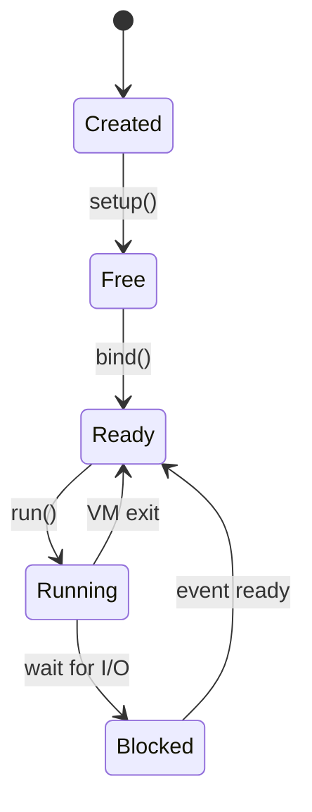
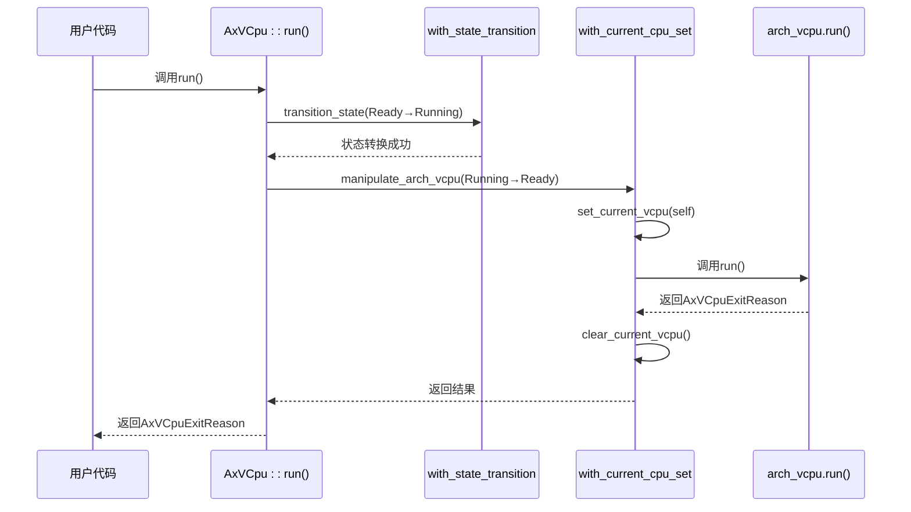

# 执行循环

<cite>
**本文档中引用的文件**
- [vcpu.rs](file://src/vcpu.rs)
- [percpu.rs](file://src/percpu.rs)
- [arch_vcpu.rs](file://src/arch_vcpu.rs)
</cite>

## 目录
1. [简介](#简介)
2. [VCPU状态机与执行流程](#vcpu状态机与执行流程)
3. [核心数据流分析：AxVCpu::run()](#核心数据流分析axvcpurun)
4. [上下文管理机制](#上下文管理机制)
5. [线程局部存储与跨层调用一致性](#线程局部存储与跨层调用一致性)
6. [状态转换与错误处理](#状态转换与错误处理)
7. [结论](#结论)

## 简介
本文档全面解析虚拟CPU（VCPU）的执行循环机制，重点描述`AxVCpu::run()`方法的数据流。从Ready到Running的状态转换开始，深入分析`manipulate_arch_vcpu`如何组合状态管理和上下文设置，在执行前通过`set_current_vcpu`将当前VCPU绑定到percpu变量`CURRENT_VCPU`，确保底层架构代码可通过`get_current_vcpu`获取宿主VCPU引用。详细说明控制权移交至`arch_vcpu.run()`后的执行流程，以及VM退出后如何恢复Ready状态并返回`AxVCpuExitReason`。结合`percpu.rs`中的线程局部存储机制，阐明跨层调用的上下文一致性保障。

**Section sources**
- [vcpu.rs](file://src/vcpu.rs#L0-L348)

## VCPU状态机与执行流程
VCPU遵循严格的状态机模型，其生命周期包含以下状态：
- **Invalid**: 无效状态，表示状态转换过程中发生错误
- **Created**: 创建状态，VCPU实例已创建但未初始化
- **Free**: 空闲状态，VCPU已初始化，准备绑定到物理CPU
- **Ready**: 就绪状态，VCPU已绑定到物理CPU，等待执行
- **Running**: 运行状态，VCPU正在物理CPU上执行
- **Blocked**: 阻塞状态，VCPU因I/O等操作暂停执行

状态转换路径为：Created → Free → Ready → Running，任何非法转换都将导致状态变为Invalid。



**Diagram sources**
- [vcpu.rs](file://src/vcpu.rs#L26-L55)

**Section sources**
- [vcpu.rs](file://src/vcpu.rs#L26-L55)

## 核心数据流分析：AxVCpu::run()
`AxVCpu::run()`是VCPU执行循环的核心方法，其数据流如下：

1. **状态验证与转换**：首先调用`transition_state(VCpuState::Ready, VCpuState::Running)`，验证当前状态是否为Ready，若是则转换为Running状态。
2. **组合操作执行**：通过`manipulate_arch_vcpu`方法，在状态为Running时执行架构特定的运行逻辑，并在完成后恢复为Ready状态。
3. **控制权移交**：内部调用`arch_vcpu.run()`，将控制权移交给底层架构实现，直至发生VM退出事件。
4. **结果返回**：VM退出后，返回`AxVCpuExitReason`枚举值，指示退出原因（如Halt、MMIO访问、超调用等）。

该方法确保了状态转换的安全性和上下文的一致性，是VCPU执行流程的关键入口。



**Diagram sources**
- [vcpu.rs](file://src/vcpu.rs#L252-L296)

**Section sources**
- [vcpu.rs](file://src/vcpu.rs#L252-L296)

## 上下文管理机制
为了在架构无关层与架构特定层之间安全地传递上下文，系统采用了一套精细的上下文管理机制：

- **`with_current_cpu_set`**：该方法确保在执行闭包期间，当前VCPU被设置为全局percpu变量`CURRENT_VCPU`，并在闭包执行完毕后清除。它通过`set_current_vcpu`和`clear_current_vcpu`实现，防止嵌套操作。
- **`manipulate_arch_vcpu`**：作为`with_state_transition`和`with_current_cpu_set`的组合，它同时保证了状态转换的原子性和上下文的正确设置。
- **`get_current_vcpu`**：供架构特定代码调用，用于获取当前正在执行的VCPU实例，从而访问其所有属性和方法。

这种设计使得底层架构代码无需直接持有VCPU引用，而是通过全局可访问的函数获取当前上下文，提高了模块间的解耦程度。

**Section sources**
- [vcpu.rs](file://src/vcpu.rs#L211-L245)

## 线程局部存储与跨层调用一致性
系统利用`percpu.rs`模块提供的线程局部存储机制来保障跨层调用的上下文一致性：

- **`CURRENT_VCPU`**：定义为`#[percpu::def_percpu] static mut CURRENT_VCPU: Option<*mut u8>`，这是一个每CPU静态变量，每个物理CPU核心都有独立的实例。
- **`set_current_vcpu`**：将当前VCPU的指针存入当前CPU的`CURRENT_VCPU`变量中，类型擦除为`*mut u8`以避免泛型问题。
- **`get_current_vcpu`**：从当前CPU的`CURRENT_VCPU`中读取指针，并将其转换回`&AxVCpu<A>`引用，供架构代码使用。
- **`clear_current_vcpu`**：在操作结束后清除当前VCPU引用，防止悬空指针和状态污染。

此机制确保了即使在多核环境下，每个物理CPU都能正确识别其当前执行的VCPU，实现了高效的上下文隔离和安全性。

```mermaid
flowchart TD
A[调用 AxVCpu::run()] --> B[transition_state: Ready → Running]
B --> C[manipulate_arch_vcpu]
C --> D[with_state_transition]
C --> E[with_current_cpu_set]
E --> F[set_current_vcpu(vcpu)]
F --> G[调用 arch_vcpu.run()]
G --> H{VM退出?}
H --> |是| I[返回 ExitReason]
I --> J[clear_current_vcpu()]
J --> K[状态: Running → Ready]
K --> L[返回 ExitReason 给调用者]
```

**Diagram sources**
- [vcpu.rs](file://src/vcpu.rs#L295-L347)
- [percpu.rs](file://src/percpu.rs#L0-L103)

**Section sources**
- [vcpu.rs](file://src/vcpu.rs#L295-L347)
- [percpu.rs](file://src/percpu.rs#L0-L103)

## 状态转换与错误处理
状态转换由`with_state_transition`方法统一管理，其核心逻辑如下：

1. 检查当前状态是否等于期望的起始状态`from`。
2. 若不相等，则将状态置为`Invalid`并返回错误。
3. 若相等，则执行传入的闭包函数`f`。
4. 根据闭包执行结果决定最终状态：成功则设为`to`，失败则设为`Invalid`。

这种方法强制所有状态转换都必须显式声明前置和后置条件，极大地降低了状态机出错的可能性。`manipulate_arch_vcpu`等高层方法均基于此构建，确保了整个VCPU生命周期的状态完整性。

**Section sources**
- [vcpu.rs](file://src/vcpu.rs#L162-L208)

## 结论
`AxVCpu::run()`方法通过精巧的状态管理和上下文传递机制，实现了VCPU安全、高效的执行循环。从Ready状态开始，经过`manipulate_arch_vcpu`的协调，将控制权安全地移交给架构特定的`arch_vcpu.run()`，并在VM退出后恢复就绪状态。`percpu`机制确保了在多核环境中上下文的唯一性和一致性，而`get_current_vcpu`/`set_current_vcpu`接口则为跨层调用提供了透明的上下文访问能力。这一设计模式体现了高内聚、低耦合的软件工程原则，为虚拟化平台的稳定运行奠定了坚实基础。