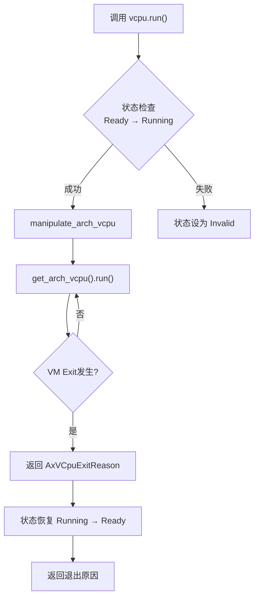
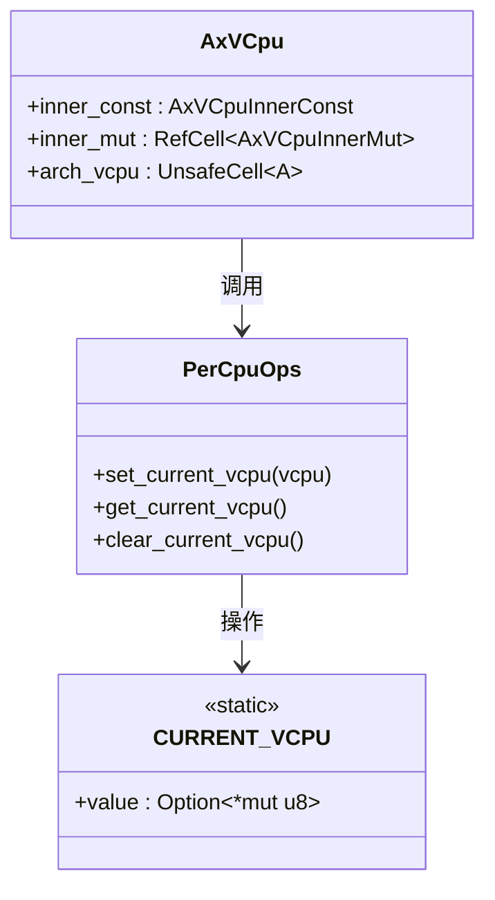

# 数据流分析

<cite>
**本文档中引用的文件**  
- [vcpu.rs](file://src/vcpu.rs)
- [arch_vcpu.rs](file://src/arch_vcpu.rs)
- [percpu.rs](file://src/percpu.rs)
- [test.rs](file://src/test.rs)
</cite>

## 目录
1. [虚拟CPU初始化流程](#虚拟cpu初始化流程)
2. [状态转换与setup方法](#状态转换与setup方法)
3. [物理CPU绑定机制](#物理cpu绑定机制)
4. [执行流程与数据流转](#执行流程与数据流转)
5. [线程局部存储机制](#线程局部存储机制)

## 虚拟CPU初始化流程

当Hypervisor调用`AxVCpu::new()`创建虚拟CPU时，系统会初始化一个全新的VCPU实例。该过程接收VM ID、VCPU ID、CPU亲和性参数等关键配置信息，并将其存储在`AxVCpuInnerConst`结构体中。

初始化过程中，VM ID和VCPU ID被用于唯一标识虚拟机及其内部的虚拟处理器；favor_phys_cpu参数指定该VCPU优先运行的物理CPU核心；phys_cpu_set则通过位掩码形式定义了允许运行此VCPU的物理CPU集合（若为None则表示无限制）。这些参数作为不可变配置，在整个VCPU生命周期内保持不变。

新创建的VCPU初始状态被设置为`Created`，并通过UnsafeCell封装架构特定的实现对象，确保后续跨层调用的安全性。

**节来源**
- [vcpu.rs](file://src/vcpu.rs#L78-L114)
- [vcpu.rs](file://src/vcpu.rs#L57-L76)

## 状态转换与setup方法

`setup()`方法负责将VCPU从`Created`状态转换至`Free`状态，完成执行前的关键配置。此过程通过`manipulate_arch_vcpu`组合操作实现原子性的状态迁移与上下文设置。

在状态转换期间，系统依次调用架构特定的`set_entry()`设置客户机入口地址，`set_ept_root()`配置EPT根页表以建立内存虚拟化映射，最后执行`setup()`完成架构相关的初始化工作。只有当所有步骤成功完成后，VCPU状态才会从`Created`转变为`Free`，表明其已准备好进行物理CPU绑定。

该设计确保了状态机的严格性：任何失败都将导致状态变为`Invalid`，防止非法状态迁移。

**节来源**
- [vcpu.rs](file://src/vcpu.rs#L116-L160)
- [arch_vcpu.rs](file://src/arch_vcpu.rs#L49-L67)

## 物理CPU绑定机制

`bind()`操作实现VCPU与当前物理CPU的绑定，触发从`Free`到`Ready`的状态转换。该操作通过`manipulate_arch_vcpu(VCpuState::Free, VCpuState::Ready)`确保仅在正确状态下执行。

绑定条件要求VCPU必须已完成`setup()`初始化且处于`Free`状态。一旦绑定成功，VCPU即进入`Ready`状态，表示其已关联到特定物理核心并准备执行。此机制保证了同一时间一个VCPU只能绑定到一个物理CPU，避免资源竞争。

解绑操作`unbind()`则反向执行该过程，使VCPU从`Ready`返回`Free`状态，释放对物理CPU的占用。

**节来源**
- [vcpu.rs](file://src/vcpu.rs#L252-L296)
- [arch_vcpu.rs](file://src/arch_vcpu.rs#L77-L85)

## 执行流程与数据流转

`run()`方法的数据流向始于状态检查：首先调用`transition_state(VCpuState::Ready, VCpuState::Running)`验证VCPU是否处于`Ready`状态，随后启动执行流程。

核心执行路径如下：
1. 调用`manipulate_arch_vcpu(VCpuState::Running, VCpuState::Ready)`开启运行态上下文
2. 获取底层架构VCPU实例：`get_arch_vcpu().run()`
3. 执行底层架构代码，直至发生VM Exit
4. 返回`AxVCpuExitReason`枚举值，指示退出原因

此过程形成闭环状态管理——无论执行结果如何，最终都会回到`Ready`状态。典型的退出原因包括Halt、I/O访问、超调用等，均由`AxVCpuExitReason`枚举详细定义。

**图来源**
- [vcpu.rs](file://src/vcpu.rs#L252-L296)
- [arch_vcpu.rs](file://src/arch_vcpu.rs#L69-L75)

**节来源**
- [vcpu.rs](file://src/vcpu.rs#L252-L296)
- [arch_vcpu.rs](file://src/arch_vcpu.rs#L69-L75)

## 线程局部存储机制

`percpu.rs`中的`CURRENT_VCPU`变量实现了当前VCPU的线程局部存储机制，采用`#[percpu::def_percpu]`宏声明为每物理CPU私有的静态变量，类型为`Option<*mut u8>`。

该机制在跨层调用中发挥关键作用：
- `set_current_vcpu()`在进入架构层前设置当前VCPU指针
- `get_current_vcpu()`允许架构层代码反向获取包含自身的`AxVCpu`引用
- `clear_current_vcpu()`在退出时清除上下文，防止嵌套操作

这种设计确保了每个物理CPU上任意时刻最多只有一个活跃VCPU，同时支持架构无关层与架构特定层之间的无缝上下文传递，是实现安全跨层调用的基础。

**图来源**
- [vcpu.rs](file://src/vcpu.rs#L295-L347)
- [percpu.rs](file://src/percpu.rs#L0-L103)

**节来源**
- [vcpu.rs](file://src/vcpu.rs#L295-L347)
- [percpu.rs](file://src/percpu.rs#L0-L103)