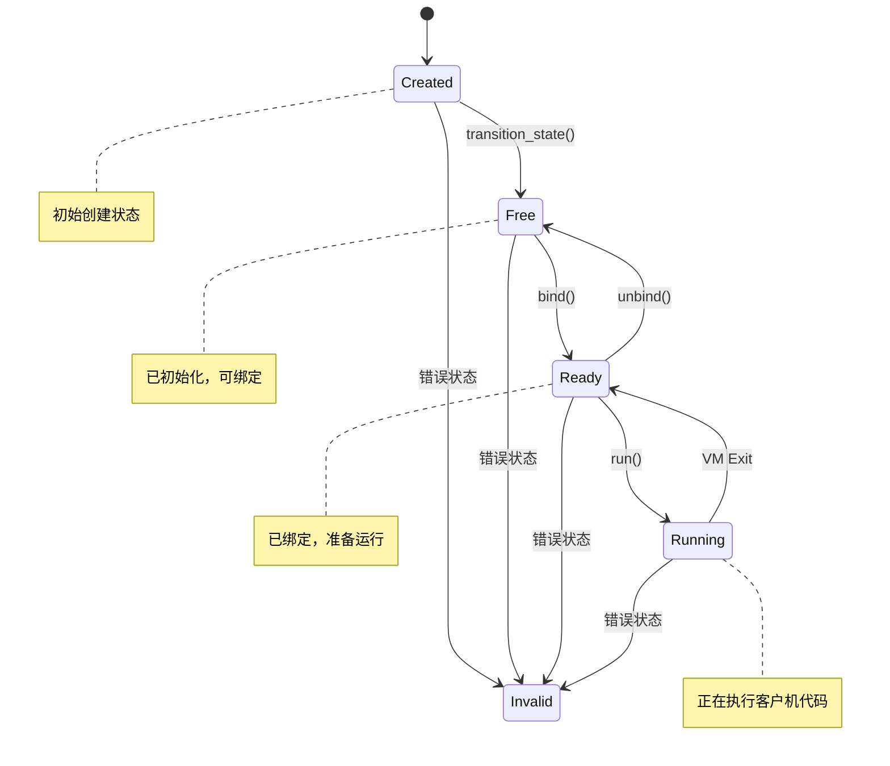
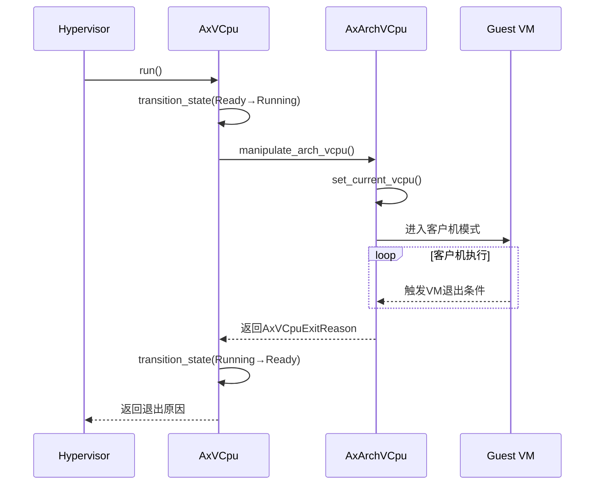
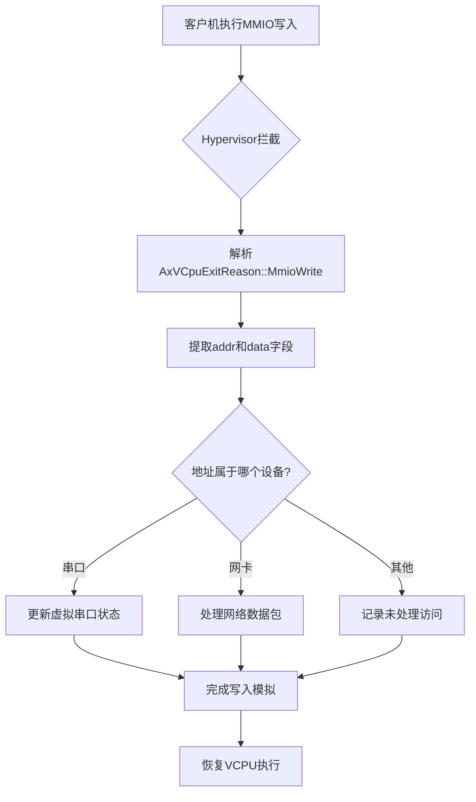
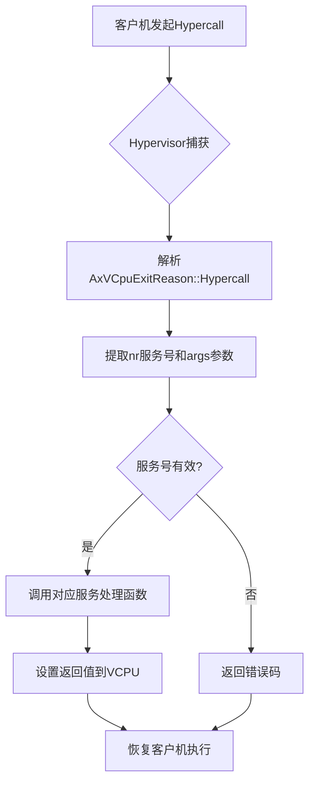

# 退出处理

<cite>
**本文档中引用的文件**  
- [exit.rs](file://src/exit.rs)
- [vcpu.rs](file://src/vcpu.rs)
- [arch_vcpu.rs](file://src/arch_vcpu.rs)
- [test.rs](file://src/test.rs)
</cite>

## 目录
1. [简介](#简介)
2. [核心数据结构分析](#核心数据结构分析)
3. [VM退出机制总体流程](#vm退出机制总体流程)
4. [退出原因分类与处理](#退出原因分类与处理)
5. [典型退出场景处理流程](#典型退出场景处理流程)
6. [异常诊断与性能优化](#异常诊断与性能优化)
7. [结论](#结论)

## 简介
本系统旨在对虚拟机监控器（Hypervisor）中的VM退出事件处理机制进行系统化描述。重点分析当`run()`方法返回`AxVCpuExitReason`枚举值后，控制权如何从客户机转移回Hypervisor，并根据不同的退出原因执行相应的模拟或资源调度操作。

该机制基于Rust语言实现，采用模块化设计，将架构无关的VCPU抽象层与架构相关的具体实现分离。通过`AxArchVCpu` trait定义统一接口，支持x86_64、AArch64和RISC-V等多种硬件架构。整个系统围绕`AxVCpuExitReason`枚举类型构建了完整的退出事件分类体系，涵盖了I/O操作、中断处理、页错误、超调用等常见虚拟化场景。

## 核心数据结构分析

### AxVCpuExitReason 枚举
该枚举定义了所有可能触发VM退出的原因，是整个退出处理机制的核心数据结构。

```mermaid
classDiagram
class AxVCpuExitReason {
+Hypercall{nr : u64, args : [u64; 6]}
+MmioRead{addr : GuestPhysAddr, width : AccessWidth, reg : usize, reg_width : AccessWidth, signed_ext : bool}
+MmioWrite{addr : GuestPhysAddr, width : AccessWidth, data : u64}
+SysRegRead{addr : SysRegAddr, reg : usize}
+SysRegWrite{addr : SysRegAddr, value : u64}
+IoRead{port : Port, width : AccessWidth}
+IoWrite{port : Port, width : AccessWidth, data : u64}
+ExternalInterrupt{vector : u64}
+NestedPageFault{addr : GuestPhysAddr, access_flags : MappingFlags}
+Halt
+CpuUp{target_cpu : u64, entry_point : GuestPhysAddr, arg : u64}
+CpuDown{_state : u64}
+SystemDown
+Nothing
+FailEntry{hardware_entry_failure_reason : u64}
+SendIPI{target_cpu : u64, target_cpu_aux : u64, send_to_all : bool, send_to_self : bool, vector : u64}
}
```

**图示来源**
- [exit.rs](file://src/exit.rs#L10-L259)

**节来源**
- [exit.rs](file://src/exit.rs#L10-L259)

### VCpu状态机
VCPU遵循严格的生命周期状态转换模型：



**图示来源**
- [vcpu.rs](file://src/vcpu.rs#L26-L55)
- [vcpu.rs](file://src/vcpu.rs#L252-L296)

**节来源**
- [vcpu.rs](file://src/vcpu.rs#L26-L55)

## VM退出机制总体流程

### 执行与退出流程
当调用`AxVCpu::run()`方法时，系统会按照预定义的状态机进行转换，并最终调用底层架构特定的`run()`实现来进入客户机模式执行。



**图示来源**
- [vcpu.rs](file://src/vcpu.rs#L252-L296)
- [arch_vcpu.rs](file://src/arch_vcpu.rs#L65-L70)

**节来源**
- [vcpu.rs](file://src/vcpu.rs#L252-L296)

## 退出原因分类与处理

### I/O相关退出
| 退出类型 | 触发条件 | 处理方式 |
|---------|--------|--------|
| **MMIO读取** | 客户机访问内存映射I/O区域 | Hypervisor模拟设备响应，将数据写入指定寄存器 |
| **MMIO写入** | 客户机向内存映射I/O写入数据 | Hypervisor解析地址和数据，执行相应设备模拟逻辑 |
| **端口I/O读取** | x86架构下IN指令执行 | 拦截并模拟传统PC设备行为 |
| **端口I/O写入** | x86架构下OUT指令执行 | 拦截并更新虚拟设备状态 |

**节来源**
- [exit.rs](file://src/exit.rs#L45-L100)

### 系统事件退出
| 退出类型 | 触发条件 | 处理方式 |
|---------|--------|--------|
| **超调用(Hypercall)** | 客户机请求Hypervisor服务 | 解析nr编号和参数，执行对应管理功能 |
| **外部中断** | 硬件中断送达VCPU | 更新中断状态，决定是否注入客户机 |
| **嵌套页错误** | EPT/NPT转换失败 | 检查访问权限，建立缺失的页表项 |
| **系统寄存器访问** | MSR/CSR/SysReg读写 | 模拟架构特定控制寄存器行为 |

**节来源**
- [exit.rs](file://src/exit.rs#L102-L164)

### 多处理器与电源管理
| 退出类型 | 触发条件 | 处理方式 |
|---------|--------|--------|
| **CPU启动(CpuUp)** | 主核请求启动次核 | 初始化目标VCPU，设置入口点并激活 |
| **发送IPI** | 客户机尝试核间通信 | 解析目标CPU集合，向对应VCPU注入中断 |
| **CPU下电(CpuDown)** | VCPU请求暂停 | 保存状态，释放物理CPU资源 |
| **系统关机(SystemDown)** | 全局关机请求 | 触发虚拟机整体关闭流程 |

**节来源**
- [exit.rs](file://src/exit.rs#L166-L234)

## 典型退出场景处理流程

### MMIO写入处理流程


**图示来源**
- [exit.rs](file://src/exit.rs#L75-L88)
- [vcpu.rs](file://src/vcpu.rs#L252-L296)

### 超调用处理流程


**图示来源**
- [exit.rs](file://src/exit.rs#L20-L43)
- [vcpu.rs](file://src/vcpu.rs#L335-L370)

## 异常诊断与性能优化

### 常见异常退出诊断
| 退出类型 | 可能原因 | 诊断方法 |
|---------|--------|--------|
| **FailEntry** | VCPU状态非法、配置错误 | 检查`hardware_entry_failure_reason`硬件码 |
| **频繁NestedPageFault** | 内存映射未预热、大页未启用 | 分析缺页地址分布，优化EPT预建策略 |
| **无效状态转换** | 并发操作冲突、API误用 | 检查`transition_state`调用序列日志 |
| **重复ExternalInterrupt** | 中断未正确EOI、共享中断线 | 验证中断控制器模拟逻辑 |

### 性能优化建议
1. **减少VM退出频率**
   - 对频繁访问的MMIO区域实施缓存代理
   - 使用大页减少嵌套页表遍历开销
   - 批量处理连续的小型I/O操作

2. **优化退出处理路径**
   - 为高频退出原因（如Hypercall）提供快速路径
   - 避免在退出处理中进行阻塞式I/O
   - 使用无锁数据结构共享状态信息

3. **提升并发处理能力**
   - 实现多VCPU并行退出处理队列
   - 采用RCU机制保护共享设备状态
   - 在非关键路径使用异步通知机制

**节来源**
- [test.rs](file://src/test.rs#L203-L244)
- [vcpu.rs](file://src/vcpu.rs#L210-L250)

## 结论
本系统通过精心设计的`AxVCpuExitReason`枚举类型，实现了对各类VM退出事件的精确分类与结构化处理。结合严格的状态机模型和分层架构设计，确保了虚拟CPU生命周期管理的安全性与可靠性。

退出处理机制不仅覆盖了基本的I/O模拟需求，还支持复杂的多处理器协同和电源管理功能。通过对不同退出原因的精细化处理，Hypervisor能够高效地模拟真实硬件行为，同时保持良好的性能特征。

未来可进一步优化的方向包括：引入退出原因预测机制以提前准备资源、实现更智能的批处理策略降低上下文切换开销、以及增强对新型虚拟化扩展特性的支持。