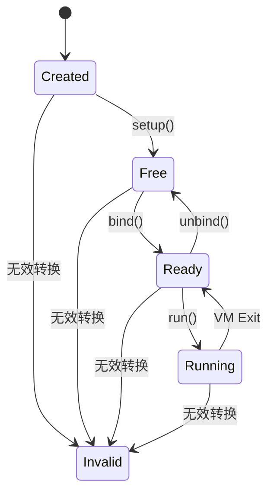
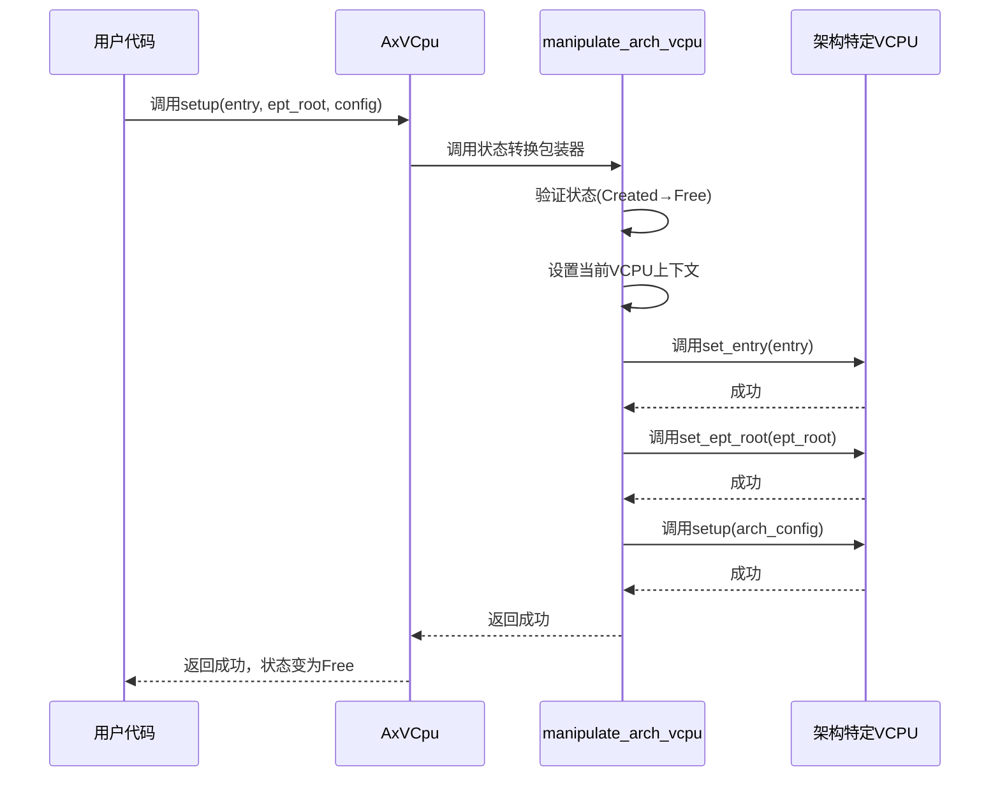
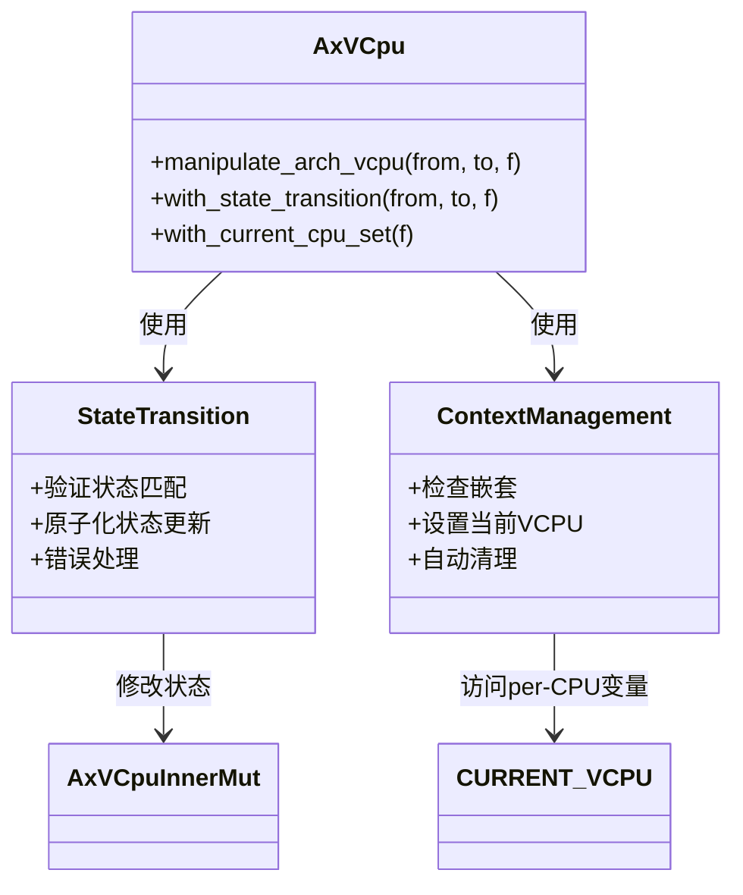
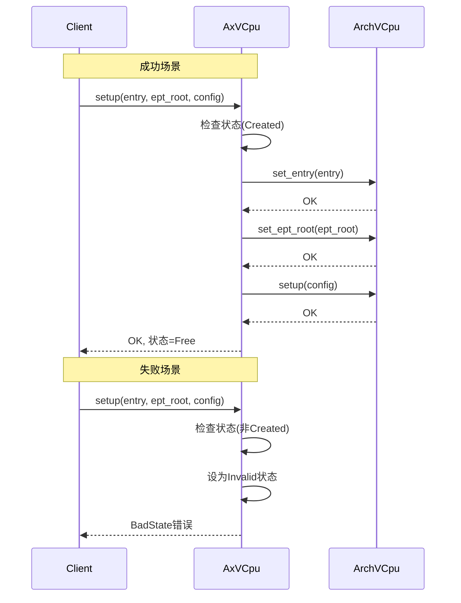
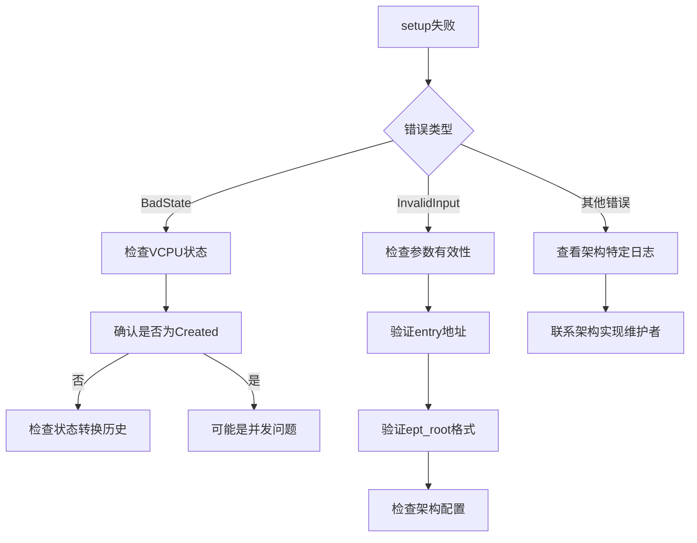

# 配置阶段

<cite>
**本文档中引用的文件**  
- [vcpu.rs](file://src/vcpu.rs)
- [arch_vcpu.rs](file://src/arch_vcpu.rs)
- [test.rs](file://src/test.rs)
</cite>

## 目录
1. [简介](#简介)
2. [VCPU状态机概述](#vcpu状态机概述)
3. [setup方法详解](#setup方法详解)
4. [入口地址与EPT根页表传递路径](#入口地址与ept根页表传递路径)
5. [原子化状态转换机制](#原子化状态转换机制)
6. [manipulate_arch_vcpu的安全注入机制](#manipulate_arch_vcpu的安全注入机制)
7. [调用示例分析](#调用示例分析)
8. [配置失败原因及调试方法](#配置失败原因及调试方法)
9. [结论](#结论)

## 简介
本文深入解析`AxVCpu::setup()`方法在VCPU生命周期中的关键作用，重点阐述其如何将VCPU从Created状态安全地转换至Free状态。文档详细说明了入口地址(entry)和EPT根页表(ept_root)的传递路径，以及这些参数如何通过`manipulate_arch_vcpu`机制安全注入到架构特定实现中。同时解释了setup操作中原子化状态转换的保障机制——即只有当当前状态为Created时才能成功进入Free状态，否则触发Invalid错误。

**Section sources**
- [vcpu.rs](file://src/vcpu.rs#L116-L160)

## VCPU状态机概述
VCPU遵循严格的状态机模型，其状态转换路径如下：
```
Created → Free → Ready → Running
```

各状态含义如下：
- **Invalid**: 错误状态，表示状态转换过程中发生异常
- **Created**: 初始状态，VCPU创建后但尚未初始化
- **Free**: 已初始化，可绑定到物理CPU
- **Ready**: 已绑定到物理CPU，准备执行
- **Running**: 正在物理CPU上运行
- **Blocked**: 执行被阻塞（等待I/O等）

该状态机确保了VCPU生命周期的有序性和安全性。



**Diagram sources**
- [vcpu.rs](file://src/vcpu.rs#L26-L55)

**Section sources**
- [vcpu.rs](file://src/vcpu.rs#L26-L55)

## setup方法详解
`AxVCpu::setup()`方法是VCPU初始化过程中的核心环节，负责完成以下关键任务：

1. 配置VCPU的入口点（entry point）
2. 设置内存管理单元的EPT根页表
3. 执行架构特定的初始化设置
4. 将VCPU状态从`Created`转换为`Free`

该方法的函数签名为：
```rust
pub fn setup(
    &self,
    entry: GuestPhysAddr,
    ept_root: HostPhysAddr,
    arch_config: A::SetupConfig,
) -> AxResult
```

其中包含三个关键参数：guest物理地址形式的入口地址、host物理地址形式的EPT根页表，以及架构特定的配置参数。



**Diagram sources**
- [vcpu.rs](file://src/vcpu.rs#L116-L160)

**Section sources**
- [vcpu.rs](file://src/vcpu.rs#L116-L160)

## 入口地址与EPT根页表传递路径
入口地址(entry)和EPT根页表(ept_root)的传递路径体现了分层设计思想，确保了架构无关性与安全性。

### 参数传递流程
1. 用户代码调用`AxVCpu::setup()`方法，传入guest物理地址形式的入口地址和host物理地址形式的EPT根页表
2. `setup()`方法通过`manipulate_arch_vcpu`包装器，确保状态转换的原子性
3. 在状态验证通过后，依次调用架构特定实现的`set_entry`、`set_ept_root`和`setup`方法
4. 架构特定实现接收并存储这些参数，为后续执行做准备

### 安全边界设计
- **GuestPhysAddr类型**：强制要求入口地址为guest物理地址，防止直接暴露host地址空间
- **HostPhysAddr类型**：EPT根页表使用host物理地址，符合硬件虚拟化要求
- **单次设置保证**：根据文档约定，`set_entry`和`set_ept_root`方法保证仅被调用一次，在`setup`之前完成

```mermaid
flowchart TD
A[用户代码] --> B[AxVCpu::setup()]
B --> C{状态检查}
C --> |状态为Created| D[调用manipulate_arch_vcpu]
C --> |状态非Created| E[返回BadState错误]
D --> F[调用set_entry(entry)]
F --> G[调用set_ept_root(ept_root)]
G --> H[调用arch_vcpu.setup(config)]
H --> I[状态转换为Free]
I --> J[返回成功]
```

**Diagram sources**
- [vcpu.rs](file://src/vcpu.rs#L116-L160)
- [arch_vcpu.rs](file://src/arch_vcpu.rs#L50-L60)

**Section sources**
- [vcpu.rs](file://src/vcpu.rs#L116-L160)
- [arch_vcpu.rs](file://src/arch_vcpu.rs#L50-L60)

## 原子化状态转换机制
`AxVCpu::setup()`方法通过多层机制确保状态转换的原子性和安全性。

### 核心保障机制
状态转换的核心由`with_state_transition`方法实现，其逻辑如下：

1. 检查当前状态是否等于期望的起始状态（from）
2. 如果不相等，立即将状态设为`Invalid`并返回`BadState`错误
3. 如果相等，执行提供的闭包函数
4. 根据闭包执行结果决定最终状态：
   - 执行成功：状态转换为目标状态（to）
   - 执行失败：状态设为`Invalid`

### setup方法中的应用
在`setup()`方法中，这一机制具体体现为：
```rust
self.manipulate_arch_vcpu(VCpuState::Created, VCpuState::Free, |arch_vcpu| {
    arch_vcpu.set_entry(entry)?;
    arch_vcpu.set_ept_root(ept_root)?;
    arch_vcpu.setup(arch_config)?;
    Ok(())
})
```

这确保了：
- 只有当VCPU处于`Created`状态时才能开始setup过程
- 整个setup过程作为一个原子操作执行
- 任何步骤失败都会导致状态变为`Invalid`
- 成功完成后状态确定地变为`Free`

```mermaid
flowchart LR
A[调用setup()] --> B{当前状态==Created?}
B --> |是| C[开始状态转换]
B --> |否| D[设为Invalid状态]
D --> E[返回BadState错误]
C --> F[执行set_entry]
F --> G{成功?}
G --> |否| H[设为Invalid状态]
H --> I[返回错误]
G --> |是| J[执行set_ept_root]
J --> K{成功?}
K --> |否| H
K --> |是| L[执行arch_vcpu.setup]
L --> M{成功?}
M --> |否| H
M --> |是| N[设为Free状态]
N --> O[返回成功]
```

**Diagram sources**
- [vcpu.rs](file://src/vcpu.rs#L188-L208)
- [vcpu.rs](file://src/vcpu.rs#L232-L240)

**Section sources**
- [vcpu.rs](file://src/vcpu.rs#L188-L240)

## manipulate_arch_vcpu的安全注入机制
`manipulate_arch_vcpu`是连接架构无关层与架构特定层的关键安全网关，它整合了多个安全保障机制。

### 方法定义
```rust
pub fn manipulate_arch_vcpu<F, T>(&self, from: VCpuState, to: VCpuState, f: F) -> AxResult<T>
where
    F: FnOnce(&mut A) -> AxResult<T>,
```

### 复合安全保障
该方法实际上是两个安全机制的组合：

1. **状态转换保护**：通过`with_state_transition`确保状态机的正确性
2. **上下文管理保护**：通过`with_current_cpu_set`管理当前VCPU上下文

其内部实现为：
```rust
self.with_state_transition(from, to, || {
    self.with_current_cpu_set(|| f(self.get_arch_vcpu()))
})
```

### 上下文管理机制
- **防嵌套操作**：`with_current_cpu_set`会检查是否存在当前VCPU，防止嵌套操作
- **自动清理**：使用RAII模式，在闭包执行完毕后自动清除当前VCPU上下文
- **线程安全**：通过per-CPU变量`CURRENT_VCPU`确保每个物理CPU上的操作隔离

这种设计确保了即使在并发环境下，架构特定代码也能安全地访问其所属的`AxVCpu`实例。



**Diagram sources**
- [vcpu.rs](file://src/vcpu.rs#L232-L240)
- [vcpu.rs](file://src/vcpu.rs#L188-L208)

**Section sources**
- [vcpu.rs](file://src/vcpu.rs#L232-L240)

## 调用示例分析
以下是一个典型的VCPU setup调用示例及其执行流程分析。

### 典型调用序列
```rust
// 创建VCPU
let vcpu = AxVCpu::new(vm_id, vcpu_id, favor_cpu, cpu_set, create_config)?;

// 执行setup
let result = vcpu.setup(entry, ept_root, setup_config);
```

### 成功执行路径
当VCPU处于正确状态时，执行流程如下：
1. VCPU创建后状态为`Created`
2. 调用`setup()`方法
3. `manipulate_arch_vcpu`验证当前状态为`Created`
4. 依次执行`set_entry`、`set_ept_root`、`arch_vcpu.setup`
5. 所有操作成功，状态转换为`Free`
6. 返回成功结果

### 失败执行路径
当VCPU状态不正确时，执行流程如下：
1. VCPU已被错误地转换到`Ready`状态
2. 调用`setup()`方法
3. `manipulate_arch_vcpu`检测到当前状态不是`Created`
4. 立即将状态设为`Invalid`
5. 返回`BadState`错误



**Diagram sources**
- [test.rs](file://src/test.rs#L335-L370)
- [vcpu.rs](file://src/vcpu.rs#L116-L160)

**Section sources**
- [test.rs](file://src/test.rs#L335-L370)

## 配置失败原因及调试方法
尽管`setup()`方法设计了多重安全保障，但在实际使用中仍可能出现配置失败的情况。

### 常见失败原因

#### 1. 状态机违规
- **现象**：返回`BadState`错误
- **原因**：VCPU未处于`Created`状态
- **典型场景**：重复调用setup，或在其他操作后调用setup

#### 2. 架构特定验证失败
- **现象**：返回`InvalidInput`或其他架构特定错误
- **原因**：`arch_vcpu.setup()`内部验证失败
- **典型场景**：EPT根页表格式错误，或入口地址无效

#### 3. 并发访问冲突
- **现象**：panic或未定义行为
- **原因**：嵌套VCPU操作
- **典型场景**：在中断处理程序中调用setup

### 调试方法

#### 1. 状态检查
```rust
println!("当前VCPU状态: {:?}", vcpu.state());
assert_eq!(vcpu.state(), VCpuState::Created, "VCPU必须处于Created状态");
```

#### 2. 日志跟踪
利用测试框架中的调用日志功能：
```rust
let calls = call_log.borrow();
assert_eq!(calls[0], "new");
assert_eq!(calls[1], "set_entry");
assert_eq!(calls[2], "set_ept_root");
assert_eq!(calls[3], "setup");
```

#### 3. 分步调试
避免直接使用`setup()`，而是分步执行以定位问题：
```rust
// 分步调试替代方案
vcpu.get_arch_vcpu().set_entry(entry)?;
vcpu.get_arch_vcpu().set_ept_root(ept_root)?;
vcpu.get_arch_vcpu().setup(config)?;
```

#### 4. 断言验证
在关键位置添加断言：
```rust
debug_assert!(self.entry.is_some(), "必须先设置入口地址");
debug_assert!(self.ept_root.is_some(), "必须先设置EPT根页表");
```



**Diagram sources**
- [test.rs](file://src/test.rs#L335-L370)
- [arch_vcpu.rs](file://src/arch_vcpu.rs#L60-L65)

**Section sources**
- [test.rs](file://src/test.rs#L335-L370)
- [arch_vcpu.rs](file://src/arch_vcpu.rs#L60-L65)

## 结论
`AxVCpu::setup()`方法通过精心设计的状态机机制和安全注入模式，实现了VCPU从`Created`到`Free`状态的安全转换。该方法的核心价值体现在：

1. **状态安全保障**：通过`manipulate_arch_vcpu`确保只有在正确状态下才能执行setup操作
2. **参数安全传递**：清晰分离guest物理地址和host物理地址，防止地址空间混淆
3. **原子化操作**：整个setup过程作为原子操作执行，避免中间状态暴露
4. **架构解耦**：通过trait接口实现架构无关性，便于扩展支持不同硬件平台

开发者在使用此API时，应严格遵守状态机规则，确保在`Created`状态下调用`setup()`方法，并妥善处理可能的错误情况。对于调试，建议使用分步执行方式定位问题根源，充分利用状态查询和日志跟踪功能。