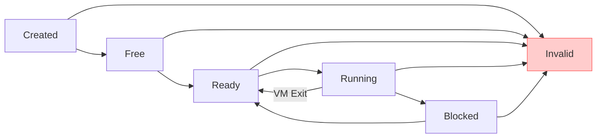

# 状态定义

<cite>
**本文档引用的文件**
- [vcpu.rs](file://src/vcpu.rs)
- [README.md](file://README.md)
</cite>

## 目录
1. [引言](#引言)
2. [VCPU状态枚举详解](#vcpu状态枚举详解)
3. [状态生命周期与转换](#状态生命周期与转换)
4. [核心状态语义分析](#核心状态语义分析)
5. [状态机图示说明](#状态机图示说明)
6. [代码实现与Trait派生](#代码实现与trait派生)

## 引言

AxVCpu 是 ArceOS 虚拟化框架中的虚拟 CPU 抽象库，提供跨架构的统一接口用于管理虚拟 CPU。本文档聚焦于其核心组件之一——VCPU 状态管理系统，特别是 `VCpuState` 枚举类型的实现。该状态系统定义了虚拟 CPU 在整个生命周期中经历的六种核心状态：Created、Free、Ready、Running、Blocked 和 Invalid。这些状态构成了严格的有限状态机，确保 VCPU 的创建、初始化、执行和终止过程安全可控。

通过结合源码分析与 README 中提供的状态机图示，本文将详细解释每种状态的语义含义、触发时机以及在调用流程中的实际应用。

## VCPU状态枚举详解

`VCpuState` 枚举类型是 AxVCpu 模块中用于表示虚拟 CPU 当前执行状态的核心数据结构。它被设计为一个可复制（Copy）、可克隆（Clone）并实现了调试（Debug）和部分相等性比较（PartialEq）等特性的类型，便于在运行时进行状态检查和日志输出。

该枚举明确地定义了六种离散状态，每种状态对应 VCPU 生命周期中的特定阶段，并通过整数值显式赋值以增强可读性和调试便利性。

**Section sources**
- [vcpu.rs](file://src/vcpu.rs#L20-L37)

## 状态生命周期与转换

VCPU 的状态遵循一条严格定义的正向路径：从 `Created` 开始，依次经过 `Free`、`Ready`，最终进入 `Running` 状态执行客户机代码。在此过程中，可能因 I/O 等待等原因进入 `Blocked` 状态，之后可恢复至 `Ready` 状态等待调度。任何非法的状态转换或操作失败都将导致 VCPU 进入 `Invalid` 错误状态。

关键的生命周期方法如 `new()` 和 `setup()` 直接驱动状态转换：
- **`new()` 方法**：当调用 `AxVCpu::new` 创建一个新的虚拟 CPU 实例时，其内部状态被初始化为 `VCpuState::Created`，标志着 VCPU 对象的诞生。
- **`setup()` 方法**：成功调用 `AxVCpu::setup` 后，VCPU 完成必要的配置（如设置入口地址、EPT 根表等），状态从 `Created` 原子性地转换为 `Free`，表明其已准备好被绑定到物理 CPU。

这种基于方法调用的状态转换机制由 `with_state_transition` 和 `manipulate_arch_vcpu` 等内部函数保障，确保了状态迁移的原子性和安全性。

**Section sources**
- [vcpu.rs](file://src/vcpu.rs#L89-L115)
- [vcpu.rs](file://src/vcpu.rs#L205-L225)

## 核心状态语义分析

以下是对六种核心状态的详细语义解释：

### Created (已创建)
此状态表示 VCPU 刚刚通过 `new()` 方法创建完成，但尚未进行任何初始化配置。此时 VCPU 仅是一个空壳对象，不具备执行能力。它是所有 VCPU 生命周期的起点。

### Free (空闲)
当 `setup()` 方法成功执行后，VCPU 进入 `Free` 状态。这表示其架构无关和架构相关的初始化工作均已完成，可以被调度器选择并绑定到某个物理 CPU 上。

### Ready (就绪)
调用 `bind()` 方法成功后，VCPU 从 `Free` 状态转变为 `Ready` 状态。这意味着它已被分配给一个特定的物理 CPU，并完成了上下文绑定，只待调度器安排其开始执行。

### Running (运行中)
当 `run()` 方法被调用时，VCPU 从 `Ready` 状态进入 `Running` 状态。在此状态下，VCPU 正在物理 CPU 上执行客户机代码。当发生 VM Exit 时，控制权返回给 VMM，VCPU 状态会回到 `Ready`。

### Blocked (阻塞)
VCPU 可能因等待外部事件（如 I/O 操作完成）而主动或被动地进入 `Blocked` 状态。在此状态下，它不会被调度执行，直到阻塞条件解除。

### Invalid (无效)
这是一个错误状态，用于标记非法的状态转换或操作失败。一旦 VCPU 进入此状态，通常意味着发生了不可恢复的错误，需要进行异常处理或重置。

**Section sources**
- [vcpu.rs](file://src/vcpu.rs#L20-L37)
- [README.md](file://README.md#L45-L65)

## 状态机图示说明

根据 README.md 文件中的描述，VCPU 的状态机呈现出清晰的线性演进路径，辅以循环和错误处理分支：



**Diagram sources**
- [README.md](file://README.md#L45-L65)
- [vcpu.rs](file://src/vcpu.rs#L20-L37)

该图示直观地展示了：
- **主执行流**：`Created → Free → Ready → Running`
- **调度循环**：`Running` 因 VM Exit 返回 `Ready`，形成执行-退出-再调度的循环
- **阻塞路径**：`Running` 可进入 `Blocked`，完成后返回 `Ready`
- **错误汇聚**：所有正常状态均可因错误转入 `Invalid`，但 `Invalid` 不可逆

## 代码实现与Trait派生

`VCpuState` 枚举的定义充分体现了 Rust 的零成本抽象和安全性原则。其 `#[derive(Clone, Copy, Debug, PartialEq, Eq)]` 属性宏自动为枚举实现了四个关键 trait：
- **`Clone` 和 `Copy`**：允许状态值在栈上高效复制，避免堆分配开销。
- **`Debug`**：使得状态可以直接通过 `{:?}` 格式化输出，极大地方便了日志记录和调试。
- **`PartialEq` 和 `Eq`**：支持使用 `==` 操作符直接比较两个状态是否相等，这是状态检查逻辑的基础。

这种设计不仅保证了性能，也提升了代码的可读性和健壮性。

```mermaid
classDiagram
class VCpuState {
<<enumeration>>
+Invalid = 0
+Created = 1
+Free = 2
+Ready = 3
+Running = 4
+Blocked = 5
}
note right of VCpuState
表示虚拟CPU的执行状态
使用#[derive(Debug, PartialEq)]
支持调试输出和相等性比较
end note
```

**Diagram sources**
- [vcpu.rs](file://src/vcpu.rs#L20-L37)