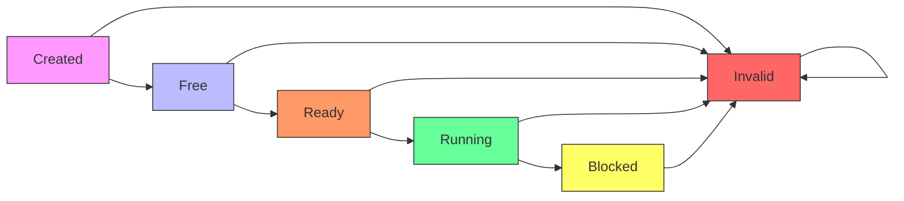
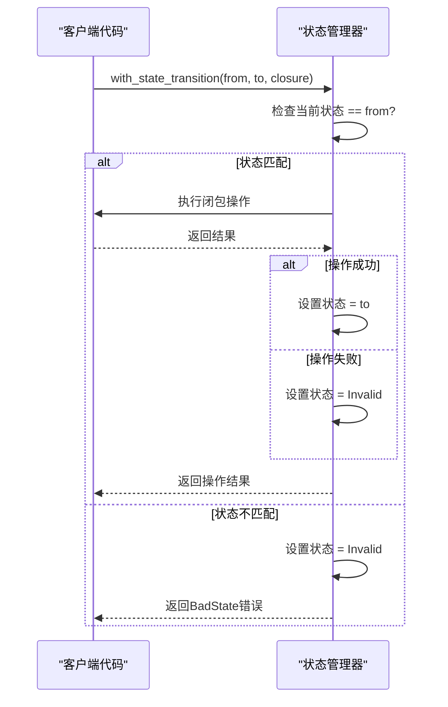

# 状态管理

<cite>
**本文档引用的文件**
- [vcpu.rs](file://src/vcpu.rs)
- [arch_vcpu.rs](file://src/arch_vcpu.rs)
- [README.md](file://README.md)
</cite>

## 目录
1. [引言](#引言)
2. [VCPU状态机概述](#vcpu状态机概述)
3. [核心状态定义](#核心状态定义)
4. [状态转换机制](#状态转换机制)
5. [内部可变性实现](#内部可变性实现)
6. [完整状态流转示例](#完整状态流转示例)
7. [状态验证与错误处理](#状态验证与错误处理)
8. [结论](#结论)

## 引言

AxVCpu库为ArceOS虚拟化环境提供了一个架构无关的虚拟CPU抽象层，其核心特性之一是严格的VCPU状态管理系统。该系统通过有限状态机模型确保虚拟CPU在其生命周期内的所有状态转换都是安全且可预测的。本文档深入分析VCPU状态管理的实现细节，包括六种核心状态的语义含义、状态转换规则、保护机制以及相关的代码实现。

**Section sources**
- [README.md](file://README.md#L35-L50)

## VCPU状态机概述

AxVCpu实现了严格的VCPU状态机模型，定义了虚拟CPU从创建到销毁的完整生命周期。状态机遵循预定义的转换路径，确保任何状态变更都必须经过合法的迁移过程。这种设计防止了无效或危险的状态组合，提高了系统的可靠性和安全性。



**Diagram sources**
- [vcpu.rs](file://src/vcpu.rs#L33-L39)

**Section sources**
- [vcpu.rs](file://src/vcpu.rs#L33-L39)
- [README.md](file://README.md#L35-L50)

## 核心状态定义

VCPU状态机包含六种离散状态，每种状态代表虚拟CPU生命周期中的特定阶段：

### Created（已创建）
这是VCPU的初始状态，在调用`new()`方法后进入。此时VCPU对象已被分配，但尚未进行任何初始化配置。处于此状态的VCPU不能执行任何操作，必须先通过`setup()`方法进行配置才能进入下一状态。

### Free（空闲）
在成功调用`setup()`方法后，VCPU进入Free状态。此时VCPU已完成基本配置（如入口地址、页表根等），可以被绑定到物理CPU上执行。该状态表示VCPU已准备好参与调度，但尚未与任何物理CPU关联。

### Ready（就绪）
当`bind()`方法成功执行后，VCPU进入Ready状态。此时VCPU已绑定到特定的物理CPU，并完成了所有必要的架构特定初始化。处于Ready状态的VCPU可以随时开始执行，等待调度器将其投入运行。

### Running（运行中）
通过调用`run()`方法，VCPU从Ready状态转换为Running状态。在此状态下，VCPU正在物理CPU上执行客户机代码。当发生VM退出（如I/O访问、中断等）时，VCPU会自动返回到Ready状态，准备处理退出事件。

### Blocked（阻塞）
当VCPU因等待外部事件（如I/O完成、信号量等）而无法继续执行时，可进入Blocked状态。虽然当前实现中未直接展示阻塞转换，但状态机设计预留了此状态以支持未来的异步操作和资源等待机制。

### Invalid（无效）
这是一个错误状态，当发生非法状态转换或操作失败时进入。一旦VCPU进入Invalid状态，通常意味着发生了不可恢复的错误，需要进行故障排查或重新创建VCPU实例。

**Section sources**
- [vcpu.rs](file://src/vcpu.rs#L33-L39)
- [README.md](file://README.md#L35-L50)

## 状态转换机制

AxVCpu通过两种关键方法实现安全的状态转换：`with_state_transition`和`manipulate_arch_vcpu`。这些方法共同构成了状态管理的核心保护机制。

### with_state_transition 方法

`with_state_transition`方法是状态转换的基础构建块，它确保只有在当前状态匹配预期源状态时才允许执行状态变更。该方法采用闭包模式，在执行提供的操作前后自动处理状态验证和更新。



**Diagram sources**
- [vcpu.rs](file://src/vcpu.rs#L150-L175)

**Section sources**
- [vcpu.rs](file://src/vcpu.rs#L150-L175)

### manipulate_arch_vcpu 方法

`manipulate_arch_vcpu`方法是`with_state_transition`的增强版本，它不仅处理状态转换，还管理当前VCPU上下文。该方法结合了状态验证和上下文设置，确保在执行架构特定操作时VCPU处于正确的状态和上下文中。

这种方法特别重要，因为它解决了并发访问和嵌套操作的问题。通过维护一个全局的`CURRENT_VCPU`变量，系统可以确保任何时候只有一个VCPU在活动状态，防止了竞态条件和不一致的状态修改。

**Section sources**
- [vcpu.rs](file://src/vcpu.rs#L200-L215)

## 内部可变性实现

AxVCpu使用Rust的`RefCell`类型来实现内部可变性，这是其状态管理能够保持API简洁性的关键设计。

### AxVCpuInnerMut 结构体

`AxVCpuInnerMut`结构体封装了VCPU的可变状态，特别是`state`字段。通过将其包装在`RefCell`中，即使在不可变的`&self`引用下也能安全地修改状态。

```mermaid
classDiagram
class AxVCpuInnerMut {
+state : VCpuState
}
class RefCell~AxVCpuInnerMut~ {
-value : AxVCpuInnerMut
-borrow_flag : i32
}
RefCell~AxVCpuInnerMut~ "1" *-- "1" AxVCpuInnerMut : contains
note right of AxVCpuInnerMut
使用RefCell实现内部可变性
允许在&self上下文中修改状态
运行时借用检查替代编译时检查
end note
```

**Diagram sources**
- [vcpu.rs](file://src/vcpu.rs#L55-L60)

**Section sources**
- [vcpu.rs](file://src/vcpu.rs#L55-L60)

### 运行时借用检查

与Rust通常的编译时借用检查不同，`RefCell`在运行时执行借用规则。这使得AxVCpu能够在保持大多数方法为`&self`的同时，安全地修改内部状态。如果违反借用规则（例如同时存在多个可变借用），程序会在运行时panic，而不是在编译时拒绝。

这种设计权衡了性能与灵活性：虽然引入了运行时开销，但极大地简化了API设计，避免了复杂的生命周期标注和所有权转移。

## 完整状态流转示例

以下是从VCPU创建到执行的完整状态流转过程，展示了各个状态转换方法的实际应用：

```mermaid
flowchart TD
Start([new()]) --> Created["Created\n(初始状态)"]
Created --> Setup["setup()\n配置入口地址和EPT)"]
Setup --> Free["Free\n(已配置)"]
Free --> Bind["bind()\n绑定到物理CPU)"]
Bind --> Ready["Ready\n(已绑定)"]
Ready --> Run["run()\n开始执行)"]
Run --> Running["Running\n(运行中)"]
Running --> Exit["VM退出事件"]
Exit --> Handle["处理退出原因"]
Handle --> Ready
style Created fill:#f9f,stroke:#333
style Free fill:#bbf,stroke:#333
style Ready fill:#f96,stroke:#333
style Running fill:#6f9,stroke:#333
click Created "file://src/vcpu.rs#L85-L100"
click Free "file://src/vcpu.rs#L105-L120"
click Ready "file://src/vcpu.rs#L250-L260"
click Running "file://src/vcpu.rs#L240-L245"
```

**Diagram sources**
- [vcpu.rs](file://src/vcpu.rs#L85-L100)
- [vcpu.rs](file://src/vcpu.rs#L105-L120)
- [vcpu.rs](file://src/vcpu.rs#L250-L260)
- [vcpu.rs](file://src/vcpu.rs#L240-L245)

**Section sources**
- [vcpu.rs](file://src/vcpu.rs#L85-L100)
- [vcpu.rs](file://src/vcpu.rs#L105-L120)
- [vcpu.rs](file://src/vcpu.rs#L240-L260)

### 创建阶段 (new → Created)

通过调用`new()`方法创建VCPU实例，此时VCPU进入Created状态。这个阶段只分配对象并初始化常量配置，不涉及任何硬件操作。

### 配置阶段 (Created → Free)

调用`setup()`方法将VCPU从Created状态转换到Free状态。此操作配置了客户机的入口地址、扩展页表（EPT）根以及其他架构特定参数。

### 绑定阶段 (Free → Ready)

`bind()`方法将VCPU与当前物理CPU关联，完成架构特定的绑定操作。成功后VCPU进入Ready状态，表示已准备好执行。

### 执行阶段 (Ready → Running)

最后，`run()`方法启动VCPU执行，将其状态从Ready转换为Running。当客户机代码触发VM退出时，控制权返回给VMM，VCPU状态自动回到Ready，等待进一步处理。

## 状态验证与错误处理

### transition_state 方法

`transition_state`方法提供了最简单的状态转换接口，它本质上是`with_state_transition`的特化版本，用于不需要额外操作的纯状态变更。该方法在内部调用`with_state_transition`并传递一个空闭包，仅执行状态验证和更新。

**Section sources**
- [vcpu.rs](file://src/vcpu.rs#L220-L225)

### 错误处理策略

当状态转换失败时，系统采取严格的错误处理策略：
1. **立即标记为Invalid**：任何状态验证失败都会立即将VCPU置于Invalid状态，防止后续的非法操作。
2. **清晰的错误信息**：返回详细的错误描述，包括期望状态和实际状态，便于调试。
3. **原子性保证**：整个状态转换过程是原子的，要么完全成功，要么回滚到错误状态，不会留下中间状态。

这种防御性编程方法确保了系统的健壮性，即使在异常情况下也能维持可预测的行为。

**Section sources**
- [vcpu.rs](file://src/vcpu.rs#L150-L175)

## 结论

AxVCpu的状态管理系统通过精心设计的状态机模型、安全的状态转换机制和Rust的内部可变性特性，实现了高效且可靠的VCPU生命周期管理。其核心优势在于：
- 严格的编排确保了状态一致性
- `with_state_transition`和`manipulate_arch_vcpu`提供了安全的转换框架
- `RefCell`的使用平衡了安全性与API简洁性
- 清晰的错误处理机制提高了系统的可靠性

这一设计模式不仅适用于虚拟化场景，也为其他需要严格状态管理的系统组件提供了有价值的参考。