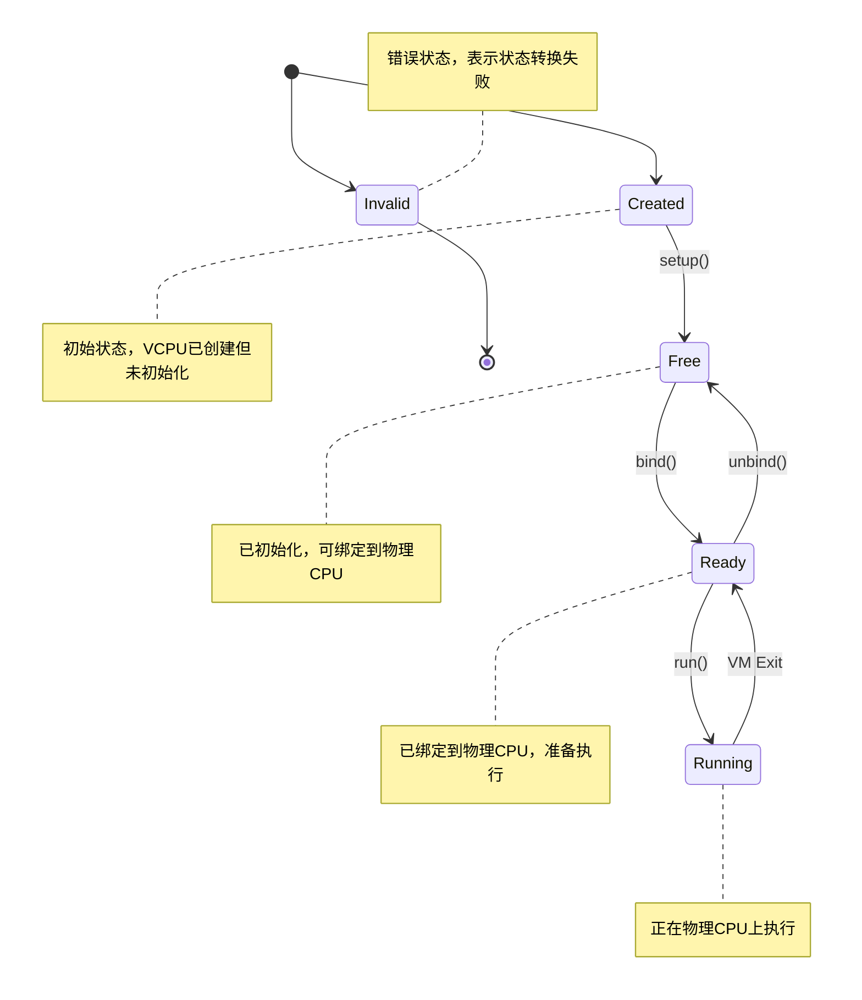
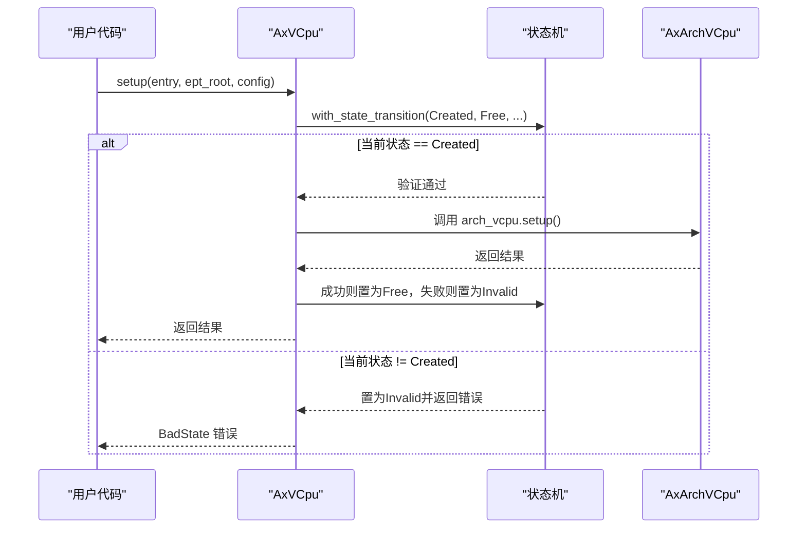

<cite>
**本文档中引用的文件**
- [vcpu.rs](file://src/vcpu.rs)
- [arch_vcpu.rs](file://src/arch_vcpu.rs)
</cite>

## 目录
1. [引言](#引言)
2. [VCPU状态机模型](#vcpu状态机模型)
3. `with_state_transition`机制详解
4. `manipulate_arch_vcpu`方法分析
5. 状态转换API调用链解析
6. `transition_state`简化工具
7. 安全性与错误处理
8. 结论

## 引言

本文深入解析axvcpu模块中虚拟CPU（VCPU）状态安全转换的核心实现机制。重点围绕`with_state_transition`和`manipulate_arch_vcpu`两个核心方法，详细阐述其如何通过闭包封装和状态验证来确保VCPU状态迁移的安全性和一致性。文档将结合VCPU的状态机模型，分析`setup()`、`bind()`、`run()`等关键API的调用流程，揭示该机制如何有效防止非法状态迁移，为虚拟化系统的稳定运行提供保障。

## VCPU状态机模型

VCPU遵循严格的状态机模型，定义了从创建到执行的完整生命周期。该状态机确保所有状态转换都必须按照预定义的路径进行，从而避免系统进入不一致或不可预测的状态。



**Diagram sources**
- [vcpu.rs](file://src/vcpu.rs#L20-L35)

**Section sources**
- [vcpu.rs](file://src/vcpu.rs#L20-L35)

## `with_state_transition`机制详解

`with_state_transition`是VCPU状态安全转换的核心方法，它通过一个精巧的设计模式实现了原子性的状态变更。

该方法接收三个参数：预期的起始状态`from`、目标状态`to`，以及一个返回`AxResult<T>`的闭包函数`f`。其执行逻辑如下：

1. **状态验证**：首先检查当前VCPU状态是否与预期的`from`状态完全匹配。如果不匹配，则立即将状态置为`Invalid`并返回错误。
2. **闭包执行**：如果状态验证通过，则执行传入的闭包函数`f`。
3. **状态提交**：
   - 若闭包执行成功（返回`Ok`），则将VCPU状态更新为`to`。
   - 若闭包执行失败（返回`Err`），则将VCPU状态置为`Invalid`，以标记此次操作失败。

这种设计的关键优势在于：
- **原子性**：整个“验证-执行-提交”过程在一个临界区内完成，由`RefCell`的借用机制保证线程安全。
- **安全性**：任何非法的状态迁移尝试都会被立即捕获，并将VCPU置于`Invalid`状态，防止后续操作继续在错误状态下执行。
- **简洁性**：调用者只需关注业务逻辑（封装在闭包中），而无需手动管理复杂的状态检查和更新。

例如，禁止从`Running`状态直接跳转到`Free`状态。任何试图绕过`Ready`状态的调用都将因状态不匹配而失败。

**Section sources**
- [vcpu.rs](file://src/vcpu.rs#L145-L165)

## `manipulate_arch_vcpu`方法分析

`manipulate_arch_vcpu`是一个更高层次的抽象，它结合了`with_state_transition`和上下文管理功能，专门用于安全地操作架构相关的VCPU实现。

该方法的签名如下：
```rust
pub fn manipulate_arch_vcpu<F, T>(&self, from: VCpuState, to: VCpuState, f: F) -> AxResult<T>
where
    F: FnOnce(&mut A) -> AxResult<T>,
```

其内部实现展示了强大的组合能力：
1. **双重保护**：它首先调用`with_state_transition`来确保状态转换的合法性。
2. **上下文设置**：在状态验证通过后，它使用`with_current_cpu_set`将当前VCPU设置为全局上下文，这对于某些需要知道“当前正在运行哪个VCPU”的底层操作至关重要。
3. **委托执行**：最后，它将控制权委托给用户提供的闭包`f`，该闭包可以安全地访问和修改底层的`AxArchVCpu`实例。

这种分层设计使得`manipulate_arch_vcpu`成为执行任何涉及架构特定操作（如`bind`、`run`）的标准入口点，既保证了状态安全，又提供了必要的执行上下文。

**Section sources**
- [vcpu.rs](file://src/vcpu.rs#L190-L200)

## 状态转换API调用链解析

VCPU的公共API（如`setup`、`bind`、`run`）都依赖于上述核心机制来保证状态一致性。下面分析其调用链：

### `setup()` 方法


**Diagram sources**
- [vcpu.rs](file://src/vcpu.rs#L75-L85)

**Section sources**
- [vcpu.rs](file://src/vcpu.rs#L75-L85)

### `bind()` 和 `run()` 方法
`bind()`和`run()`方法的调用链更为典型，它们都直接使用`manipulate_arch_vcpu`作为执行框架：
- `bind()`：要求从`Free`状态迁移到`Ready`状态。
- `run()`：首先使用`transition_state`从`Ready`切换到`Running`，然后在`manipulate_arch_vcpu`的保护下执行`arch_vcpu.run()`。

这形成了一条清晰且安全的执行路径：`Created → Free → Ready → Running`，任何偏离此路径的调用都会被拦截。

**Section sources**
- [vcpu.rs](file://src/vcpu.rs#L220-L240)

## `transition_state`简化工具

`transition_state`是`with_state_transition`的一个简化版本，用于那些不需要执行复杂业务逻辑的纯状态转换场景。

其实现非常简洁：
```rust
pub fn transition_state(&self, from: VCpuState, to: VCpuState) -> AxResult {
    self.with_state_transition(from, to, || Ok(()))
}
```

它本质上是调用`with_state_transition`并传入一个总是返回`Ok(())`的空闭包。这使得`transition_state`成为一个轻量级的工具，适用于简单的状态跃迁，例如`run()`方法中从`Ready`到`Running`的初始状态切换。它继承了`with_state_transition`的所有安全特性，同时提供了更直观的API。

**Section sources**
- [vcpu.rs](file://src/vcpu.rs#L210-L215)

## 安全性与错误处理

该状态转换机制在安全性方面表现出色：
- **防呆设计**：通过严格的前置状态检查，从根本上杜绝了非法迁移的可能性。
- **故障隔离**：一旦发生错误，VCPU会被立即标记为`Invalid`状态，阻止任何进一步的操作，防止错误蔓延。
- **清晰的错误反馈**：返回详细的错误信息（包含期望状态和实际状态），便于调试。

唯一的潜在风险是`set_state`方法被标记为`unsafe`，这意味着开发者必须谨慎使用，否则可能破坏状态机的完整性。但在正常情况下，所有状态变更都应通过`with_state_transition`及其衍生方法进行。

## 结论

axvcpu模块通过`with_state_transition`和`manipulate_arch_vcpu`构建了一个健壮、安全的状态转换框架。该框架利用Rust的类型系统和闭包特性，将复杂的并发和状态管理问题转化为简单、可组合的API。`setup`、`bind`、`run`等API的调用链清晰地体现了这一设计的优势，确保了VCPU在其整个生命周期内始终处于一致且可预测的状态。`transition_state`作为简化工具，进一步提升了API的易用性。整体设计充分展现了Rust在系统编程中对安全性和性能的卓越平衡。