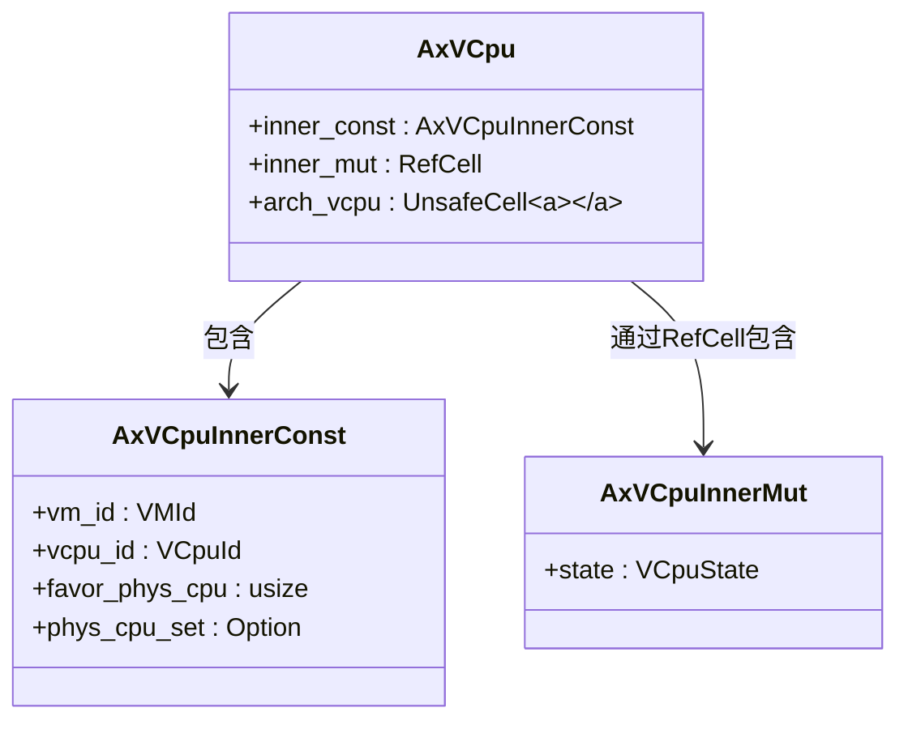
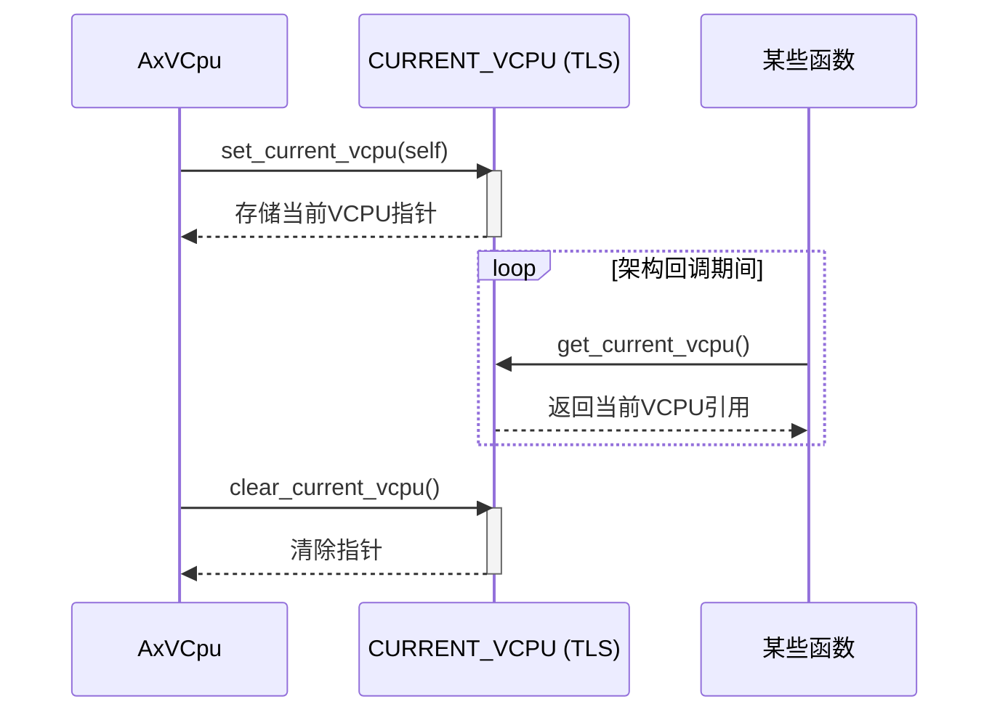
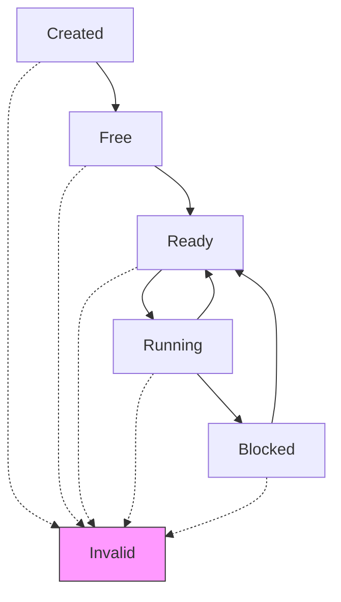

# 运行时状态管理

<cite>
**本文档引用的文件**  
- [vcpu.rs](file://src/vcpu.rs)
- [arch_vcpu.rs](file://src/arch_vcpu.rs)
- [percpu.rs](file://src/percpu.rs)
</cite>

## 目录
1. [引言](#引言)
2. [核心结构与内部可变性机制](#核心结构与内部可变性机制)
3. [`AxVCpuInnerMut` 与 `RefCell` 的协同工作原理](#axvcpuinnersmut-与-refcell-的协同工作原理)
4. `inner_mut` 字段的设计优势分析
5. `arch_vcpu` 字段中 `UnsafeCell` 的必要性
6. 当前VCPU实例的安全获取机制
7. 状态转换与执行流程控制
8. 总结

## 引言
在虚拟化系统中，虚拟CPU（VCPU）的状态管理是确保虚拟机稳定运行的关键。`axvcpu`库通过Rust语言的内部可变性机制实现了对VCPU运行时状态的安全管理。该设计允许在不可变引用（&self）上调用方法来修改内部状态，同时避免了数据竞争和借用冲突。本文将深入分析`AxVCpu`如何利用`RefCell`和`UnsafeCell`实现这一目标，并探讨其在跨架构回调、控制权转移等场景下的安全性保障。

## 核心结构与内部可变性机制
`AxVCpu`结构体采用分层设计，分离了不可变配置与可变状态：



**图示来源**
- [vcpu.rs](file://src/vcpu.rs#L57-L76)

**本节来源**
- [vcpu.rs](file://src/vcpu.rs#L57-L76)

## `AxVCpuInnerMut` 与 `RefCell` 的协同工作原理
`AxVCpuInnerMut`结构体封装了VCPU的可变运行时状态，特别是当前执行状态`state`。为了在不暴露可变引用的前提下安全地进行状态变更，`AxVCpu`使用`RefCell<AxVCpuInnerMut>`包装该结构体。

这种设计使得即使在不可变引用（&self）上也能调用`state()`或`bind()`等方法修改内部状态。其核心在于`RefCell`提供的“内部可变性”机制：它将借用检查从编译时推迟到运行时。当调用`borrow()`或`borrow_mut()`时，`RefCell`会在运行时动态检查是否存在活跃的可变/不可变借用，从而防止数据竞争。

例如，在`state()`方法中：
```rust
pub fn state(&self) -> VCpuState {
    self.inner_mut.borrow().state
}
```
尽管`&self`是不可变引用，但`RefCell::borrow()`允许临时获取一个不可变引用以读取状态值，而不会违反Rust的所有权规则。

**本节来源**
- [vcpu.rs](file://src/vcpu.rs#L69-L70)
- [vcpu.rs](file://src/vcpu.rs#L165-L168)

## `inner_mut` 字段的设计优势分析
`inner_mut: RefCell<AxVCpuInnerMut>`字段的设计具有以下显著优势：

1. **封装性增强**：外部代码无法直接获得`AxVCpuInnerMut`的可变引用，所有状态变更必须通过`AxVCpu`提供的公共接口完成。
2. **线程非安全性可控**：由于`RefCell`不具备线程同步能力，此设计明确要求调用者保证单线程访问或外部同步，符合VCPU通常绑定到特定物理CPU的使用模式。
3. **状态一致性保障**：结合`with_state_transition`等方法，可在状态变更前后自动验证状态机合法性，防止非法转换。

例如，`with_state_transition`方法确保只有当VCPU处于预期状态时才执行操作，否则标记为`Invalid`并返回错误。

**本节来源**
- [vcpu.rs](file://src/vcpu.rs#L70)
- [vcpu.rs](file://src/vcpu.rs#L188-L208)

## `arch_vcpu` 字段中 `UnsafeCell` 的必要性
`arch_vcpu: UnsafeCell<A>`字段用于存储架构特定的VCPU实现。之所以选择`UnsafeCell`而非`RefCell`，是因为在控制权转移给客户机操作系统期间，无法释放`RefCell`的守卫（guard）。

具体来说，当调用`run()`方法时，控制权会从宿主内核转移到客户机操作系统，此时无法保证能及时调用`RefCell`的`Drop`实现来释放借用。若使用`RefCell`，会导致运行时借用检查失败或死锁。而`UnsafeCell`绕过了Rust的别名限制，允许通过原始指针直接访问内部数据，只要开发者确保不会发生数据竞争即可。

此外，`get_arch_vcpu()`方法虽被标记为`unsafe`，但在正确使用上下文（如仅在`manipulate_arch_vcpu`保护下调用）时是安全的。

**本节来源**
- [vcpu.rs](file://src/vcpu.rs#L73-L75)
- [vcpu.rs](file://src/vcpu.rs#L240-L242)

## 当前VCPU实例的安全获取机制
为了支持跨架构回调时安全获取当前运行的VCPU实例，`axvcpu`采用了线程局部存储（TLS）结合原子操作的方式：



**图示来源**
- [vcpu.rs](file://src/vcpu.rs#L296-L345)

**本节来源**
- [vcpu.rs](file://src/vcpu.rs#L296-L345)

`CURRENT_VCPU`是一个线程局部静态变量，类型为`Option<*mut u8>`，用于存储指向当前VCPU的裸指针。`set_current_vcpu`和`clear_current_vcpu`分别在进入和退出关键区域时设置和清除该指针。`get_current_vcpu`则允许任何架构相关代码查询当前正在执行的VCPU实例。

这种方法确保了每个物理CPU在同一时间最多只有一个活动的VCPU，且所有架构回调都能安全地访问其所属的VCPU对象。

## 状态转换与执行流程控制
VCPU遵循严格的状态机模型：Created → Free → Ready → Running → Blocked。状态转换由`with_state_transition`和`manipulate_arch_vcpu`等组合方法统一管理。



**图示来源**
- [vcpu.rs](file://src/vcpu.rs#L26-L55)
- [README.md](file://README.md#L45-L51)

**本节来源**
- [vcpu.rs](file://src/vcpu.rs#L26-L55)
- [vcpu.rs](file://src/vcpu.rs#L231-L237)

`manipulate_arch_vcpu`方法是核心协调器，它结合了状态转换和当前VCPU设置两个动作，确保在执行架构特定操作前完成必要的前置条件检查和环境准备。

## 总结
`axvcpu`通过精巧地运用Rust的内部可变性机制，实现了VCPU运行时状态的安全高效管理。`RefCell`用于常规状态访问，提供运行时借用检查；`UnsafeCell`用于跨越控制权转移的场景，规避生命周期限制；线程局部存储配合守卫模式确保跨架构回调的安全性。整体设计既保持了API的简洁性（多数方法为`&self`），又保障了并发环境下的内存安全，体现了Rust在系统编程中的强大表达能力。