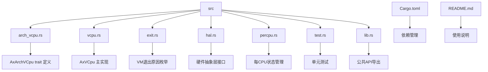
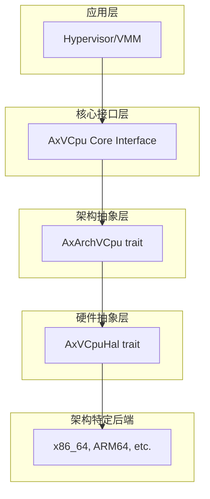
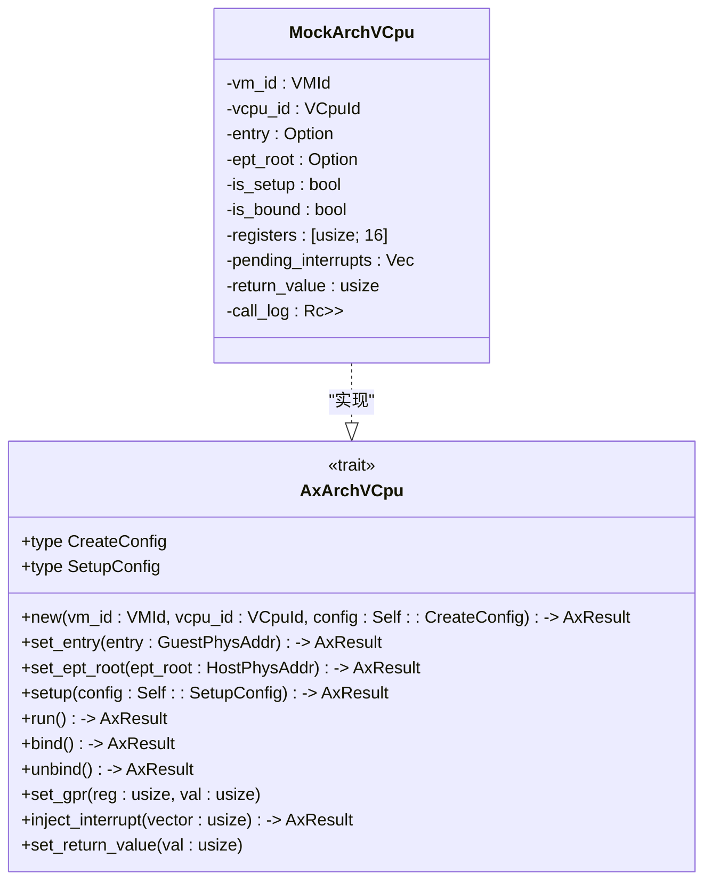
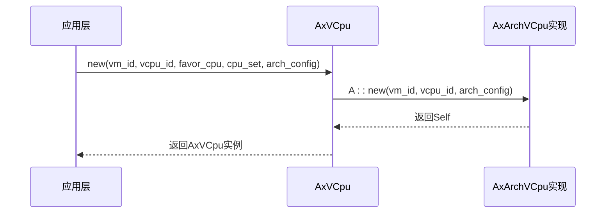
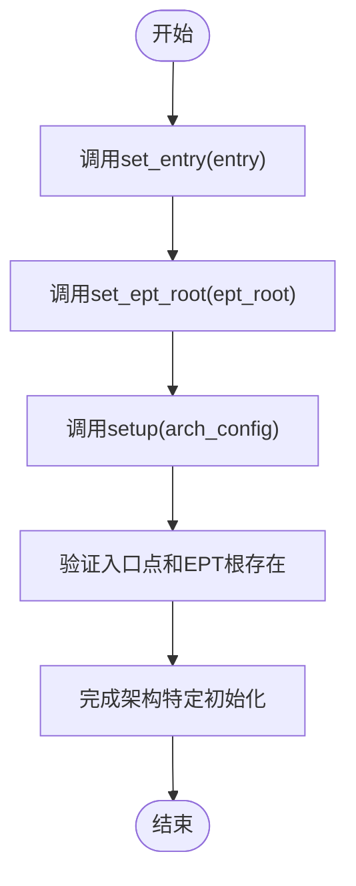
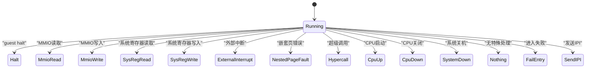
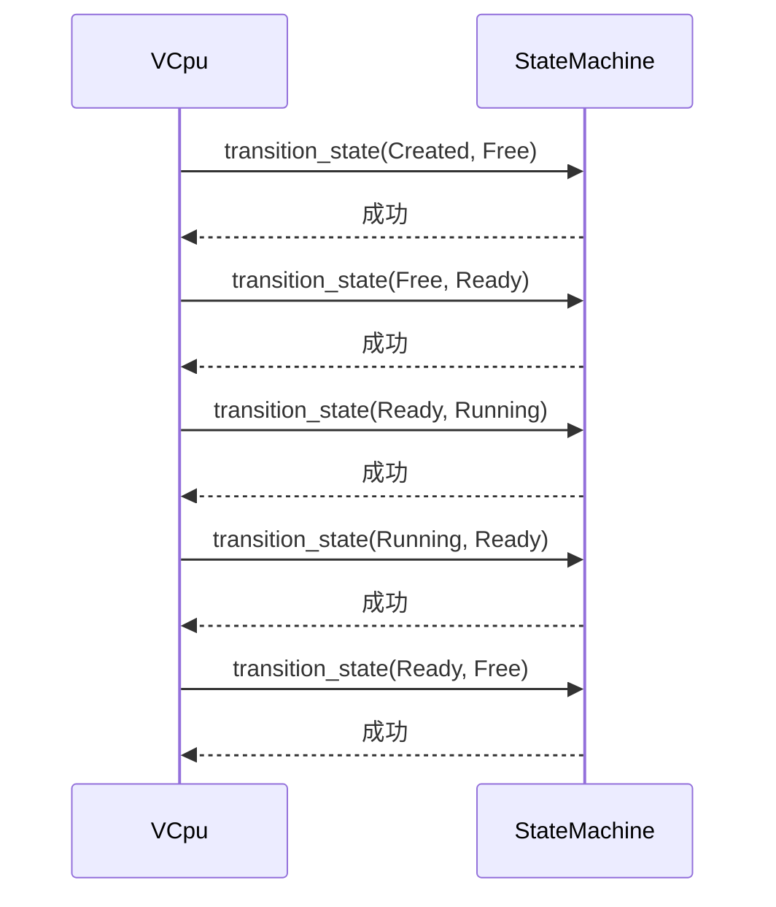
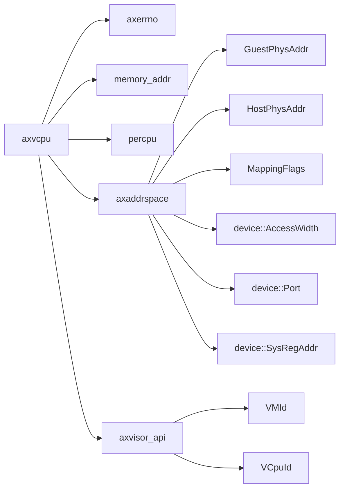

# AxArchVCpu Trait 实现指南

<cite>
**本文档中引用的文件**
- [arch_vcpu.rs](file://src/arch_vcpu.rs)
- [vcpu.rs](file://src/vcpu.rs)
- [exit.rs](file://src/exit.rs)
- [lib.rs](file://src/lib.rs)
- [Cargo.toml](file://Cargo.toml)
- [README.md](file://README.md)
</cite>

## 目录
1. [简介](#简介)
2. [项目结构](#项目结构)
3. [核心组件](#核心组件)
4. [架构概述](#架构概述)
5. [详细组件分析](#详细组件分析)
6. [依赖关系分析](#依赖关系分析)
7. [性能考虑](#性能考虑)
8. [故障排除指南](#故障排除指南)
9. [结论](#结论)

## 简介
AxArchVCpu 是 ArceOS 虚拟化框架中的核心 trait，为不同硬件架构（x86_64、ARM64、RISC-V 等）提供虚拟 CPU 的抽象层。本指南深入解释如何实现该 trait 以支持新型处理器架构，涵盖配置结构体设计、资源分配模式、启动参数传递机制、初始化流程关键步骤以及执行逻辑处理等核心内容。

## 项目结构
axvcpu 项目采用模块化设计，各源文件职责分明：



**Diagram sources**
- [src/arch_vcpu.rs](file://src/arch_vcpu.rs)
- [src/vcpu.rs](file://src/vcpu.rs)
- [src/exit.rs](file://src/exit.rs)
- [src/hal.rs](file://src/hal.rs)
- [src/percpu.rs](file://src/percpu.rs)
- [src/test.rs](file://src/test.rs)
- [src/lib.rs](file://src/lib.rs)
- [Cargo.toml](file://Cargo.toml)
- [README.md](file://README.md)

**Section sources**
- [src/arch_vcpu.rs](file://src/arch_vcpu.rs)
- [src/vcpu.rs](file://src/vcpu.rs)
- [src/exit.rs](file://src/exit.rs)
- [src/lib.rs](file://src/lib.rs)
- [Cargo.toml](file://Cargo.toml)
- [README.md](file://README.md)

## 核心组件
AxArchVCpu trait 定义了架构特定的虚拟 CPU 接口，包括 CreateConfig 和 SetupConfig 关联类型、new() 构造方法、set_entry() 和 set_ept_root() 启动参数设置、setup() 初始化流程以及 run() 执行逻辑等关键组件。

**Section sources**
- [src/arch_vcpu.rs](file://src/arch_vcpu.rs#L0-L80)
- [src/vcpu.rs](file://src/vcpu.rs#L57-L76)

## 架构概述
axvcpu 遵循分层架构设计，将架构无关的核心接口与架构特定的后端实现分离：



**Diagram sources**
- [README.md](file://README.md#L15-L32)

## 详细组件分析

### AxArchVCpu Trait 分析
AxArchVCpu trait 提供跨架构的虚拟 CPU 抽象，要求实现者定义架构特定的创建和设置配置类型，并实现相应的生命周期方法。

#### 类图


**Diagram sources**
- [src/arch_vcpu.rs](file://src/arch_vcpu.rs#L0-L30)
- [src/test.rs](file://src/test.rs#L39-L78)

#### 创建与配置
CreateConfig 和 SetupConfig 关联类型允许各架构定义自己的初始化参数。new() 方法负责创建架构特定的 VCpu 实例并进行基本资源分配。



**Diagram sources**
- [src/vcpu.rs](file://src/vcpu.rs#L78-L114)
- [src/arch_vcpu.rs](file://src/arch_vcpu.rs#L32-L40)

#### 初始化流程
setup() 方法完成 VCpu 的最终初始化，包括寄存器设置、内存映射等关键步骤。该方法在 set_entry() 和 set_ept_root() 之后调用。



**Diagram sources**
- [src/vcpu.rs](file://src/vcpu.rs#L116-L138)
- [src/test.rs](file://src/test.rs#L39-L78)

#### 执行逻辑
run() 方法是 VCpu 的核心执行入口，它将控制权转移给客户机代码，直到发生 VM 退出事件。返回值为 AxVCpuExitReason 枚举，指示退出原因。



**Diagram sources**
- [src/arch_vcpu.rs](file://src/arch_vcpu.rs#L68-L74)
- [src/exit.rs](file://src/exit.rs#L0-L259)

### VCpu 状态机分析
AxVCpu 实现了严格的生命周期状态机，确保 VCpu 在正确的状态下执行相应操作。

#### 状态转换图
```mermaid
graph LR
Created --> Free : "setup()"
Free --> Ready : "bind()"
Ready --> Running : "run()"
Running --> Ready : "VM exit"
Ready --> Free : "unbind()"
Created --> Invalid : "非法转换"
Free --> Invalid : "非法转换"
Ready --> Invalid : "非法转换"
Running --> Invalid : "非法转换"
Blocked --> Ready : "恢复"
style Invalid fill:#f9f,stroke:#333
```

**Diagram sources**
- [src/vcpu.rs](file://src/vcpu.rs#L26-L55)
- [README.md](file://README.md#L78-L88)

#### 状态转换序列


**Diagram sources**
- [src/vcpu.rs](file://src/vcpu.rs#L210-L250)
- [src/test.rs](file://src/test.rs#L162-L201)

## 依赖关系分析
axvcpu 项目依赖多个外部 crate 来实现其功能：



**Diagram sources**
- [Cargo.toml](file://Cargo.toml#L0-L17)
- [src/arch_vcpu.rs](file://src/arch_vcpu.rs#L1-L5)

## 性能考虑
- 使用 UnsafeCell 而非 RefCell 存储 arch_vcpu，避免在客户机执行期间无法释放借用检查器守卫的问题
- 通过 per-CPU 变量 CURRENT_VCPU 快速获取当前执行的 VCpu 实例
- 状态转换通过 with_state_transition 统一管理，确保状态一致性
- 内部可变性由 RefCell 保护，减少同步开销

## 故障排除指南
常见问题及调试建议：

- **状态机违规转换**：检查当前状态是否符合预期，避免跳过必要步骤
- **资源泄漏**：确保 unbind() 正确清理绑定资源
- **空指针解引用**：在 get_current_vcpu 前确认已正确设置
- **死锁风险**：避免嵌套 VCpu 操作，因框架会 panic
- **调试位置**：在 mock 实现中添加日志记录调用顺序
- **断点设置**：在 manipulate_arch_vcpu 和 with_state_transition 处设置断点观察状态流转

**Section sources**
- [src/vcpu.rs](file://src/vcpu.rs#L295-L336)
- [src/test.rs](file://src/test.rs#L39-L119)

## 结论
实现 AxArchVCpu trait 需要严格遵循状态机模型，正确处理资源配置与释放，准确传递启动参数，并妥善管理 VM 退出事件。通过遵循本文档指导，开发者可以为新型处理器架构提供高效、安全的虚拟化支持。