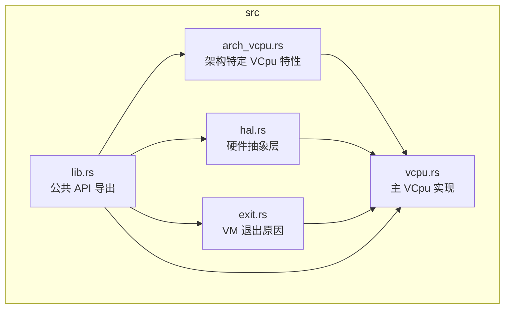
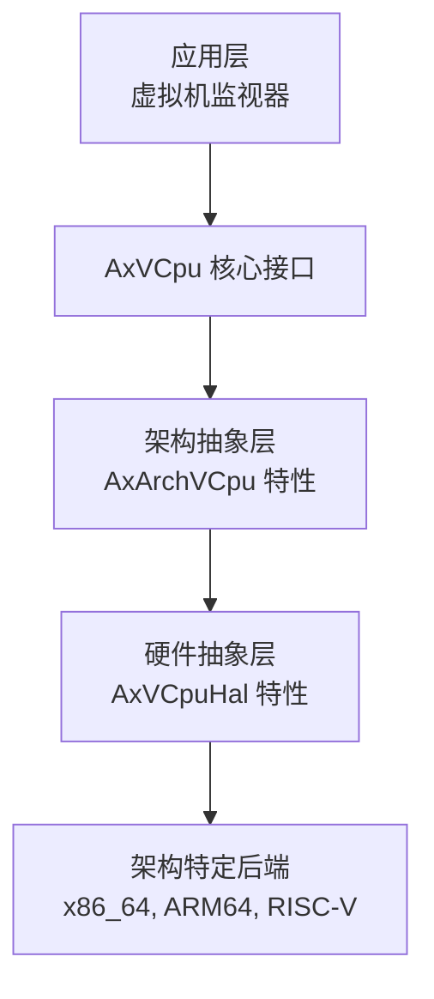
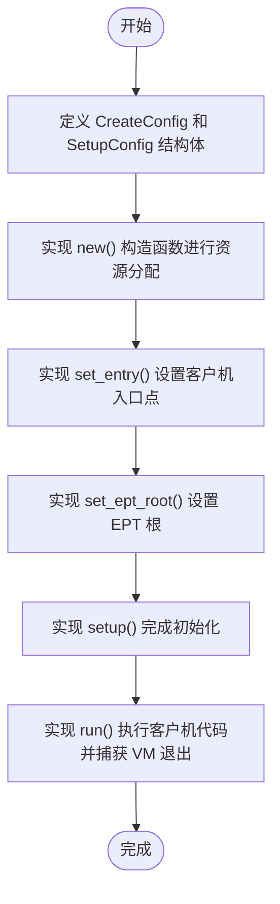
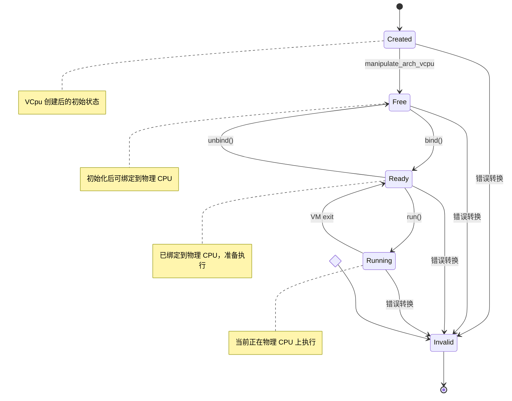
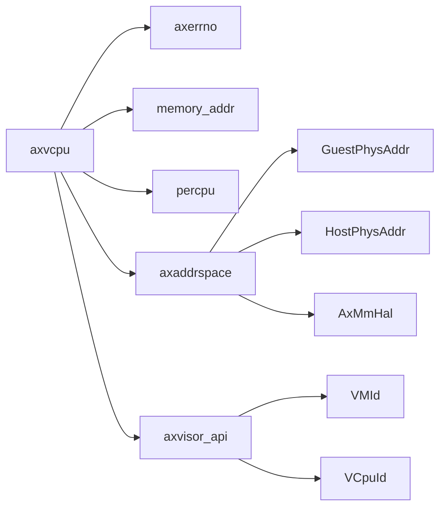

# 架构实现指南

<cite>
**本文档中引用的文件**
- [arch_vcpu.rs](file://src/arch_vcpu.rs)
- [hal.rs](file://src/hal.rs)
- [vcpu.rs](file://src/vcpu.rs)
- [exit.rs](file://src/exit.rs)
- [lib.rs](file://src/lib.rs)
- [Cargo.toml](file://Cargo.toml)
- [README.md](file://README.md)
</cite>

## 目录
1. [简介](#简介)
2. [项目结构](#项目结构)
3. [核心组件](#核心组件)
4. [架构概述](#架构概述)
5. [详细组件分析](#详细组件分析)
6. [依赖关系分析](#依赖关系分析)
7. [性能考虑](#性能考虑)
8. [故障排除指南](#故障排除指南)
9. [结论](#结论)

## 简介
AxVCpu 是一个为 ArceOS 虚拟机监视器设计的虚拟 CPU 抽象库，提供统一且与架构无关的接口来管理虚拟化环境中的虚拟 CPU。该库通过 `AxArchVCpu` 特性将架构特定的操作委托给具体实现，同时提供状态管理、CPU 绑定和执行控制等通用功能。

## 项目结构
该项目采用模块化设计，包含多个核心源文件，分别负责不同的抽象层次和功能。



**图示来源**
- [arch_vcpu.rs](file://src/arch_vcpu.rs)
- [hal.rs](file://src/hal.rs)
- [vcpu.rs](file://src/vcpu.rs)
- [lib.rs](file://src/lib.rs)

**本节来源**
- [src/arch_vcpu.rs](file://src/arch_vcpu.rs)
- [src/hal.rs](file://src/hal.rs)
- [src/vcpu.rs](file://src/vcpu.rs)
- [src/lib.rs](file://src/lib.rs)

## 核心组件
AxVCpu 的核心是 `AxArchVCpu` 特性，它定义了跨不同硬件架构（如 x86_64、ARM64、RISC-V）实现虚拟 CPU 所需的抽象层。每个架构必须实现此特性以提供必要的底层虚拟化原语。

**本节来源**
- [src/arch_vcpu.rs](file://src/arch_vcpu.rs#L0-L79)
- [src/vcpu.rs](file://src/vcpu.rs#L57-L76)

## 架构概述
AxVCpu 遵循分层架构设计，清晰地分离了不同层次的关注点：



**图示来源**
- [README.md](file://README.md#L15-L32)

**本节来源**
- [README.md](file://README.md#L0-L13)

## 详细组件分析

### AxArchVCpu 特性分析
`AxArchVCpu` 特性是扩展新型处理器架构支持的基础。开发者需要为新架构实现此特性，包括定义配置结构体、资源分配、启动参数处理、初始化逻辑和客户机代码执行。

#### 关键方法实现流程


**图示来源**
- [arch_vcpu.rs](file://src/arch_vcpu.rs#L0-L79)

**本节来源**
- [src/arch_vcpu.rs](file://src/arch_vcpu.rs#L0-L79)

### AxVCpuHal 特性分析
`AxVCpuHal` 特性定义了底层软件（内核或虚拟机监视器）必须实现的接口，以支持 VCpu 操作，如中断处理和内存管理。

```mermaid
classDiagram
class AxVCpuHal {
<<trait>>
+type MmHal : axaddrspace : : AxMmHal
+irq_fetch() usize
+irq_hanlder()
}
note right of AxVCpuHal
必须由底层虚拟机监视器
或内核实现以提供正确的
中断处理
end note
```

**图示来源**
- [hal.rs](file://src/hal.rs#L0-L31)

**本节来源**
- [src/hal.rs](file://src/hal.rs#L0-L31)

### VCpu 状态机分析
VCpu 遵循严格的状态机模型，确保生命周期管理的健壮性。



**图示来源**
- [vcpu.rs](file://src/vcpu.rs#L26-L55)
- [README.md](file://README.md#L33-L57)

**本节来源**
- [src/vcpu.rs](file://src/vcpu.rs#L26-L55)
- [README.md](file://README.md#L33-L57)

### 最小可行实现模板
以下是基于 `MockArchVCpu` 测试实现的最小可行模板，展示了如何实现 `AxArchVCpu` 特性：

```rust
// 参见 src/test.rs 中 MockArchVCpu 的实现
// 包含 new(), set_entry(), set_ept_root(), setup(), run(), bind(), unbind() 等方法
```

**本节来源**
- [src/test.rs](file://src/test.rs#L39-L80)

## 依赖关系分析
AxVCpu 库依赖于多个外部 crate 来提供关键功能：



**图示来源**
- [Cargo.toml](file://Cargo.toml#L0-L17)
- [arch_vcpu.rs](file://src/arch_vcpu.rs#L0-L5)

**本节来源**
- [Cargo.toml](file://Cargo.toml#L0-L17)
- [src/arch_vcpu.rs](file://src/arch_vcpu.rs#L0-L5)

## 性能考虑
- **线程安全性**：`AxVCpu` 结构本身不是线程安全的，调用者有责任确保安全性。
- **内部可变性**：使用 `RefCell` 和 `UnsafeCell` 处理内部可变性，避免在转移控制权给客户机时出现借用检查问题。
- **每 CPU 状态**：通过 `CURRENT_VCPU` 静态变量维护当前物理 CPU 上的 VCpu 状态，优化上下文切换性能。

**本节来源**
- [src/vcpu.rs](file://src/vcpu.rs#L57-L76)
- [src/vcpu.rs](file://src/vcpu.rs#L295-L336)

## 故障排除指南
常见问题及调试策略：
- **状态转换失败**：检查当前状态是否符合预期转换条件，避免非法状态转换。
- **中断注入失败**：确保在正确的时间点调用 `inject_interrupt`，可能需要中断队列缓冲。
- **VM 入口失败**：验证客户机入口点和 EPT 根是否已正确设置。
- **绑定失败**：确认 VCpu 已完成 `setup` 阶段后再进行 `bind` 操作。

**本节来源**
- [src/vcpu.rs](file://src/vcpu.rs#L162-L208)
- [src/test.rs](file://src/test.rs#L335-L370)

## 结论
AxVCpu 提供了一个强大而灵活的框架，用于在 ArceOS 虚拟机监视器中实现新型处理器架构的支持。通过遵循 `AxArchVCpu` 特性的实现指南，开发者可以系统地扩展对新架构的支持，同时利用现有的硬件抽象层和状态管理机制。建议在实现过程中参考已支持架构（x86_64, ARM64, RISC-V）的最佳实践，并使用提供的测试框架验证功能正确性。