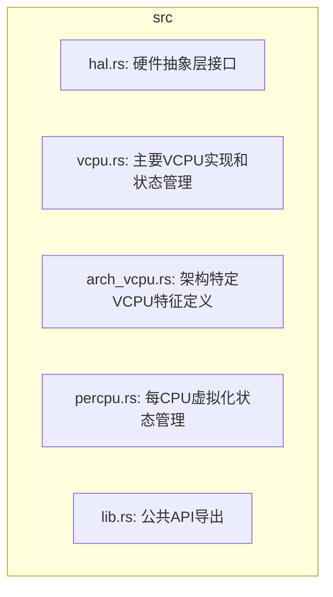
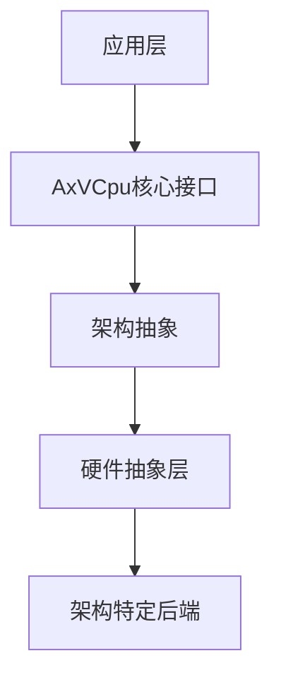
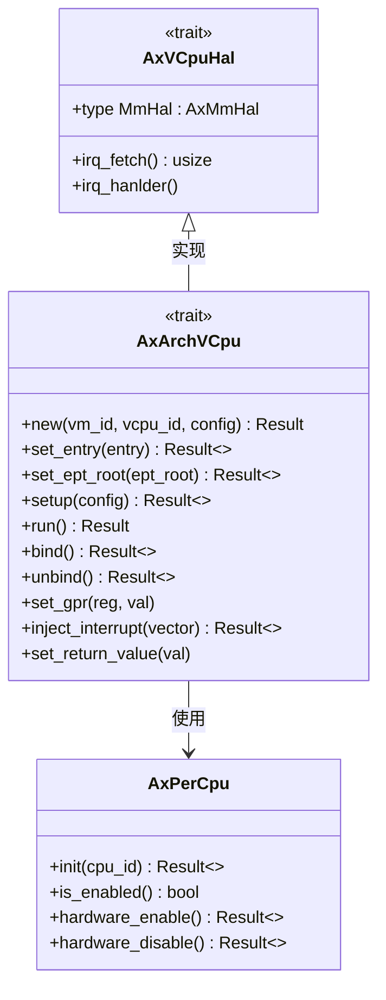
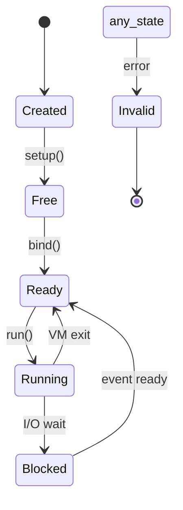
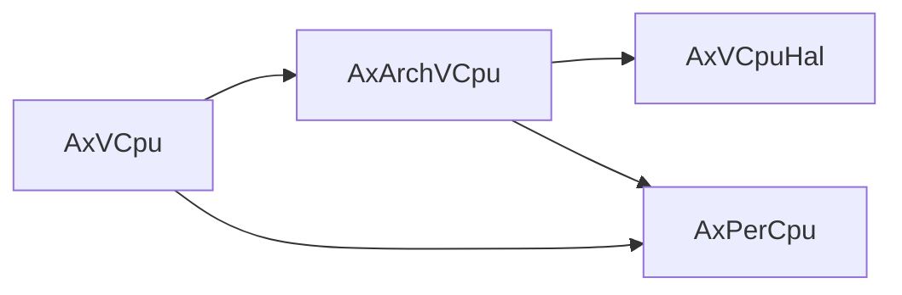

# 硬件抽象层（HAL）集成

<cite>
**本文档中引用的文件**
- [hal.rs](file://src/hal.rs)
- [vcpu.rs](file://src/vcpu.rs)
- [arch_vcpu.rs](file://src/arch_vcpu.rs)
- [percpu.rs](file://src/percpu.rs)
- [lib.rs](file://src/lib.rs)
</cite>

## 目录
1. [引言](#引言)
2. [项目结构](#项目结构)
3. [核心组件](#核心组件)
4. [架构概述](#架构概述)
5. [详细组件分析](#详细组件分析)
6. [依赖分析](#依赖分析)
7. [性能考虑](#性能考虑)
8. [故障排除指南](#故障排除指南)
9. [结论](#结论)

## 引言
AxVCpu 是一个为 ArceOS 虚拟机监控器设计的虚拟 CPU 抽象库，提供统一且与架构无关的接口来管理虚拟 CPU。该文档深入探讨了 `AxVCpuHal` trait 在跨平台硬件操作抽象中的核心作用，并指导开发者如何实现这一关键接口以支持新平台。

## 项目结构
AxVCpu 项目采用模块化设计，将不同功能分离到独立的源文件中。这种结构有助于维护代码清晰性和可扩展性。

**图示来源**
- [hal.rs](file://src/hal.rs#L0-L31)
- [vcpu.rs](file://src/vcpu.rs#L0-L24)
- [arch_vcpu.rs](file://src/arch_vcpu.rs#L0-L30)
- [percpu.rs](file://src/percpu.rs#L0-L18)
- [lib.rs](file://src/lib.rs#L0-L33)

**本节来源**
- [src](file://src)

## 核心组件
`AxVCpuHal` trait 定义了底层软件（内核或虚拟机监控程序）必须实现的接口，以支持诸如中断处理和内存管理等 VCPU 操作。它通过关联类型 `MmHal` 集成内存管理功能，并提供获取当前中断号的方法 `irq_fetch()`。特别需要注意的是，`irq_hanlder()` 方法是强制要求实现的，其默认实现会触发未实现 panic，确保所有底层系统都正确处理中断分发。

**本节来源**
- [hal.rs](file://src/hal.rs#L0-L31)

## 架构概述
AxVCpu 遵循分层架构设计，从上至下分别为应用层、核心接口、架构抽象、硬件抽象层以及架构特定后端。这种层次分明的设计使得上层应用可以无需关心底层硬件细节，同时允许灵活地添加对新架构的支持。

**图示来源**
- [README.md](file://README.md#L15-L32)

## 详细组件分析

### AxVCpuHal 分析
`AxVCpuHal` trait 提供了虚拟化环境中硬件操作的关键抽象。通过此 trait，虚拟机监控器能够以安全且一致的方式访问底层硬件资源。

#### 类图展示

**图示来源**
- [hal.rs](file://src/hal.rs#L0-L31)
- [arch_vcpu.rs](file://src/arch_vcpu.rs#L0-L78)
- [percpu.rs](file://src/percpu.rs#L0-L18)

### VCpu 状态机分析
VCPU 遵循严格的状态机：创建 → 空闲 → 就绪 → 运行 → 阻塞。无效状态用于指示转换过程中发生的错误。

**图示来源**
- [vcpu.rs](file://src/vcpu.rs#L57-L76)
- [README.md](file://README.md#L33-L57)

## 依赖分析
AxVCpu 的各个组件之间存在明确的依赖关系。`AxVCpu` 结构体依赖于 `AxArchVCpu` 特征进行架构特定的操作，而 `AxArchVCpu` 又依赖于 `AxVCpuHal` 和 `AxPerCpu` 来完成硬件抽象和每 CPU 状态管理。

**图示来源**
- [vcpu.rs](file://src/vcpu.rs#L57-L76)
- [arch_vcpu.rs](file://src/arch_vcpu.rs#L0-L78)
- [percpu.rs](file://src/percpu.rs#L0-L18)

## 性能考虑
在实现 HAL 时，应特别注意减少上下文切换开销。例如，在 `run()` 方法中避免不必要的锁竞争，并确保 `irq_fetch()` 和 `irq_hanlder()` 的执行尽可能高效。此外，多核同步问题需要仔细处理，特别是在共享资源访问时使用适当的原子操作或锁机制。

## 故障排除指南
当遇到硬件不支持某特性的情况时，建议返回 `AxError::Unsupported` 错误码。对于中断处理失败的情形，则应返回 `AxError::InterruptFailed`。开发人员还应注意检查 `CURRENT_VCPU` 是否已正确设置，因为这是许多操作的前提条件。

**本节来源**
- [vcpu.rs](file://src/vcpu.rs#L295-L336)
- [hal.rs](file://src/hal.rs#L0-L31)

## 结论
`AxVCpuHal` trait 在 AxVCpu 框架中扮演着至关重要的角色，它不仅提供了必要的硬件抽象，还确保了跨平台的一致性和可移植性。通过遵循本文档提供的指导原则，开发者可以有效地为新平台实现所需的 HAL 接口，从而扩展 AxVCpu 的适用范围。