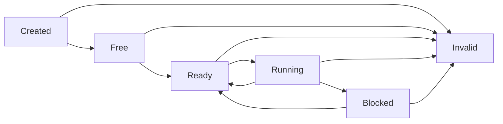
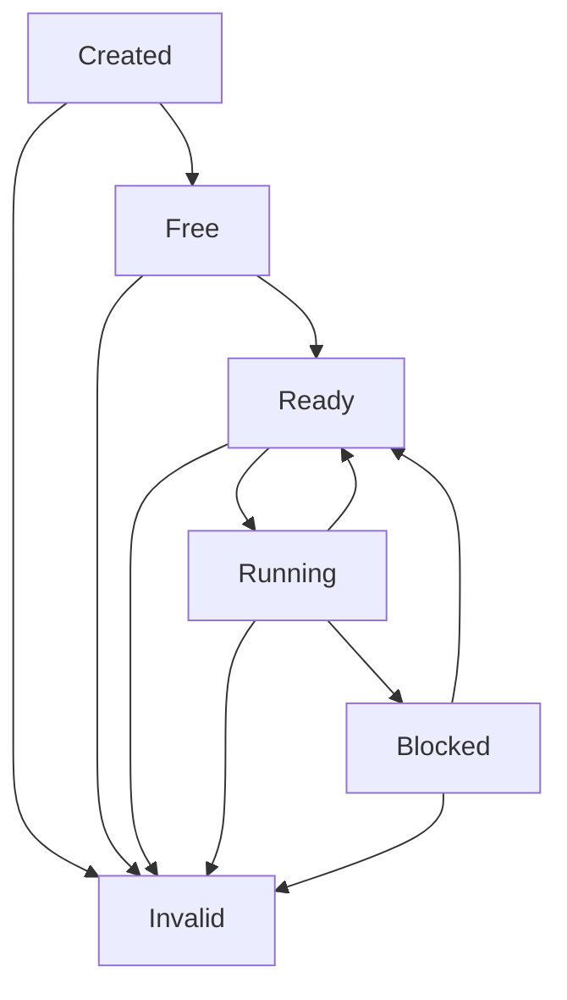
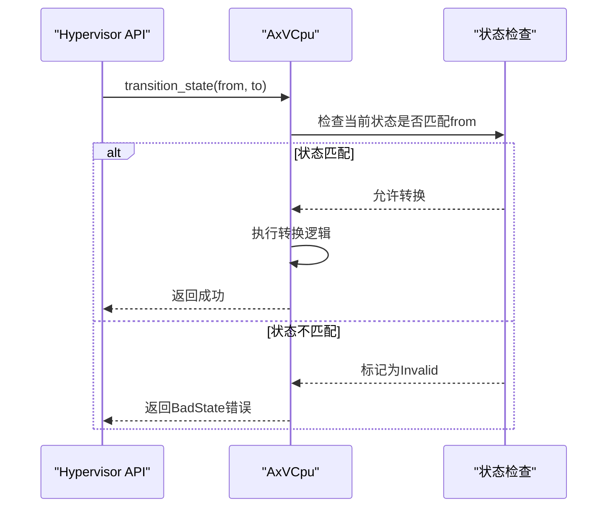
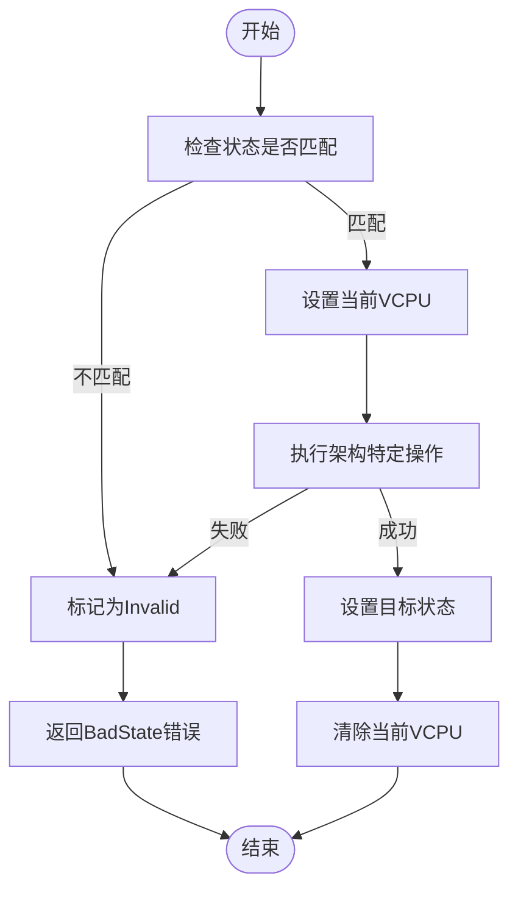
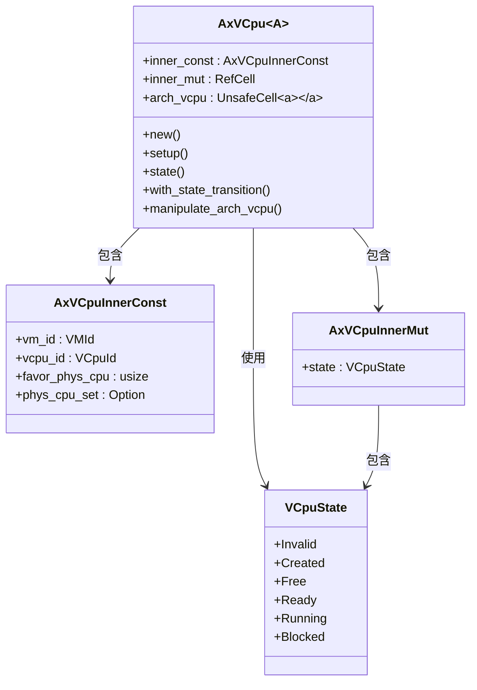

# VCPU状态机

<cite>
**本文档引用的文件**
- [vcpu.rs](file://src/vcpu.rs)
- [arch_vcpu.rs](file://src/arch_vcpu.rs)
</cite>

## 目录
1. [引言](#引言)
2. [VCPU核心状态定义](#vcpu核心状态定义)
3. [状态转换机制](#状态转换机制)
4. [安全性保障措施](#安全性保障措施)
5. [状态管理实现](#状态管理实现)
6. [常见误解与陷阱](#常见误解与陷阱)
7. [设计优势与系统可靠性](#设计优势与系统可靠性)

## 引言

本文档深入阐述AxVCpu中的VCPU状态机机制，详细解释六种核心状态（Created、Free、Ready、Running、Blocked、Invalid）的语义定义、进入条件和合法转换路径。重点说明状态转换的安全性保障措施，如通过`with_state_transition`方法确保原子性和错误恢复。结合`VCpuState`枚举和`transition_state`等方法的源码实现，展示状态如何在`RefCell<AxVCpuInnerMut>`中被安全地管理。



**Diagram sources**
- [vcpu.rs](file://src/vcpu.rs#L20-L50)

**Section sources**
- [vcpu.rs](file://src/vcpu.rs#L1-L100)
- [README.md](file://README.md#L35-L50)

## VCPU核心状态定义

VCPU遵循严格的状态机模型，其生命周期由六种核心状态构成：

### Created 状态
- **语义定义**：VCPU创建后的初始状态，尚未初始化
- **生命周期阶段**：对象构造完成但未配置
- **调度意义**：不可被调度执行，必须先进行setup操作
- **进入条件**：调用`AxVCpu::new()`创建VCPU实例后自动进入

### Free 状态
- **语义定义**：VCPU已初始化完成，可绑定到物理CPU
- **生命周期阶段**：已完成基本配置，等待资源分配
- **调度意义**：可被调度器选中并绑定到特定物理CPU
- **进入条件**：成功调用`setup()`方法从Created状态转换而来

### Ready 状态
- **语义定义**：VCPU已绑定到物理CPU，准备执行
- **生命周期阶段**：资源已分配，等待调度运行
- **调度意义**：位于就绪队列中，是调度器的主要选择对象
- **进入条件**：成功调用`bind()`方法从Free状态转换而来

### Running 状态
- **语义定义**：VCPU正在物理CPU上执行
- **生命周期阶段**：实际运行阶段
- **调度意义**：当前占用CPU资源，需要处理VM Exit时返回
- **进入条件**：成功调用`run()`方法从Ready状态转换而来

### Blocked 状态
- **语义定义**：VCPU执行被阻塞（等待I/O等）
- **生命周期阶段**：暂停执行，等待外部事件
- **调度意义**：释放CPU资源，允许其他VCPU运行
- **进入条件**：因I/O等待或其他阻塞原因从Running状态转换而来

### Invalid 状态
- **语义定义**：错误状态，表示状态转换失败
- **生命周期阶段**：异常终止阶段
- **调度意义**：不可再参与正常调度流程
- **进入条件**：非法状态转换或操作失败时自动进入

**Section sources**
- [vcpu.rs](file://src/vcpu.rs#L20-L50)
- [README.md](file://README.md#L35-L50)

## 状态转换机制

VCPU状态机定义了严格的转换规则，确保系统稳定性和可预测性。

### 合法转换路径


**Diagram sources**
- [vcpu.rs](file://src/vcpu.rs#L20-L50)

#### 主要转换序列
1. **初始化序列**：`Created → Free → Ready`
   - 通过`setup()`完成初始化
   - 通过`bind()`绑定到物理CPU

2. **执行循环**：`Ready ↔ Running`
   - `Ready → Running`：通过`run()`开始执行
   - `Running → Ready`：VM Exit后返回就绪状态

3. **阻塞处理**：`Running → Blocked → Ready`
   - 运行时遇到阻塞条件进入Blocked
   - 阻塞解除后返回Ready状态等待重新调度

### 转换方法分析


**Diagram sources**
- [vcpu.rs](file://src/vcpu.rs#L180-L200)

**Section sources**
- [vcpu.rs](file://src/vcpu.rs#L150-L250)

## 安全性保障措施

### 原子性状态转换
通过`with_state_transition`方法确保状态转换的原子性：

```rust
pub fn with_state_transition<F, T>(&self, from: VCpuState, to: VCpuState, f: F) -> AxResult<T>
where
    F: FnOnce() -> AxResult<T>,
{
    let mut inner_mut = self.inner_mut.borrow_mut();
    if inner_mut.state != from {
        inner_mut.state = VCpuState::Invalid;
        ax_err!(BadState, format!("VCpu state is not {:?}, but {:?}", from, inner_mut.state))
    } else {
        let result = f();
        inner_mut.state = if result.is_err() {
            VCpuState::Invalid
        } else {
            to
        };
        result
    }
}
```

该方法提供以下安全保障：
- **前置条件检查**：确保当前状态与期望的起始状态一致
- **异常安全**：操作失败时自动转入Invalid状态
- **结果导向**：成功则转入目标状态，失败则标记为Invalid

### 组合操作保护
`manipulate_arch_vcpu`方法结合了状态转换和上下文设置：



**Diagram sources**
- [vcpu.rs](file://src/vcpu.rs#L220-L240)

**Section sources**
- [vcpu.rs](file://src/vcpu.rs#L200-L250)

## 状态管理实现

### 内部数据结构


**Diagram sources**
- [vcpu.rs](file://src/vcpu.rs#L55-L100)

### 内存安全设计
采用分层设计确保内存安全：

- **不可变部分** (`inner_const`)：存储VCPU的静态配置
- **可变部分** (`inner_mut`)：使用`RefCell`提供内部可变性
- **架构特定部分** (`arch_vcpu`)：使用`UnsafeCell`因为RefCell无法在控制转移期间保持

这种设计允许在保持`&self`引用的同时修改内部状态，同时防止数据竞争。

**Section sources**
- [vcpu.rs](file://src/vcpu.rs#L55-L150)

## 常见误解与陷阱

### 直接调用set_state的危险性
虽然存在`set_state`方法，但它被标记为`unsafe`：

```rust
pub unsafe fn set_state(&self, state: VCpuState) {
    self.inner_mut.borrow_mut().state = state;
}
```

直接调用此方法的风险包括：
- 绕过状态转换检查，可能导致非法状态
- 破坏状态机的一致性保证
- 在生产代码中应始终使用`with_state_transition`等安全方法

### 嵌套VCPU操作限制
系统通过`CURRENT_VCPU` per-CPU变量防止嵌套操作：

```rust
pub fn with_current_cpu_set<F, T>(&self, f: F) -> T
where
    F: FnOnce() -> T,
{
    if get_current_vcpu::<A>().is_some() {
        panic!("Nested vcpu operation is not allowed!");
    } else {
        unsafe {
            set_current_vcpu(self);
        }
        let result = f();
        unsafe {
            clear_current_vcpu::<A>();
        }
        result
    }
}
```

这一设计防止了：
- 递归或嵌套的VCPU操作
- 状态混乱和资源泄漏
- 并发访问导致的数据竞争

**Section sources**
- [vcpu.rs](file://src/vcpu.rs#L200-L220)

## 设计优势与系统可靠性

### 非法转换防护
状态机设计有效防止了多种非法转换：

- **前向验证**：必须满足起始状态才能转换
- **后向恢复**：失败时自动进入安全的Invalid状态
- **单向流动**：正常状态下不会出现逆向转换

### 系统可靠性提升
该设计带来以下可靠性优势：

1. **故障隔离**：单个VCPU的状态错误不会影响其他VCPU
2. **快速诊断**：Invalid状态明确指示问题发生点
3. **资源管理**：清晰的状态边界便于资源分配和回收
4. **调试友好**：可通过`state()`方法随时查询当前状态

### 调度意义
不同状态对Hypervisor调度具有重要意义：

| 状态 | 调度行为 | 资源占用 |
|------|----------|----------|
| Created | 不参与调度 | 最小资源 |
| Free | 可被选中绑定 | 中等资源 |
| Ready | 就绪队列成员 | 完整资源 |
| Running | 当前执行者 | 全部资源 |
| Blocked | 暂停调度 | 部分资源 |
| Invalid | 排除调度 | 待清理 |

这种设计使调度器能够根据VCPU状态做出最优决策，提高整体系统效率。

**Section sources**
- [vcpu.rs](file://src/vcpu.rs#L1-L348)