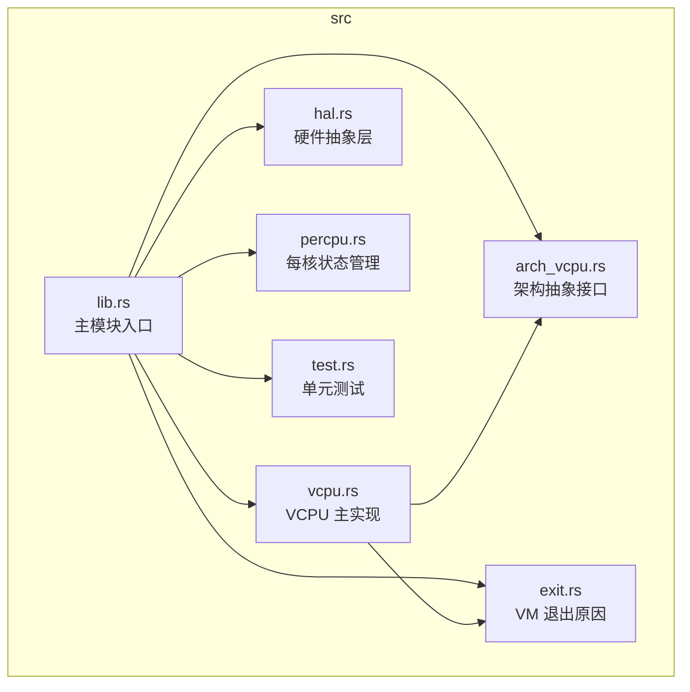
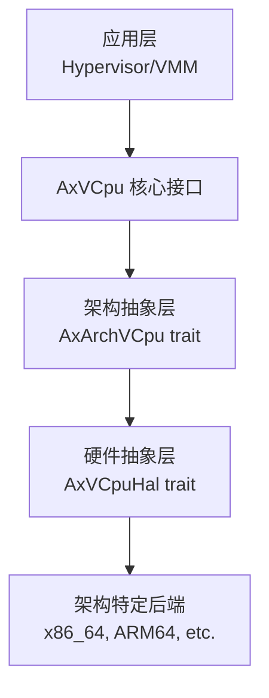
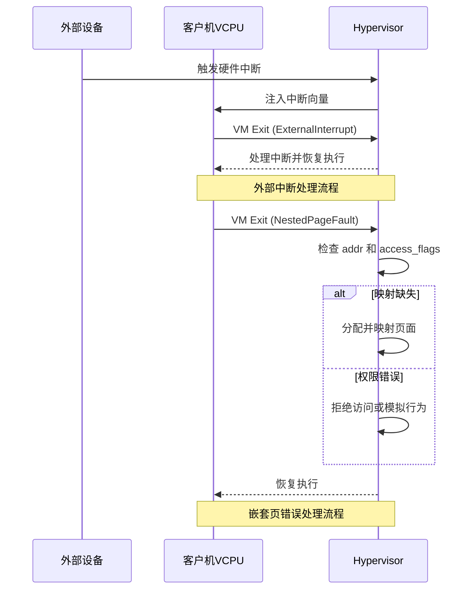
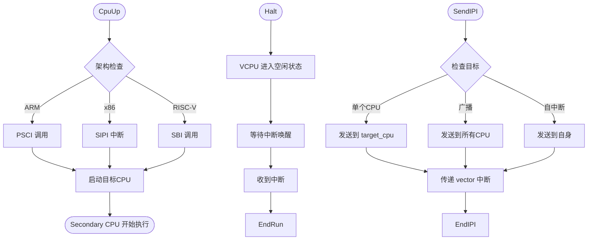
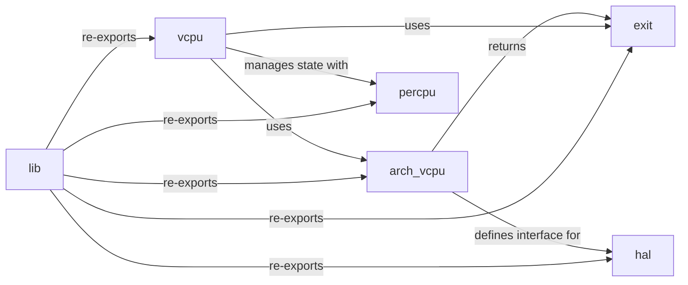

# VM退出机制

<cite>
**本文档引用的文件**
- [exit.rs](file://src/exit.rs)
- [vcpu.rs](file://src/vcpu.rs)
- [arch_vcpu.rs](file://src/arch_vcpu.rs)
- [lib.rs](file://src/lib.rs)
- [README.md](file://README.md)
</cite>

## 目录
1. [简介](#简介)
2. [项目结构](#项目结构)
3. [核心组件](#核心组件)
4. [架构概述](#架构概述)
5. [详细组件分析](#详细组件分析)
6. [依赖关系分析](#依赖关系分析)
7. [性能考虑](#性能考虑)
8. [故障排除指南](#故障排除指南)
9. [结论](#结论)

## 简介
AxVCpu 是一个为 ArceOS 虚拟机监视器设计的虚拟 CPU 抽象库，提供统一且与架构无关的接口，用于管理虚拟化环境中的虚拟 CPU。该库通过 `AxArchVCpu` 特性将架构特定操作委托给具体实现，同时提供状态管理、CPU 绑定和执行控制等通用功能。其核心是 `AxVCpuExitReason` 枚举，它定义了所有可能的 VM 退出原因，使 Hypervisor 能够正确地处理来自客户机的各种请求和事件。

## 项目结构
该项目采用模块化设计，各源文件职责分明，共同构建了一个跨平台的虚拟 CPU 管理框架。



**Diagram sources**
- [lib.rs](file://src/lib.rs#L0-L33)
- [vcpu.rs](file://src/vcpu.rs#L0-L348)
- [arch_vcpu.rs](file://src/arch_vcpu.rs#L0-L79)
- [exit.rs](file://src/exit.rs#L0-L259)

**Section sources**
- [lib.rs](file://src/lib.rs#L0-L33)
- [README.md](file://README.md#L0-L167)

## 核心组件
`AxVCpu` 库的核心由几个关键部分构成：`AxVCpuExitReason` 枚举定义了所有可能的 VM 退出原因；`AxArchVCpu` 特性为不同硬件架构（如 x86_64, ARM64, RISC-V）提供了统一的接口契约；而 `AxVCpu` 结构体则封装了与架构无关的 VCpu 生命周期管理和状态机。

**Section sources**
- [exit.rs](file://src/exit.rs#L0-L259)
- [arch_vcpu.rs](file://src/arch_vcpu.rs#L0-L79)
- [vcpu.rs](file://src/vcpu.rs#L0-L348)

## 架构概述
AxVCpu 遵循分层架构设计，实现了清晰的关注点分离。上层应用（Hypervisor/VMM）通过 `AxVCpu` 的核心接口与虚拟 CPU 交互。该接口向下调用 `AxArchVCpu` 特性，后者作为架构抽象层，将通用指令转换为底层硬件的具体操作。最终，这些操作由针对特定架构（x86_64, ARM64 等）的后端实现，并通过 `AxVCpuHal` 硬件抽象层与物理硬件进行交互。



**Diagram sources**
- [README.md](file://README.md#L20-L30)

## 详细组件分析
### AxVCpuExitReason 分析
`AxVCpuExitReason` 枚举是 Hypervisor 与客户机通信的核心。当客户机执行某些需要虚拟化支持的操作时，会触发 VM 退出，`AxArchVCpu::run()` 方法返回此枚举的一个变体，通知 Hypervisor 具体的退出原因。

#### I/O 访问类退出
此类退出涉及客户机对设备或特殊内存区域的访问。
```mermaid
classDiagram
class MmioRead {
+addr : GuestPhysAddr
+width : AccessWidth
+reg : usize
+reg_width : AccessWidth
+signed_ext : bool
}
class MmioWrite {
+addr : GuestPhysAddr
+width : AccessWidth
+data : u64
}
class IoRead {
+port : Port
+width : AccessWidth
}
class IoWrite {
+port : Port
+width : AccessWidth
+data : u64
}
class SysRegRead {
+addr : SysRegAddr
+reg : usize
}
class SysRegWrite {
+addr : SysRegAddr
+value : u64
}
note right of MmioRead
客户机读取MMIO地址
end
note right of MmioWrite
客户机写入MMIO地址
end
note right of IoRead
x86专用端口I/O读取
end
note right of IoWrite
x86专用端口I/O写入
end
note right of SysRegRead
读取MSR(CSR/SysReg)
end
note right of SysRegWrite
写入MSR(CSR/SysReg)
end
```

**Diagram sources**
- [exit.rs](file://src/exit.rs#L45-L115)

#### 中断与异常处理
此类退出涉及外部中断和内存管理错误。


**Diagram sources**
- [exit.rs](file://src/exit.rs#L117-L148)

#### 电源管理与多处理器操作
此类退出涉及系统级控制和多核协调。


**Diagram sources**
- [exit.rs](file://src/exit.rs#L150-L258)

## 依赖关系分析
`AxVCpu` 库内部组件之间存在明确的依赖关系。`vcpu.rs` 是核心，它直接依赖于 `arch_vcpu.rs` 提供的特性以及 `exit.rs` 定义的退出原因。`lib.rs` 作为公共 API 的入口，重新导出了这三个模块的关键类型。`hal.rs` 和 `percpu.rs` 则为底层操作和每核状态管理提供支持，被 `arch_vcpu.rs` 的具体实现所依赖。



**Diagram sources**
- [lib.rs](file://src/lib.rs#L25-L33)
- [vcpu.rs](file://src/vcpu.rs#L0-L348)
- [arch_vcpu.rs](file://src/arch_vcpu.rs#L0-L79)

## 性能考虑
为了保证高性能，`AxVCpu` 在设计上做了多项优化。首先，`AxVCpu` 结构体使用 `UnsafeCell` 包装 `arch_vcpu`，避免了在 `run()` 这种长时间运行的方法中因借用检查而导致的性能开销。其次，`get_current_vcpu` 机制允许架构特定代码在不持有引用的情况下访问其所属的 `AxVCpu` 实例，减少了锁竞争。最后，`Nothing` 退出原因的设计使得 Hypervisor 可以在无需复杂处理的情况下快速恢复客户机执行，这对于高频次但无实际意义的退出非常高效。

## 故障排除指南
处理 `AxVCpuExitReason` 时，最常见的问题是模式匹配不完整。由于 `#[non_exhaustive]` 属性的存在，未来版本可能会向枚举中添加新的变体。因此，在 `match` 表达式中必须使用通配符 `_` 或 `..` 来捕获未知情况，以确保向前兼容性。例如：
```rust
match exit_reason {
    AxVCpuExitReason::Hypercall { nr, args } => { /* ... */ },
    AxVCpuExitReason::MmioRead { addr, .. } => { /* ... */ },
    // 必须包含通配符分支
    _ => println!("未知或未来的退出原因"),
}
```
此外，`FailEntry` 退出表示 VM 入口失败，通常源于无效的 VCpu 状态或配置，应检查 `hardware_entry_failure_reason` 并参考具体架构的文档进行诊断。

**Section sources**
- [exit.rs](file://src/exit.rs#L26-L27)
- [exit.rs](file://src/exit.rs#L245-L251)

## 结论
`AxVCpu` 通过精心设计的 `AxVCpuExitReason` 枚举，成功地为跨平台虚拟化提供了一个统一且可扩展的接口。它不仅涵盖了从 I/O 访问、中断处理到多处理器协调等广泛的场景，还通过 `#[non_exhaustive]` 属性和详细的文档说明，强调了向前兼容的重要性。其分层架构和清晰的状态机设计，使得开发人员能够高效、安全地实现和管理虚拟 CPU，为构建健壮的 Hypervisor 奠定了坚实的基础。