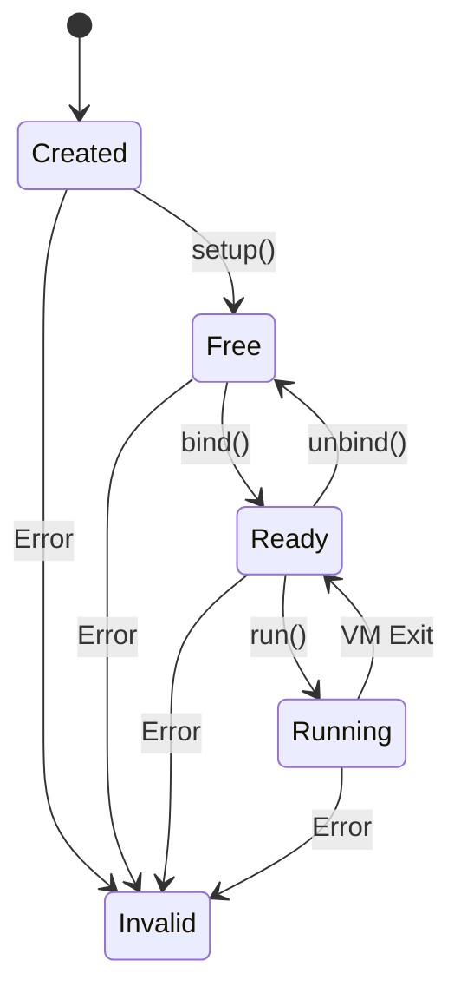
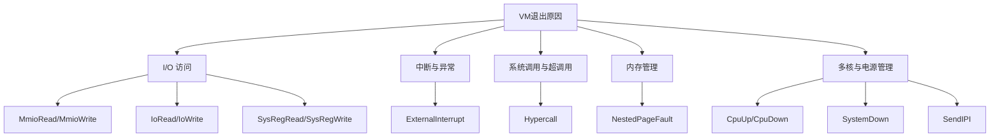
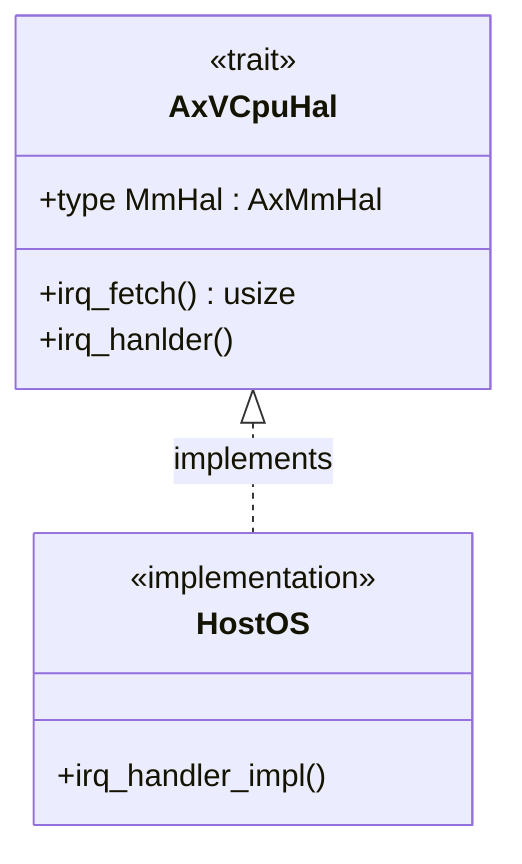

# 核心概念

<cite>
**本文档引用的文件**
- [vcpu.rs](file://src/vcpu.rs)
- [exit.rs](file://src/exit.rs)
- [hal.rs](file://src/hal.rs)
</cite>

## 目录
1. [VCPU状态机](#vcpu状态机)
2. [VM退出机制](#vm退出机制)
3. [硬件抽象层](#硬件抽象层)
4. [协同工作方式](#协同工作方式)

## VCPU状态机

`AxVCpu` 的核心是其严格的状态机模型，该模型定义了虚拟CPU在其生命周期内可以经历的六种离散状态。这种设计确保了VCPU操作的顺序性和安全性，防止了无效或危险的状态转换。

### 状态语义与转换路径

VCPU状态机遵循一个严格的单向流动路径，从创建到运行，确保每个VCPU在执行前都经过正确的初始化和绑定过程。

**Diagram sources**
- [vcpu.rs](file://src/vcpu.rs#L25-L35)

#### 六种状态详解

| 状态 | 语义 | 进入条件 | 合法转换 |
| :--- | :--- | :--- | :--- |
| **Created** | 初始状态，VCPU已创建但未初始化 | `AxVCpu::new()` 调用成功后 | → Free (通过 `setup()`) 或 → Invalid (错误) |
| **Free** | 已初始化，可被绑定到物理CPU | `setup()` 成功执行后 | → Ready (通过 `bind()`) 或 → Invalid (错误) |
| **Ready** | 已绑定到物理CPU，准备执行 | `bind()` 成功执行后 | → Running (通过 `run()`)、→ Free (通过 `unbind()`) 或 → Invalid (错误) |
| **Running** | 正在物理CPU上执行客户机代码 | `run()` 被调用后 | → Ready (发生VM退出时) 或 → Invalid (错误) |
| **Blocked** | 执行被阻塞（等待I/O等） | 当前未使用，保留供未来扩展 | 无（当前为占位符） |
| **Invalid** | 无效状态，表示发生错误 | 任何状态转换失败时 | 终止状态，无法再进行有效转换 |

**Section sources**
- [vcpu.rs](file://src/vcpu.rs#L25-L35)

### 安全性保障措施

状态机的安全性通过 `with_state_transition` 和 `manipulate_arch_vcpu` 方法实现，这些方法强制执行原子性的状态转换：

1.  **前置条件检查**：在执行任何操作前，会检查VCPU是否处于预期的起始状态 (`from`)。
2.  **原子性操作**：用户提供的闭包函数 (`f`) 在状态检查通过后才执行。
3.  **异常安全**：如果闭包执行失败（返回 `Err`），VCPU状态将自动设置为 `Invalid`，防止系统进入不一致状态。
4.  **成功转换**：如果闭包执行成功，状态将被更新为目标状态 (`to`)。

这种方法确保了所有状态转换都是受控的，并且任何违反状态机规则的操作都会导致VCPU进入一个明确的错误状态，便于调试和恢复。

## VM退出机制

当客户机操作系统执行某些需要Hypervisor介入的操作时，会发生“VM退出”(VM Exit)，控制权从客户机转移到Hypervisor。`AxVCpuExitReason` 枚举是处理这些事件的核心，它为Hypervisor提供了关于退出原因的详细信息。

### 退出原因分类

根据 `exit.rs` 文件中的定义，VM退出原因可以分为以下几大类：

**Diagram sources**
- [exit.rs](file://src/exit.rs#L10-L259)

#### 关键退出类型及其处理要求

| 类别 | 退出原因 | 处理要求 |
| :--- | :--- | :--- |
| **I/O访问** | `MmioRead`, `MmioWrite` | Hypervisor必须模拟设备行为，读取/写入虚拟设备寄存器，并将结果返回给客户机。 |
| | `IoRead`, `IoWrite` | x86特有，需模拟端口I/O指令，通常用于传统PC设备。 |
| | `SysRegRead`, `SysRegWrite` | 模拟对架构特定寄存器（如x86的MSR、ARM的CSR）的访问，可能涉及权限检查和值重定向。 |
| **中断** | `ExternalInterrupt` | 将外部硬件中断注入到客户机VCPU中，使其能够响应设备事件。 |
| **系统调用** | `Hypercall` | 处理客户机发起的服务请求，例如获取时间、管理内存等，是客户机与Hypervisor通信的主要通道。 |
| **页错误** | `NestedPageFault` | 处理嵌套分页故障，可能需要分配物理内存、建立EPT/PTE映射或处理权限违规。 |
| **多核管理** | `CpuUp` | 响应启动新VCPU的请求，初始化目标VCPU并将其置于就绪状态。 |
| | `SendIPI` | 实现处理器间中断，用于多核同步和通信。 |
| **电源管理** | `Halt`, `CpuDown`, `SystemDown` | 处理VCPU或整个虚拟机的休眠、下电请求，可能涉及调度决策或资源回收。 |

**Section sources**
- [exit.rs](file://src/exit.rs#L10-L259)

## 硬件抽象层

硬件抽象层（HAL）是 `axvcpu` 库实现跨平台兼容性的关键。`AxVCpuHal` trait 定义了一组接口，允许底层Hypervisor或内核提供与具体硬件无关的服务。

### 设计意图与接口解析

`AxVCpuHal` 的主要目的是解耦VCPU核心逻辑与底层硬件的具体实现细节。这样，`axvcpu` 可以在不同的宿主操作系统或硬件平台上复用，而无需修改其核心代码。

**Diagram sources**
- [hal.rs](file://src/hal.rs#L5-L33)

#### 核心接口说明

-   **`type MmHal: axaddrspace::AxMmHal`**: 这是一个关联类型，要求实现者提供一个满足 `AxMmHal` 特征的内存管理模块。这使得VCPU可以利用宿主系统的内存分配、映射和保护功能。
-   **`fn irq_fetch() -> usize`**: 默认返回0，用于获取当前待处理的中断号。此方法可以被重载以适应不同的中断控制器。
-   **`fn irq_hanlder()`**: **这是一个必须实现的方法**。它负责处理来自硬件的实际中断，并将其分发给相应的中断服务例程（ISR）。默认实现会触发 `unimplemented!` panic，强制开发者提供具体的中断处理逻辑。

通过这个简单的trait，`axvcpu` 将复杂的硬件交互（如中断处理）的责任委托给了更了解底层环境的宿主软件，从而保持了自身核心的简洁和可移植性。

**Section sources**
- [hal.rs](file://src/hal.rs#L5-L33)

## 协同工作方式

这三个核心概念共同构成了一个高效、安全的虚拟化框架：

1.  **生命周期管理**：`VCPU状态机` 控制着VCPU的整个生命周期。当用户调用 `run()` 时，状态从 `Ready` 转换为 `Running`。
2.  **事件驱动**：一旦VCPU开始运行，它可能会因为各种原因（如I/O访问、中断）触发 `VM退出`。此时，`run()` 方法返回一个 `AxVCpuExitReason`。
3.  **Hypervisor响应**：Hypervisor根据 `AxVCpuExitReason` 的类型采取相应行动。例如，对于 `MmioWrite`，它会模拟设备写入；对于 `ExternalInterrupt`，它会调用 `AxVCpuHal::irq_hanlder()` 来处理中断。
4.  **循环往复**：在处理完退出事件后，Hypervisor通常会再次调用 `run()`，使VCPU回到 `Running` 状态，继续执行客户机代码。

这种设计模式清晰地分离了关注点：状态机保证了操作的正确性，退出机制提供了事件通知，而硬件抽象层则屏蔽了底层差异。新手常见的误区包括：
-   忽视状态机的约束，尝试在错误的状态下调用方法（如在 `Created` 状态直接调用 `run()`）。
-   忽略 `AxVCpuExitReason` 中携带的详细信息，导致无法正确模拟复杂设备行为。
-   忘记实现 `AxVCpuHal` 的必需方法，导致程序在中断发生时崩溃。