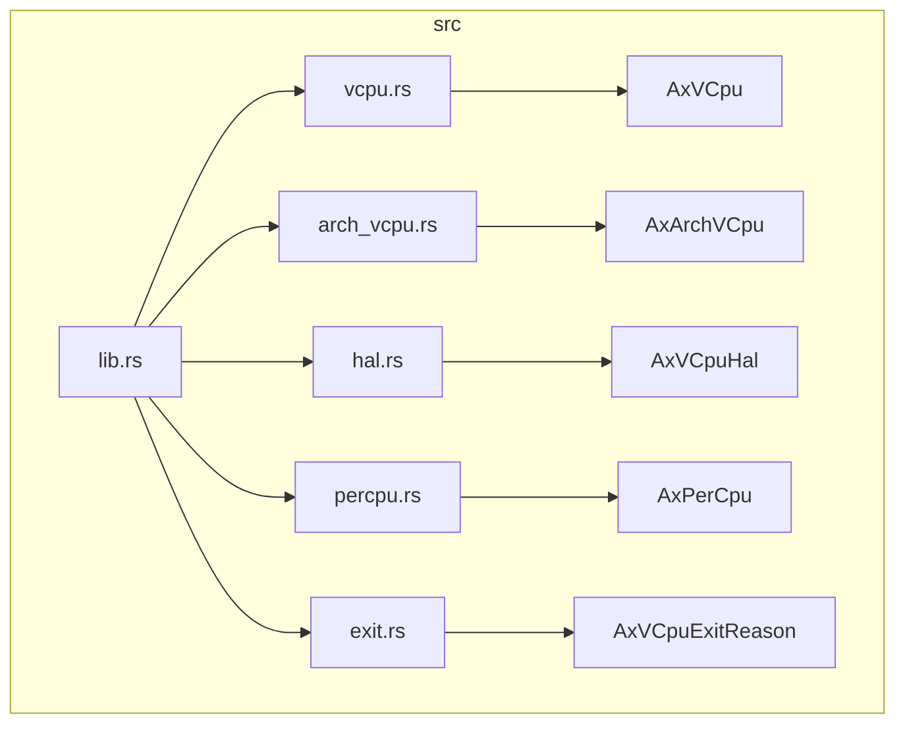
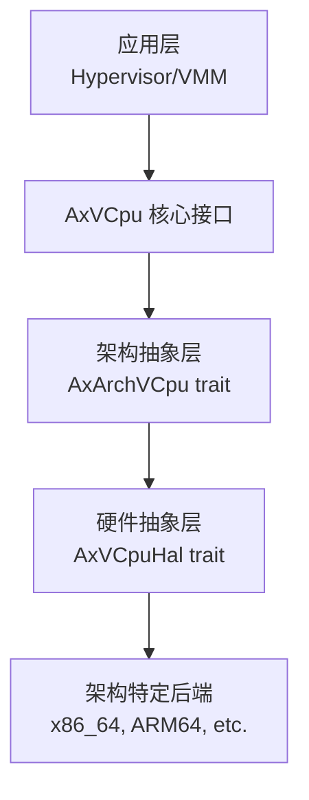
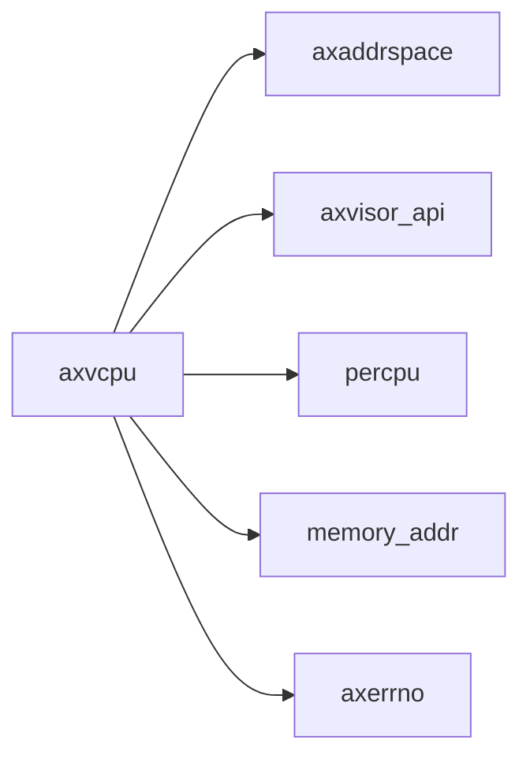

# 硬件抽象层

<cite>
**本文档中引用的文件**  
- [hal.rs](file://src/hal.rs)
- [vcpu.rs](file://src/vcpu.rs)
- [arch_vcpu.rs](file://src/arch_vcpu.rs)
- [lib.rs](file://src/lib.rs)
- [Cargo.toml](file://Cargo.toml)
- [README.md](file://README.md)
</cite>

## 目录
1. [引言](#引言)
2. [项目结构](#项目结构)
3. [核心组件](#核心组件)
4. [架构概述](#架构概述)
5. [详细组件分析](#详细组件分析)
6. [依赖分析](#依赖分析)
7. [性能考虑](#性能考虑)
8. [故障排除指南](#故障排除指南)
9. [结论](#结论)

## 引言
`axvcpu` 是一个为 ArceOS 超级管理程序设计的虚拟 CPU 抽象库，提供了一个统一且与架构无关的接口，用于在超级管理程序环境中管理虚拟 CPU。其核心设计理念是通过分层架构实现硬件和架构的解耦，其中 `AxVCpuHal` 特性（trait）作为硬件抽象层（HAL），为不同底层系统（如 ArceOS 内核或特定 Hypervisor）提供了统一的硬件操作接口。

本文档将深入解析 `AxVCpuHal` 的设计，重点剖析其关键方法 `irq_fetch` 和 `irq_handler` 的作用、调用时机以及为何 `irq_handler` 必须由具体平台实现。同时，将解释关联类型 `type MmHal: axaddrspace::AxMmHal` 如何实现内存管理功能的解耦，并结合实际场景说明下游项目如何通过实现此特性来适配特定硬件环境。

## 项目结构
`axvcpu` 项目的目录结构清晰地反映了其模块化设计：

```
.
├── src
│   ├── arch_vcpu.rs      # 定义架构特定的 VCpu 接口 (AxArchVCpu trait)
│   ├── exit.rs           # 定义 VM 退出原因枚举 (AxVCpuExitReason)
│   ├── hal.rs            # 定义硬件抽象层接口 (AxVCpuHal trait)
│   ├── lib.rs            # 库的入口点，导出公共 API
│   ├── percpu.rs         # 管理每物理 CPU 的虚拟化状态
│   ├── test.rs           # 单元测试
│   └── vcpu.rs           # 实现架构无关的 VCpu 核心逻辑 (AxVCpu 结构体)
├── Cargo.toml            # 项目配置文件
└── README.md             # 项目说明文档
```

这种结构将通用逻辑 (`vcpu.rs`)、架构抽象 (`arch_vcpu.rs`)、硬件抽象 (`hal.rs`) 和辅助功能 (`percpu.rs`, `exit.rs`) 分离，确保了代码的高内聚和低耦合。



**图源**
- [lib.rs](file://src/lib.rs#L0-L33)
- [vcpu.rs](file://src/vcpu.rs#L57-L76)
- [arch_vcpu.rs](file://src/arch_vcpu.rs#L10-L15)
- [hal.rs](file://src/hal.rs#L3-L5)
- [percpu.rs](file://src/percpu.rs#L10-L15)
- [exit.rs](file://src/exit.rs#L10-L15)

**节源**
- [src](file://src)

## 核心组件
`axvcpu` 的核心在于 `AxVCpu` 结构体和 `AxArchVCpu`、`AxVCpuHal` 两个关键特性。`AxVCpu` 提供了与架构无关的虚拟 CPU 生命周期管理，包括创建、设置、绑定、运行和状态转换。它通过内部的 `arch_vcpu` 字段委托所有架构特定的操作给实现了 `AxArchVCpu` 特性的后端。而 `AxVCpuHal` 则位于更底层，为整个虚拟化子系统提供对宿主操作系统或硬件的访问能力，如中断处理和内存管理。

**节源**
- [vcpu.rs](file://src/vcpu.rs#L57-L76)
- [arch_vcpu.rs](file://src/arch_vcpu.rs#L10-L15)
- [hal.rs](file://src/hal.rs#L3-L5)

## 架构概述
`axvcpu` 遵循严格的分层架构设计，从上到下依次为：
1.  **应用层**: 超级管理程序 (VMM) 或 ArceOS 内核。
2.  **核心接口层**: `AxVCpu` 结构体，提供统一的 API。
3.  **架构抽象层**: `AxArchVCpu` 特性，定义 x86_64、ARM64 等架构的具体实现。
4.  **硬件抽象层**: `AxVCpuHal` 特性，定义与底层硬件/内核交互的接口。
5.  **架构特定后端**: 各种硬件架构的实际实现。

这种设计使得上层代码无需关心底层细节，极大地提高了可移植性和可维护性。



**图源**
- [README.md](file://README.md#L15-L32)

**节源**
- [README.md](file://README.md#L15-L32)

## 详细组件分析
### AxVCpuHal 特性分析
`AxVCpuHal` 特性是 `axvcpu` 框架中实现硬件解耦的核心。它允许框架本身不直接依赖于任何特定的硬件或内核功能，而是通过这个契约来请求必要的服务。

#### 关联类型 `MmHal` 的解耦机制
```rust
type MmHal: axaddrspace::AxMmHal;
```
该关联类型是实现内存管理功能解耦的关键。`axvcpu` 在执行虚拟 CPU 操作时可能需要进行内存分配、映射等操作，但它并不直接调用具体的内存管理函数。相反，它要求实现 `AxVCpuHal` 的类型必须提供一个满足 `axaddrspace::AxMmHal` 特性的类型作为 `MmHal`。这样，当 `axvcpu` 需要内存服务时，它可以通过 `T::MmHal` 来访问这些功能。例如，在初始化过程中，`axvcpu` 可以使用 `T::MmHal::alloc()` 来分配页表内存。这使得 `axvcpu` 可以无缝集成到不同的内存管理系统中，无论是 ArceOS 的内存管理器还是其他自定义实现。

#### `irq_fetch` 方法的设计意图与调用时机
```rust
fn irq_fetch() -> usize {
    0
}
```
`irq_fetch` 方法的作用是从硬件或宿主操作系统中获取当前待处理的中断号（IRQ number）。它的设计意图是为 `axvcpu` 提供一种标准化的方式来查询中断源。该方法通常在虚拟 CPU 运行循环中被调用，特别是在处理 VM Exit 之后。当虚拟 CPU 因某些事件（如 I/O 访问）退出到超级管理程序时，超级管理程序会检查是否有挂起的中断需要注入到虚拟 CPU 中。此时，`irq_fetch` 会被调用以确定下一个应处理的中断号。值得注意的是，该方法提供了一个默认实现（返回 0），这通常表示“无中断”或作为一个占位符，具体的平台实现可能会覆盖它以提供真实的中断号。

**节源**
- [hal.rs](file://src/hal.rs#L15-L18)

#### `irq_handler` 方法的强制实现与重要性
```rust
fn irq_hanlder() {
    unimplemented!("irq_handler is not implemented");
}
```
`irq_handler` 方法的设计意图是派遣（dispatch）一个中断请求到宿主操作系统或底层硬件进行实际处理。与 `irq_fetch` 不同，此方法没有有效的默认实现，其默认行为是调用 `unimplemented!` 宏并引发 panic。文档明确指出：“**必须**由底层 hypervisor 或内核实现”，这强调了其实现的必要性。

其重要性体现在：
1.  **中断处理的核心**: 这是处理中断逻辑的入口点。当 `axvcpu` 检测到需要向虚拟 CPU 注入中断时，最终会调用此方法。
2.  **平台特定性**: 实际的中断派遣过程高度依赖于底层平台。例如，在基于 Linux KVM 的系统中，它可能涉及 ioctl 调用；而在裸机 hypervisor 中，它可能涉及直接操作中断控制器（如 APIC）。因此，无法在框架层面提供通用实现。
3.  **安全保证**: 文档中的 `# Safety` 注释提醒实现者必须确保中断处理的安全性，避免重入等问题。这表明该方法的正确实现对于系统的稳定至关重要。

**节源**
- [hal.rs](file://src/hal.rs#L20-L31)

### 下游项目集成实践
下游项目（如一个基于 `axvcpu` 的 hypervisor）要完成与特定硬件环境的适配，必须创建一个类型来实现 `AxVCpuHal` 特性。例如：

```rust
struct MyPlatformHal;

impl AxVCpuHal for MyPlatformHal {
    type MmHal = MyMemoryManager; // 指定自己的内存管理实现

    fn irq_fetch() -> usize {
        // 读取本地 APIC 的中断寄存器，获取当前 IRQ
        unsafe { read_apic_irq_register() }
    }

    fn irq_handler() {
        // 将中断派遣给宿主操作系统的中断处理链
        dispatch_to_host_kernel();
    }
}
```
通过这种方式，`MyPlatformHal` 就成为了连接 `axvcpu` 框架与特定硬件/内核的桥梁。

### 默认实现的局限性与生产环境最佳实践
`AxVCpuHal` 的默认实现仅适用于最简单的场景或测试目的。在生产环境中，以下部分**必须**被重写：
-   **`irq_handler`**: 如前所述，这是硬性要求，否则会导致程序崩溃。
-   **`irq_fetch`**: 返回 `0` 的默认实现意味着永远不会有中断被检测到，这会使虚拟机无法响应外部设备，因此必须根据实际硬件实现正确的中断查询逻辑。

**安全实现的最佳实践指导**：
1.  **原子性**: `irq_handler` 的实现应尽可能保证原子性，或使用适当的锁机制来防止并发访问导致的状态不一致。
2.  **错误处理**: 虽然 `irq_handler` 的签名是 `-> ()`，但内部应妥善处理派遣失败的情况，避免因单个中断处理失败而导致整个系统崩溃。
3.  **资源管理**: 确保在派遣中断时不会造成资源泄漏。
4.  **性能优化**: 中断处理路径应尽可能高效，避免长时间占用 CPU，影响系统实时性。

## 依赖分析
`axvcpu` 通过 `Cargo.toml` 文件声明了其对外部 crate 的依赖，这些依赖构成了其功能的基础。

```toml
[dependencies]
axerrno = "0.1.0"
memory_addr = "0.4"
percpu = "0.2.0"
axaddrspace = "=0.1.0"
axvisor_api = "=0.1.0"
```

-   `axaddrspace`: 提供了地址空间管理和内存映射功能，`AxVCpuHal` 的 `MmHal` 关联类型正是依赖于此 crate 的 `AxMmHal` 特性。
-   `axvisor_api`: 定义了 VMM 相关的通用数据结构，如 `VMId` 和 `VCpuId`，确保了与 ArceOS 生态的兼容性。
-   `percpu`: 用于管理每个物理 CPU 上的虚拟化状态，这对于多核环境下的虚拟 CPU 调度至关重要。



**图源**
- [Cargo.toml](file://Cargo.toml#L10-L17)

**节源**
- [Cargo.toml](file://Cargo.toml#L10-L17)

## 性能考虑
虽然 `axvcpu` 的分层设计带来了良好的可维护性，但也引入了一定的间接调用开销。每次虚拟 CPU 操作都可能经过 `AxVCpu` -> `AxArchVCpu` -> `AxVCpuHal` 的调用链。然而，这种开销在现代处理器上通常是可接受的，并且被架构解耦带来的好处所抵消。为了优化性能，建议：
-   确保 `AxArchVCpu` 和 `AxVCpuHal` 的实现尽可能高效，避免不必要的计算。
-   利用编译器的内联优化（`#[inline]`）来减少函数调用开销。
-   在 `irq_fetch` 等频繁调用的方法中，尽量减少锁的使用或采用无锁数据结构。

## 故障排除指南
在集成 `axvcpu` 时，最常见的问题是 `irq_handler` 未实现导致的 panic。如果遇到此类问题，请检查：
1.  是否已经为您的平台创建了 `AxVCpuHal` 的实现。
2.  该实现是否正确定义了 `irq_handler` 方法。
3.  在创建 `AxVCpu` 实例时，是否正确地使用了实现了 `AxVCpuHal` 的类型参数。

另一个潜在问题是中断无法正常工作。这通常源于 `irq_fetch` 的实现有误，未能正确返回挂起的中断号。建议使用调试工具检查硬件中断寄存器的状态，并验证 `irq_fetch` 的返回值。

**节源**
- [hal.rs](file://src/hal.rs#L20-L31)

## 结论
`AxVCpuHal` 特性是 `axvcpu` 框架实现硬件和架构解耦的基石。通过定义 `irq_fetch` 和强制要求实现 `irq_handler`，它为中断处理建立了一个清晰的契约。同时，利用关联类型 `MmHal`，它巧妙地将内存管理功能也进行了抽象。这种设计使得 `axvcpu` 成为一个高度灵活和可移植的虚拟 CPU 抽象库，能够轻松适应从裸机 hypervisor 到内核模块的各种部署场景。在生产环境中，开发者必须牢记重写 `irq_handler` 并提供高效的 `irq_fetch` 实现，以确保虚拟机的稳定和高性能运行。