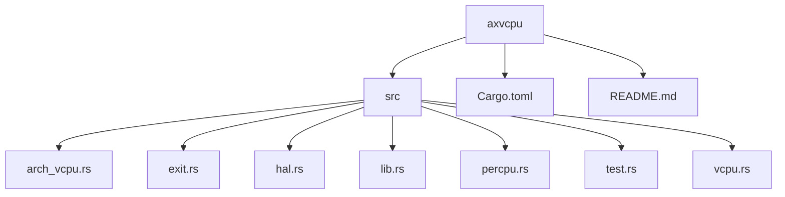
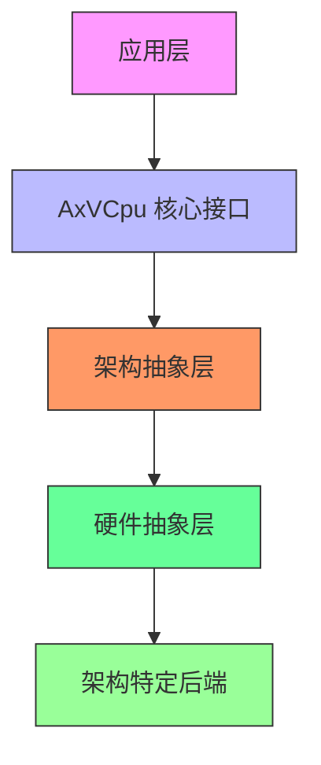
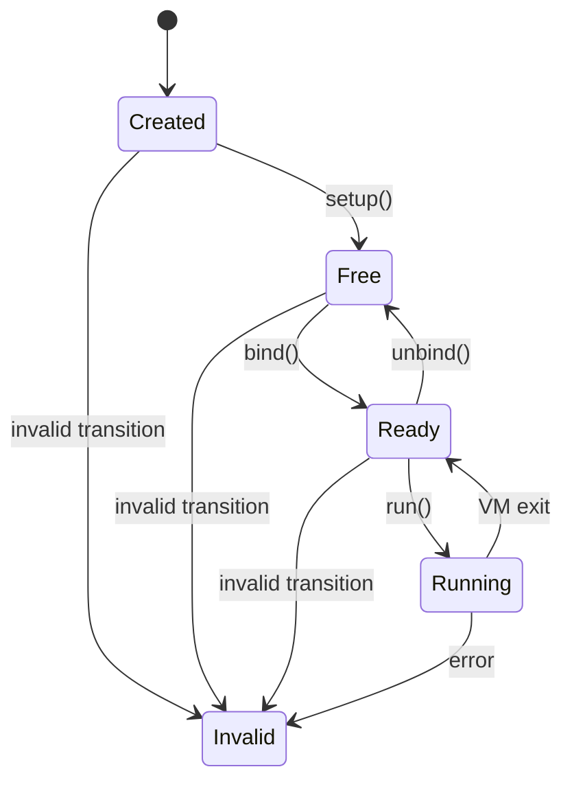
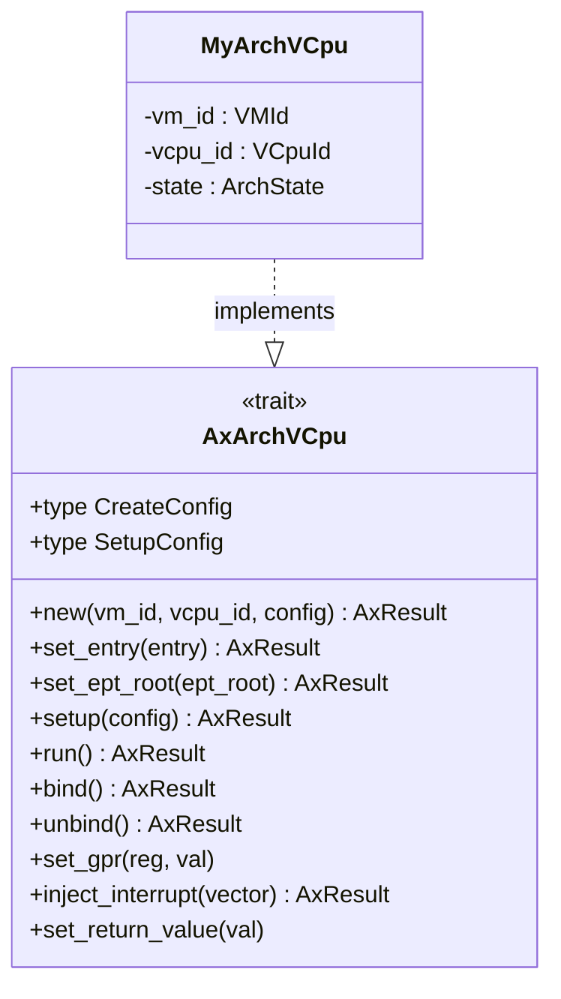
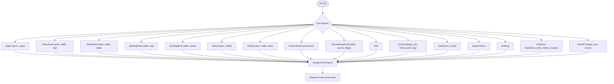
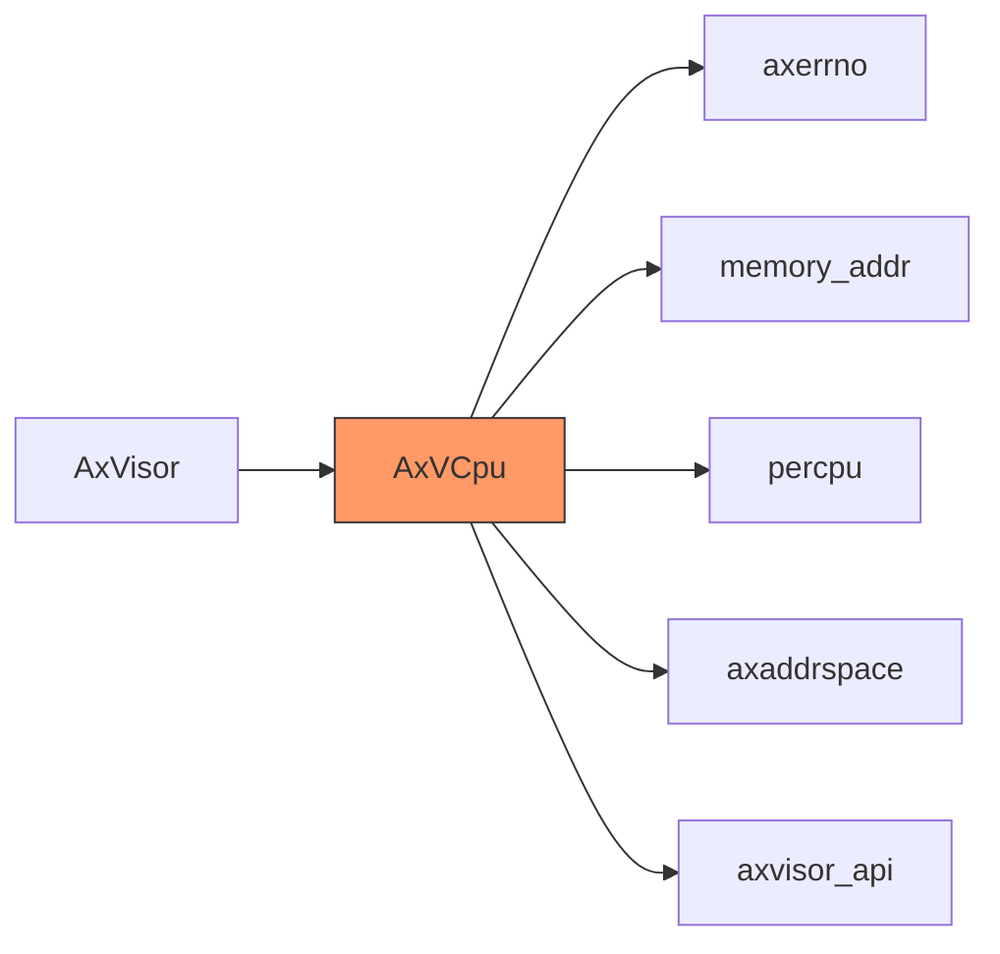

# 项目概述

<cite>
**本文档引用的文件**
- [README.md](file://README.md)
- [Cargo.toml](file://Cargo.toml)
- [src/lib.rs](file://src/lib.rs)
- [src/vcpu.rs](file://src/vcpu.rs)
- [src/arch_vcpu.rs](file://src/arch_vcpu.rs)
- [src/exit.rs](file://src/exit.rs)
- [src/hal.rs](file://src/hal.rs)
- [LICENSE.GPLv3](file://LICENSE.GPLv3)
- [LICENSE.Apache2](file://LICENSE.Apache2)
- [LICENSE.MulanPSL2](file://LICENSE.MulanPSL2)
</cite>

## 目录
1. [简介](#简介)
2. [项目结构](#项目结构)
3. [核心组件](#核心组件)
4. [架构概览](#架构概览)
5. [详细组件分析](#详细组件分析)
6. [依赖分析](#依赖分析)
7. [性能考虑](#性能考虑)
8. [故障排除指南](#故障排除指南)
9. [结论](#结论)

## 简介

AxVCpu 是 ArceOS 虚拟机监控器中的虚拟 CPU 抽象库，为管理虚拟化环境中的虚拟 CPU 提供统一且与架构无关的接口。该项目旨在为 Hypervisor 开发者和系统架构师提供一个可扩展、高性能的虚拟 CPU 管理框架，支持多种硬件架构（x86_64, ARM64, RISC-V），并实现高效的 VCPU 生命周期管理和 VM 退出处理机制。

本项目作为 ArceOS 生态系统的关键组成部分，通过分层设计实现了架构无关性与硬件特定功能之间的平衡。其目标受众主要包括需要集成虚拟 CPU 功能的 Hypervisor 开发者、系统架构师以及从事虚拟化技术研究的专业人员。AxVCpu 不仅提供了基础的虚拟 CPU 操作接口，还通过清晰的状态机模型确保了 VCPU 生命周期的可靠性和可预测性。

**Section sources**
- [README.md](file://README.md#L1-L167)
- [Cargo.toml](file://Cargo.toml#L1-L17)

## 项目结构

AxVCpu 项目采用模块化设计，源代码组织清晰，各组件职责分明。项目根目录包含 `Cargo.toml` 构建配置文件、`README.md` 文档以及 `src` 源码目录。`src` 目录下包含了所有核心功能模块：

- `arch_vcpu.rs`: 定义架构特定的虚拟 CPU 接口
- `exit.rs`: 处理 VM 退出原因的枚举和逻辑
- `hal.rs`: 硬件抽象层接口定义
- `lib.rs`: 库的入口点和公共 API 导出
- `percpu.rs`: 每个 CPU 的虚拟化状态管理
- `test.rs`: 单元测试代码
- `vcpu.rs`: 主要的 VCPU 实现和状态管理

这种组织方式遵循了关注点分离原则，使得不同层次的功能可以独立开发和维护。项目的构建系统基于 Cargo，通过 `Cargo.toml` 文件声明了对 `axerrno`、`memory_addr`、`percpu`、`axaddrspace` 和 `axvisor_api` 等外部依赖的引用，确保了与其他 ArceOS 组件的良好集成。

**Diagram sources**
- [src/lib.rs](file://src/lib.rs#L0-L34)

**Section sources**
- [src/lib.rs](file://src/lib.rs#L0-L34)

## 核心组件

AxVCpu 的核心组件围绕虚拟 CPU 的生命周期管理、架构抽象和硬件交互展开。主要包含四个关键部分：VCPU 状态机、架构抽象接口、硬件抽象层和 VM 退出处理机制。

VCPU 状态机定义了虚拟 CPU 的完整生命周期，包括 Created（已创建）、Free（空闲）、Ready（就绪）、Running（运行中）和 Blocked（阻塞）等状态。这一严格的状态转换模型确保了虚拟 CPU 在不同执行阶段的行为一致性。架构抽象接口通过 `AxArchVCpu` trait 提供了跨平台兼容性，允许在 x86_64、ARM64 和 RISC-V 等不同架构上实现统一的虚拟 CPU 操作接口。硬件抽象层则通过 `AxVCpuHal` trait 封装了底层硬件操作，实现了与具体硬件平台的解耦。

VM 退出处理机制是虚拟化的核心功能之一，AxVCpu 通过 `AxVCpuExitReason` 枚举类型全面覆盖了各种可能的 VM 退出场景，包括超调用、内存映射 I/O 操作、系统寄存器访问、端口 I/O、外部中断、嵌套页错误等。这些核心组件共同构成了一个健壮且灵活的虚拟 CPU 管理框架，为上层 Hypervisor 提供了可靠的基础设施支持。

**Section sources**
- [src/vcpu.rs](file://src/vcpu.rs#L0-L348)
- [src/arch_vcpu.rs](file://src/arch_vcpu.rs#L0-L79)
- [src/exit.rs](file://src/exit.rs#L0-L259)
- [src/hal.rs](file://src/hal.rs#L0-L32)

## 架构概览

AxVCpu 遵循分层架构设计，将复杂性分解为多个相互协作的层次。从上到下依次为应用层、AxVCpu 核心接口、架构抽象层、硬件抽象层和架构特定后端。这种分层设计实现了高度的模块化和可扩展性，使得新架构的添加变得简单而安全。

应用层代表使用该库的 Hypervisor 或 VMM，通过 AxVCpu 核心接口与虚拟 CPU 进行交互。核心接口提供了统一的 API，隐藏了底层的复杂性。架构抽象层通过 `AxArchVCpu` trait 定义了架构无关的操作接口，而硬件抽象层则通过 `AxVCpuHal` trait 封装了底层硬件操作。最底层的架构特定后端负责实现具体的硬件虚拟化细节，如 x86_64 的 VMX 指令、ARM64 的 EL2 模式切换或 RISC-V 的 S-mode/V-mode 转换。

这种分层架构不仅提高了代码的可维护性，还增强了系统的可移植性。开发者可以在不了解底层硬件细节的情况下使用高级 API，同时又能根据需要深入到底层进行性能优化或功能扩展。各层之间的清晰边界也便于单元测试和故障排查。

**Diagram sources**
- [README.md](file://README.md#L25-L45)

## 详细组件分析

### VCPU 状态机分析

AxVCpu 的 VCPU 状态机是整个系统的核心，它定义了虚拟 CPU 的完整生命周期和状态转换规则。状态机包含六个主要状态：Invalid（无效）、Created（已创建）、Free（空闲）、Ready（就绪）、Running（运行中）和 Blocked（阻塞）。这些状态之间存在严格的转换路径，确保了虚拟 CPU 行为的一致性和可靠性。

状态转换由 `with_state_transition` 方法控制，该方法在执行状态转换时会检查当前状态是否符合预期。如果状态不匹配，系统会自动进入 Invalid 状态以防止非法操作。例如，只有当 VCPU 处于 Free 状态时才能调用 `bind` 方法将其绑定到物理 CPU 上，成功后状态变为 Ready；只有当 VCPU 处于 Ready 状态时才能调用 `run` 方法开始执行，执行期间状态为 Running，返回后恢复为 Ready。

**Diagram sources**
- [src/vcpu.rs](file://src/vcpu.rs#L45-L100)

**Section sources**
- [src/vcpu.rs](file://src/vcpu.rs#L45-L348)

### 架构抽象接口分析

`AxArchVCpu` trait 是 AxVCpu 实现架构无关性的关键。该 trait 定义了一组必须由具体架构实现的方法，包括创建、设置入口地址、配置扩展页表根、完成初始化、执行、绑定/解绑物理 CPU 等。每个架构（如 x86_64、ARM64、RISC-V）都需要提供自己的 `AxArchVCpu` 实现，从而将架构特定的细节封装起来。

该 trait 使用关联类型 `CreateConfig` 和 `SetupConfig` 来允许不同架构定义自己的配置参数，这增加了灵活性和类型安全性。例如，x86_64 架构可能需要额外的 MSR 配置，而 RISC-V 架构可能需要特定的 CSR 设置。通过这种方式，AxVCpu 能够在保持统一接口的同时适应不同架构的独特需求。

**Diagram sources**
- [src/arch_vcpu.rs](file://src/arch_vcpu.rs#L5-L79)

**Section sources**
- [src/arch_vcpu.rs](file://src/arch_vcpu.rs#L5-L79)

### VM 退出处理机制分析

VM 退出处理是虚拟化技术的核心挑战之一，AxVCpu 通过 `AxVCpuExitReason` 枚举类型提供了全面的解决方案。该枚举涵盖了几乎所有可能的 VM 退出场景，包括超调用、内存映射 I/O 读写、系统寄存器访问、端口 I/O、外部中断、嵌套页错误、CPU 停止/启动请求等。

每种退出原因都携带了必要的上下文信息，使 Hypervisor 能够准确地模拟相应行为。例如，`MmioRead` 包含了访问地址、宽度和目标寄存器信息；`SysRegRead` 包含了系统寄存器地址和目标寄存器索引；`CpuUp` 包含了目标 CPU 标识符、入口点和启动参数。这种精细化的设计使得 Hypervisor 可以高效地处理各种虚拟化事件，而无需进行复杂的解析工作。

**Diagram sources**
- [src/exit.rs](file://src/exit.rs#L5-L259)

**Section sources**
- [src/exit.rs](file://src/exit.rs#L5-L259)

## 依赖分析

AxVCpu 项目依赖于多个 ArceOS 生态系统中的关键组件，形成了一个紧密集成的技术栈。在 `Cargo.toml` 文件中声明的主要依赖包括 `axerrno`（错误处理）、`memory_addr`（内存地址操作）、`percpu`（每 CPU 数据管理）、`axaddrspace`（地址空间管理）和 `axvisor_api`（虚拟机监控器 API）。

这些依赖关系体现了 AxVCpu 在 ArceOS 架构中的定位：作为一个中间层组件，它既向上为 Hypervisor 提供虚拟 CPU 抽象，又向下利用底层系统服务。特别是 `axaddrspace` 和 `axvisor_api` 的依赖表明 AxVCpu 与 ArceOS 的内存管理和虚拟化基础设施深度集成。此外，项目本身也被设计为可被其他组件（如 AxVisor）所依赖，形成完整的虚拟化解决方案。

**Diagram sources**
- [Cargo.toml](file://Cargo.toml#L1-L17)

**Section sources**
- [Cargo.toml](file://Cargo.toml#L1-L17)

## 性能考虑

AxVCpu 在设计时充分考虑了性能因素，采用了多项优化策略来减少虚拟化开销。首先，通过使用 `UnsafeCell` 而不是 `RefCell` 来管理架构特定的 VCPU 实例，避免了在 guest 执行期间因借用检查而导致的性能损失。其次，状态转换操作被精心设计为原子性操作，减少了锁竞争的可能性。

CPU 亲和性支持是另一个重要的性能特性，通过 `favor_phys_cpu` 和 `phys_cpu_set` 参数，调度器可以优先将 VCPU 分配到指定的物理 CPU 上，从而提高缓存局部性和 NUMA 效率。此外，`CURRENT_VCPU` 的每 CPU 变量设计确保了快速访问当前执行的 VCPU 实例，这对于频繁的 VM 退出处理至关重要。

尽管如此，在高并发场景下仍需注意潜在的性能瓶颈。例如，全局的 `CURRENT_VCPU` 变量虽然方便，但在多核密集型工作负载下可能会成为热点。未来的优化方向可能包括引入更细粒度的锁机制或采用无锁数据结构来进一步提升性能。

## 故障排除指南

在使用 AxVCpu 时，常见的问题主要集中在状态机异常、VM 退出处理失败和架构特定实现错误等方面。当遇到 `VCpuState::Invalid` 状态时，通常意味着发生了非法的状态转换，应检查调用序列是否符合预期的生命周期。对于 VM 退出处理，建议启用详细的日志记录以捕获具体的退出原因和上下文信息。

调试工具方面，可以利用 `get_current_vcpu` 函数获取当前正在执行的 VCPU 实例，结合断点调试来分析问题根源。对于跨架构开发，建议先在支持良好的架构（如 x86_64）上验证核心逻辑，再移植到其他架构。单元测试文件 `test.rs` 中包含了大量的测试用例，可以作为验证正确性的参考。

**Section sources**
- [src/vcpu.rs](file://src/vcpu.rs#L200-L300)
- [src/test.rs](file://src/test.rs)

## 结论

AxVCpu 作为一个现代化的虚拟 CPU 抽象库，成功地在架构无关性和性能之间取得了平衡。其分层架构设计、严谨的状态机模型和全面的 VM 退出处理机制使其成为 ArceOS 虚拟化生态系统中的关键组件。通过提供统一的 API 接口，AxVCpu 极大地简化了 Hypervisor 的开发工作，同时保持了足够的灵活性以适应不同硬件平台的需求。

该项目的多重许可模式（GPL-3.0-or-later, Apache-2.0, MulanPSL-2.0）体现了其开放性和包容性，允许不同背景的开发者根据自身需求选择合适的许可证。随着 ArceOS 生态系统的不断发展，AxVCpu 有望成为 Rust 语言虚拟化领域的标杆项目，推动安全、高效的虚拟化技术进步。